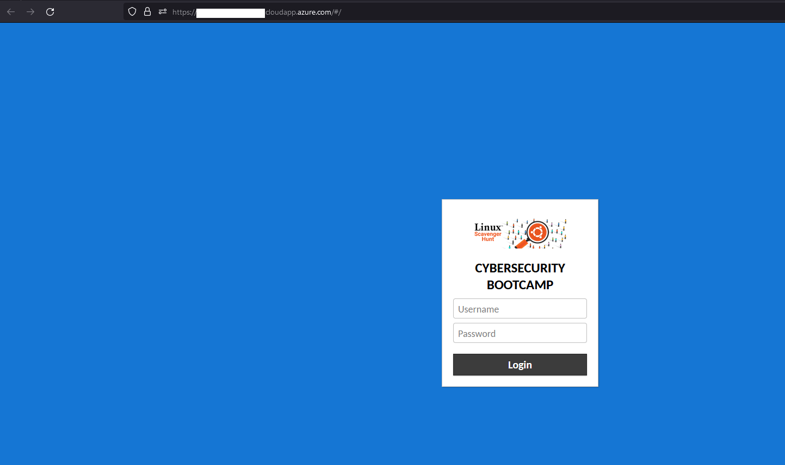
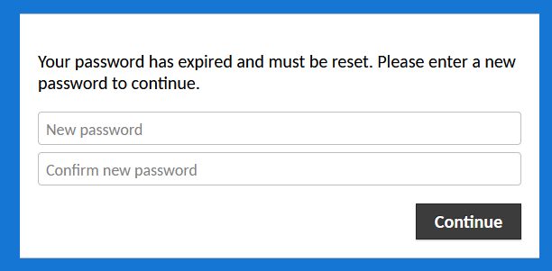
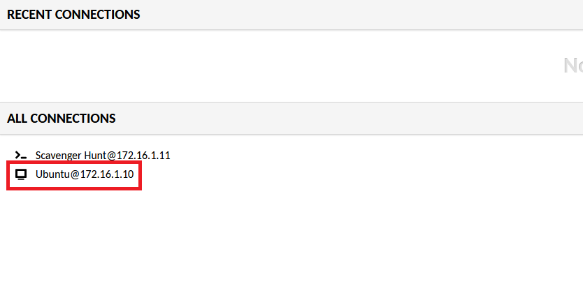
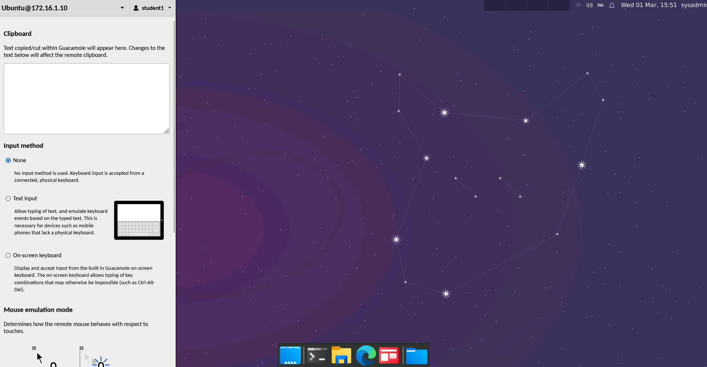

## Web Labs Student Guide

### 01. Connecting to Web Labs

In order to connect to the web lab, your instructor will Slack the classroom specific web lab URL. Be sure to bookmark this URL as you will use it throughout the entire course.

- Once you browse to the classroom's web lab URL, you will be prompted for credentials. Your instructor will also Slack you your initial credentials. Your username should start with 'Student' followed by a number. The default password is **password**. 
	
	
	
- Once you login, you will be asked to change your password.

	
	
	
- After logging in, ensure you can access the Ubuntu VM by double-clicking on it.

	

- You should see the default Ubuntu desktop. If prompted for credentials for 'sysadmin', the password is **cybersecurity**.

	
	
### 02. Web Lab Usage

Web labs use a service called **Guacamole** to render the virtual machine in your browser. 

- In order to copy/paste from Guacamole, press ctrl+shift+alt (Windows) or ctrl+command+shift (Mac)
	
	
	
- There shouldn't be a reason to tamper with any settings within Guacamole unless instructed to do so. 

- If the VMs within Guacamole become corrupted or have a major issue, your instructor has the ability to reset the VM.

---

© 2023 edX Boot Camps LLC. Confidential and Proprietary. All Rights Reserved.    
