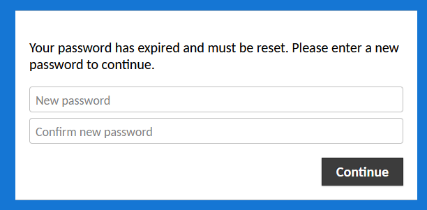

## 2.2 Student Guide: Risk Management and Threat Modeling

### Overview

Today's class will introduce cyber risk management and threat modeling.

### Class Objectives

By the end of today's class, you will be able to:

- Identify threat agents, possible attacks, and exploitable vulnerabilities relevant to a given asset.

- Prioritize risks based on likelihood and impact potential.

- Choose and justify controls for a given risk.


### Slideshow

- The lesson slides are available on Google Drive here: [2.2 Slides](https://docs.google.com/presentation/d/1sEsG0BEQ40gj2pDyEaiKnOTM--4dxKeUIsVLMYo_QJQ/edit#slide=id.g23a4a1ce5f4_0_0).


--

### 01. Welcome and Overview 

This section will serve as a brief review of the topics and scenario of the last class, and a broad introduction to threat modeling and risk management. 

In the previous class, we covered:

  - The roles and responsibilities of the security department.

  - Applying the security culture framework to build a plan for improving an organization's security culture.

  - Identifying appropriate security controls for a given resource and situation.

Today's class will introduce **risk management** and **threat modeling** as methods of identifying, anticipating, budgeting, and planning for when risks occur.

- These tools will allow you to:

  - Enumerate possible risks, threats, and vulnerabilities to a company. 

  - Identify the most likely and most serious risks.

  - Evaluate the impact the occurrence of a serious risk may have.

  - Develop strategies for monitoring or mitigating. 

- These skills will increase your knowledge of technical infrastructure protection, with an emphasis on evaluating what to protect.

### 02. Introduction to Threat Modeling and Risk Management 

#### Risk Management and Threat Modeling

We will review the basic security elements of vulnerabilities, threats, and risks, and how they apply to the practical business tasks of risk analysis, risk management, and threat modeling.  

- Review the definitions of the terms vulnerability, threat, and risk:

  - A **vulnerability** is the aspect of a business that can be exploited to compromise a system's CIA (confidentiality, integrity, or availability).
  
  - A **threat** is an actor that might exploit a vulnerability. Threats can be intentional (e.g., a malicious hacker steals data), unintentional (e.g., an incompetent sysadmin destroys the network), or due to a natural disaster.
  
  - A **risk** is the possibility of losing something valuable. A risk will cost money if it occurs.

Common business practices that organizations employ to understand, manage, and forecast these elements include:  

- **Risk analysis:** Understanding what risks an organization faces, which are most severe, and which are most likely.

- **Risk management:** Using the results of such an analysis to determine how to deploy personnel and spend budget.

- **Threat modeling:** Determining which attacks an organization is most likely to experience, who is most likely to launch them, and what can be done to stop them.

These practices directly relate to a business's pursuit of profit: 

  - Risk analysis is important because it quantifies how much a business will need to spend in the event of a given security breach. This allows businesses to plan for such events before they occur. 

  - Threat modeling is important because risks come with a price, which the business will have to pay if the threat is realized. Threat modeling allows them to prioritize the most expensive risks. 

Threat modeling is so essential to the running of a business that the results of threat modeling are funneled upwards to executives to influence business decisions.

We'll continue the lesson focusing on how to perform threat modeling.

#### Threat Modeling Methodologies

There are multiple approaches to threat modeling. Security professionals often refer to the following industry standard frameworks:

  - **PASTA (Process for Attack Simulation and Threat Analysis):** Aims to align consideration of business objectives with technical requirements.
  
  - **STRIDE (Spoofing, Tampering, Repudiation, Information disclosure, DoS [Denial of Service], Elevation of Privilege):** Focuses on identifying what can fail in the system being modeled.
  
  - **OWASP (Open Web Application Security Project):** Focuses on identifying possible threats, prioritizing risks, and planning mitigation strategies. It is mainly applied to the analysis of applications, such as web or desktop apps.

Each methodology is relevant in different situations. A bank might choose PASTA, which gives greater consideration to the business being modeled, while a pen testing firm would probably choose STRIDE or OWASP. 

You should know that you will likely encounter more than one of these frameworks during your professional career.


#### OWASP In-Depth

The OWASP process consists of six steps: 
1. Determine assessment scope

2. Identify threat agents

3. Identify possible attacks

4. Identify exploitable vulnerabilities

5. Rank/prioritize risks

6. Mitigate risks

Overview of each step:

1. **Determine assessment Scope:** Listing the assets under consideration, determining their value, and defining objectives for your threat modeling assessment.
    
    - **Asset value** is the monetary worth of a given asset. For assets like web applications, asset value should represent how much revenue and profit the asset generates.

    - **Objective** is the metric that the business wants to achieve, such as reducing the incidence of DoS attacks against its servers. 
  
2. **Identify threat agents:** A threat agent is a person or group that can actualize a threat, whether or not they are malicious. 
  
    - Examples include APTs (advanced persistent threats), script kiddies, employees who open phishing emails, and even incompetent users who break configurations on company computers.

3. **Identify possible attacks:** Identify the attacks that each threat agent is likely to perform, based on how much skill and funding they have. 
  
4. **Identify exploitable vulnerabilities:** Identify ways for data to enter and exit the system. 
  
   - For example, a web application takes information in from users and sends information back out in response to requests. Consider ways attackers might exploit these points of entry and exit.
  
5. **Rank/prioritize risks:** Rank which potential attacks are most severe and most likely to occur.
  
6. **Mitigate risks:** Determine ways to mitigate the most serious risks you identified.


#### Step 1: Determining Scope

Determining scope aims to identify which assets an organization wants to assess. 
  
- Organizations often consider one specific category of risk at a time. 

- For example, they might perform a risk analysis to specifically assess the weakness of their network infrastructure, and not think about their application security. 

- When an organization focuses on specific subset of their assets, they are adjusting their scope.

- Scope is important because it tells risk analysts what they should focus on and what they can ignore.

Scoping begins with **asset inventory**. 
  
- Asset inventory is the process of identifying and assigning an asset value (financial worth of an asset) to all of an organization's assets. 

- For assets like a web application, asset value might be measured as revenue and/or profit it generates. A secret recipe might be valued as the amount of revenue generated by that particular dish, plus however much the business gains by being the only one to offer it.

- Determining scope usually results in a spreadsheet or a written report.


#### Step 2: Identifying Threat Agents

Analysts identify threat agents by determining which attackers would be interested in the relevant assets. Analysts also consider "unwitting" sources of threats, such as incompetent employees and natural disasters. However, these unintentional threat agents will not be the focus of today's discussion.

  - For example: Threat agents faced by Facebook are script kiddies, APTs, and disgruntled insiders.

#### Step 3: Identifying Potential Attacks

Analysts identify which attacks the threat agent would most likely perform.

  - For example: A script kiddie would have different goals than a disgruntled employee. Therefore, they would use different attacks. As such, these are different risks and must be considered separately.

Analysts often consider each threat agent's motivation, skill level, and level of funding when determining which attacks they will attempt.

  - For example: Suppose a client's web application is taken offline by a denial-of-service (DoS) attack. The severity of this risk depends on the threat agent:
  
    - A script kiddie might DoS a server simply to cause trouble.
  
  - An APT, on the other hand, might DoS a server as a smokescreen while they break in elsewhere to steal trade secrets.

#### Step 4: Identifying Exploitable Vulnerabilities and Points of Failure

Finally, analysts evaluate the system for ways malicious attackers can deliver these attacks and which parts of the system are likely to suffer security failures.

  - For example: If your network uses one database to store all data, the entire company will lose access to all data if that single machine goes down. An attacker seeking to DoS the company's network can exploit this database to achieve their goal.

#### Summary

  - **Determining Assessment Scope:** Identify all relevant assets and their financial values.

  - **Identify Threat Agents:** Identify potential attackers who might be interested in these assets and possible unwitting sources of risk.

  - **Identify Potential Attacks:** Identify attacks that these threat agents are most likely to use.

  - **Identify Exploitable Vulnerabilities:** Identify areas in the system most vulnerable to these kinds of attacks.


### 03. Activity: Threat Modeling Steps 1–4 

- [Activity File: Threat Modeling Steps 1-4](Activities/03_Threat_Modeling/Unsolved/README.md)

### 04. Activity Review: Threat Modeling Steps 1–4 

- [Solution Guide: Threat Modeling Steps 1-4](Activities/03_Threat_Modeling/Solved/README.md)

### 05. Risk Analysis 

:warning: **Heads Up** This section covers some math formulas. Be prepared to allocate a little extra study time to this section.

In this section, we will focus on risk analysis and explain the process of prioritizing attack possibilities. 

Some of the possible threat agents and attacks identified in the previous exercise are more likely than others. The goal of these first four steps was to identify all possible threats, including unlikely ones.

  - For example: Script kiddies are likely to account for the majority of attacks an organization experiences, simply because they're so numerous.

  - For most organizations, organized cybercriminals aren't a major threat actor. They are more relevant to financial organizations, branches of government, and military targets.

- Risk analysis is the process of prioritizing these possibilities according to their potential impact and likelihood.

Consider the following scenario to contextualize risk analysis:

  - You've identified over 10 potential attacks that GeldCorp should consider. All can be mitigated, but it costs upwards of $2.5K to implement each fix. The security Department only has $10k budgeted for this project, and needs advice on which four fixes would have the greatest security benefit.

We'll proceed by exploring:
  
  - Qualitative vs. quantitative risk analysis
  
  - Likelihood, impact, and loss expectancies
  
  - Risk factor and heat maps

#### Qualitative vs. Quantitative Risk Analysis

Risk analysis can be conducted in one of two ways: qualitatively or quantitatively.

- **Qualitative risk analysis** is the process of prioritizing risk based on intangible factors. 

- **Quantitative risk analysis** is the process of evaluating each risk based on its measured likelihood and impact. 

    - **Likelihood** is the probability that the event will occur and **impact** is a measure of how bad it would be. 

    - There is an additional metric, called **risk factor**, which is likelihood multiplied by impact.

    - For example, if a risk has a likelihood of 20 and an impact of 20, its risk factor would be 400.

Not every scenario is easily analyzed qualitatively. Likewise, other scenarios are difficult to quantify. In the next section, we will differentiate between scenarios that use each risk analysis methodology. 

#### Qualitative Risk Analysis

Qualitative risk analysis is useful because accurately assigning likelihood and impact can be difficult, if not impossible. 

  - It's impossible to calculate a precise probability that some malicious attacker, somewhere in the world, will attack your servers within the next year.

  - It's impossible to precisely determine the fallout of a breach. 

    - For example: A company might face the risk of a distributed deniel-of-service (DDoS) attack against its core web servers. The cost of this attack depends on how long the attack lasts, which is impossible to determine ahead of time.

Qualitative analysis is typically much faster than quantitative risk analysis, and for high-level problems, might be just as effective.

  - For example: A baking company might be deciding between an inexpensive VPN service that logs traffic on its servers for internal use and a more expensive service that does not keep any logs.

  - In this case, a simple qualitative analysis might lead to the conclusion that the less expensive VPN is suitable, since it shouldn't much matter if they're logging non-confidential information.

  - A defense organization, on the other hand, would probably choose the more expensive service, as it would prefer to leave no traces.

In either case, a complex evaluation of cost versus benefit is unnecessary.

#### Quantitative Risk Analysis

There are circumstances where intuitive analysis is not enough. The following scenarios require quantitative analysis:

  - The security department wants to invest in protecting the organization's infrastructure. In order to secure the money from the finance department, they must justify their ask. They present a quantitative risk analysis to demonstrate that the cost of not investing is much greater than the budget they're requesting. 

  - The executive team needs to decide whether to migrate to a new cloud provider as part of negotiations with a potential partner. Since this transition has major financial implications, they won't make the decision without accurate assessment of potential losses due to downtime, retraining, risk of data corruption during migration, etc.

Risk analysts use a well-defined methodology to determine the likelihood and potential impact of a given risk.

#### Asset Value and Exposure Factor

In order to perform quantitative risk analysis, analysts start by calculating how much it costs if an asset is breached. To calculate this, they first quantify **asset value** and **exposure factor**.

- We've previously covered that asset value is how much money the asset is worth in currency. 

  - In the case of a web application's core application server, the asset value would probably be the amount of revenue or profit generated by that server, not the price of the server itself.

- Analysts also consider how exposure to an attack can result in either partial/temporary or complete/permanent destruction of an asset. For example, a DDoS attack might take down a server for a few hours, but a fire would destroy it for good.

- Analysts quantify this **exposure factor** by measuring "how much" of an asset will be affected in the event of a breach.

  - Exposure factor is always somewhat subjective. Analysts should start by estimating whether the occurrence of a risk would completely eliminate (1.0), mostly eliminate (0.75), half eliminate (0.5), partially eliminate (0.25), or not affect (0.0) an asset's ability to function.

  - For instance, consider the risk of attackers DDoS-ing one of an organization's web application servers. If the network has another backup server, the exposure factor might be 0.5, because the attack takes down roughly half of the application's ability to generate profit.
  
  - For the risk of attackers DDoS-ing all of an organization's application servers, the exposure factor would be 1.0.

#### Loss Expectancies

**Loss expectancy** is a measure of how much money an organization will lose in the event of a given breach.

- There are two common methods of measuring loss expectancy:

  - Single loss expectancy (SLE)

  - Annual loss expectancy (ALE)

Analysts use exposure factor and asset value to calculate the number they're actually interested in: SLE.

- **SLE** is the estimated cost of the occurrence of a risk on a given asset.

   - It is calculated as: SLE = AV x EF, where **SLE** is single loss expectancy, **AV** is asset value, and **EV** is exposure factor.

  - **SLE** is the estimated cost each time the risk occurs. If it happens twice, the total cost would be twice the SLE.

- **ALE** is the metric determining the cost of a risk reoccurring.

**EDITOR: Are lines 308 and 310 correct? 308 seems to be bordering on the concept of ALE since it is moving beyond single occurrences.**

  - It is calculated as: ALE = ARO x SLE, where **ALE** is annual loss expectancy, **ARO** is annual rate of occurrence, and **SLE** is single loss expectancy.

- **Annual rate of occurrence** is an estimate of how many times a risk is likely to occur in a given year.

  - For example: One might assume a physical break-in would only happen once per year, at most. However, one should guess that phishing attacks could happen as often as monthly.

  - **ARO** is calculated as follows: ARO = X / years, where **ARO** is annual rate of occurrence, **X** occurrence(s), and **years** is per number of years.

    - Example 1: 2 attacks every 3 years is ARO = 2 / 3. ARO would be **.67**

    - Example 2: 1 attack every 2 years is ARO = 1 / 2. ARO would be **.50**

Note that loss expectancy can be used to categorize a breach's impact as marginal, notable, severe, or catastrophic.

  - **Marginal:** The organization has sufficient resources to respond to the breach immediately, without affecting day-to-day operations or revenue.

  - **Notable:** The organization has sufficient resources to respond to the breach, but may not be able to do so immediately. It may experience interruptions to operations.

  - **Severe:** The organization experiences serious interruptions to operations, and does not have sufficient monetary and/or personnel resources to respond to the breach effectively. It may have to defer revenue, delay project timelines, reassign employees, and/or hire consultants to address the issue.

  - **Catastrophic:** The organization suffers severe, lasting damage to its reputation and/or infrastructure. The future of the business is threatened by reputational damage, bankruptcy, being found in contempt of federal regulations, etc.

Different organizations use different categories and thresholds, but these categories will be used throughout today's lesson.

#### Risk Factor and Heat Maps

These assessments allow us to generate charts that make it easier to understand risks. Today, we'll focus on risk matrices and heat maps.

- A **risk matrix** is used to compare how many of the risks an organization faces are mild versus how many are severe.

- A **heat map** is a visual representation of the probability and likelihood of risks to an organization. Heat maps provide organizations with the capability to make strategic decisions designed to protect the company.

  - During a risk assessment, having the ability to visualize risks provides a holistic view of risks that affect an organization.

  - Heat maps display three relative values:

    - **Probability:** Measured from bottom (low) to top (high).

    - **Impact:** Measured from left (low) to right (high).

    - **Inherent risk score:** Indicated by a dot within a quadrant relative to the values defined in the graph. 

  - Areas of high concern are displayed in the upper right quadrant of the heat map.

  - Areas of low concern are displayed in the lower right quadrant of the heat map.

#### Demonstration: The Risk Spreadsheet

Risk analysts typically use spreadsheets to automate the calculation of these metrics.

  - :warning: **Heads Up** When creating your heat map, only choose **probability** and **impact** with the values of 10, 20, 30, or 40. Otherwise, the heat map will not work.

1.  Open the spreadsheet [Risk Analysis Template](https://docs.google.com/spreadsheets/d/1gwNSDxTnVOv7d8PXXZCjZl00ymtKwQjkWCKD1IaMC-A/edit#gid=1384626883) in Google Sheets Select **File** > **Make a Copy** to make it editable.

2. Click on **Risk Ratings**. This tab documents how GeldCorp categorizes probability/likelihood and impact.

    - The company rates probability/likelihood based on expected annual rate of occurrence.
    
    - It rates impact based on cost. Impact falls into one of four categories, corresponding to those above (marginal, severe, etc.).

    We will use these ratings to fill out the Risk Assessment Data tab.

3. Click the **Risk Assessment Data** tab and see the following columns:
  
    - **Risk ID:** The numerical ID for the risk.
  
    - **Risk Description:** A textual description of the risk.
  
    - **Likelihood:** Probability that the event will happen. (10, 20, 30, or 40)
    
    - **Impact:** Monetary impact of the event. (10, 20, 30, or 40)
    
    - **Risk Factor:** This is the product of likelihood and impact.
    
    - **Concat:** Puts the likelihood and impact numbers together directly.

      - For example: A likelihood of 10 and impact of 30 produce 1,030. This is used as a label in charts, and makes it easy to see if a risk has a high-risk factor because of high probability, high impact, or both.
    
    - **Risk ID:** This is the same as the first column, but used by the heat map.
  
    - **Probability Class:** A likelihood of 10 indicates there is at most a 25% chance the risk occurs in a year (relatively unlikely), 20 indicates there is at most a 50% chance, 30 indicates at most a 75% chance, and 40 indicates at most a 100% chance (potentially very likely).

4. The numbers 10, 20, 30, and 40 are used to map the categories of marginal, severe, etc. to numbers.

    - Note that this spreadsheet does not require you to explicitly calculate asset value, exposure factor, SLE, or ALE. Estimate the ALE directly, and use this to determine the impact rating.

5.  Click the **Risk Matrix** tab. This compares risks according to likelihood and impact.

6. Click the **Heat Map** tab. This visualizes risks according to likelihood and impact, and provides color-coding to suggest when to make do with, monitor, manage, or mitigate a risk.

7. The Risk Matrix auto-populates as we fill in the **Risk Assessment Data** tab. However, to generate the heat map, we will need to click the button that says **Refresh Heat Map** in the bottom-left after filling out the **Risk Assessment Data** tab.

### 06. Break

### 07. Activity: Threat Modeling Step 5: Risk Analysis
- [Activity File: Threat Modeling Step 5: Risk Analysis](Activities/07_Risk_Analysis/Unsolved/README.md)

### 08. Activity Review: Threat Modeling Step 5: Risk Analysis 

- [Solution Guide: Threat Modeling Step 5: Risk Analysis](https://docs.google.com/spreadsheets/d/1v1QMihD0Y8C9bBFIFmdlZ9vIWQ0obubkHTK10KchteU/edit#gid=1384626883)


### 09. Mitigating Risk 

Analysts rank risks to clarify which threats are worth investing in solutions for. In the final section of the class, we'll look at recommending controls for the most critical risks. 

#### Deciding on Security Controls

Determining an appropriate control entails answering the following questions:

  - **Required control type:** Should the control be physical, administrative, or technical? Should it be protective, preventive, deterrent, corrective, or detective in nature? Sometimes multiple types of controls might be appropriate.

  - **Required strength of control:** How strong does the control really need to be? An organization could require everyone to encrypt their disks and refresh their passwords weekly, but it probably doesn't need to.

  - **Cost of implementation:** How much does the control cost, relative to how much protection it provides and how much is needed?

  - **Time to implementation:** How long will it take to implement this control? Sometimes an imperfect but more immediate fix is better than the a fully general solution you can only implement later.

Additionally, you should consider what resources your client has available when deciding on controls. Some organizations will be able to afford "proper" solutions, while others might only be able to implement something "good enough."

#### Mitigation Example

Read the following scenario as an example of a risk mitigation method:

  ```
    LifeNotes is a new medical records company that makes it easy for doctors from different hospitals to share medical records with each other. When they need to transfer a patient to another hospital or physician, they can use the application to send the patient's medical history, lab results, medication schedules, etc. LifeNotes also ensures that doctors can only see records for their own patients.

    The app functions like "Google for medical records." To use it, doctors enter a password to log in, search for a patient by name, select the correct patient, and can then see the patient's records.

    However, a client recently reported that they were able to load records for patients they were not assigned to. They noticed this because they accidentally clicked on the wrong search result, but were still able to load that patient's medical details.

    This violates regulatory standards for protecting patient medical information, and must be resolved immediately.
  ```

This is a security issue because it violates client-data confidentiality.

Some example controls for this problem:
  
- **Required Control Type**

  - Since this problem must be fixed immediately, LifeNotes must implement a corrective control. It should also implement protective controls to prevent the issue from reoccurring.

  - It can accomplish this with either administrative or technical controls.

- **Required Control Strength**

  - The corrective control must completely resolve the issue, because the bug means LifeNotes is in violation of the law.

  - The protective control(s) must completely prevent this issue from reoccurring, for the same reason.

- **Controls**

  - LifeNotes can implement the following example controls:

    - As a corrective control, it can redeploy the older version of the application, which did not have this issue.

    - As an administrative preventive control, it can require doctors to transfer records to the target hospital, and then have the hospital give those records to the specific doctor who needs them.

    - As a technical preventive control, it can require doctors to provide a password to log in and their employee ID to load a specific patient's records. This is called **two-factor authentication**.

- **Cost of Implementation**

  - Returning to an older version of the application is **low cost**, as it simply requires redeploying an older version of the application. 

  - Changing the way doctors and hospitals communicate data to one another is **high cost**. This requires that their clients change their processes, and that LifeNotes change how its application works.

  - Implementing two-factor authentication is **medium cost**. It requires that the engineering team implement a new feature, and that doctors learn a new workflow. However, this is an acceptable amount of work for both doctors and developers, as this would entirely control the issue.

- **Time to Implementation**

  - Rolling back to an older version of the application should take less than one day.

  - The administrative control would take months to implement.

  - Implementing two-factor authentication would likely take about a quarter (three months). This will vary by company.


### 10. Activity: Threat Modeling Step 6: Mitigating Risk

- [Activity File: Threat Modeling Step 6: Mitigating Risk](Activities/10_Mitigating_Risk/Unsolved/README.md)

### 11. Activity Review: Threat Modeling Step 6: Mitigating Risk
 - [Solution Guide: Threat Modeling Step 6: Mitigating Risk](Activities/10_Mitigating_Risk/Solved/README.md)

---

### 12. Class Do: Web Labs Introduction (0:15)

For the rest of the day you will learn about the virtual environment we will use for the majority of future class activities. 

- During these first two weeks, the in-class activities were mostly big-picture security thinking and conceptual exercises.  

- Starting in class next week, you will complete practical technical activities.

- To complete these activities, you will need access to virtual machines and virtual networks. You will use these tools to practice attacking and securing systems.

Note the following:

* While you will not use the virtual machine until Module 3, we want to provide students ample time and resources to set up their environment so they are ready to work immediately when we start the module. 

* If you experience any issues during this set up process, you should schedule time to visit office hours so the instructional staff can assist. 

#### What is a Virtual Machine?

:question: : Can you explain what a virtual machine is? 

Answer: 

- To most people, a computer means a desktop or laptop. These are the common **physical machines** we use in everyday life.

- Physical machines, also known as bare metal machines, are physical computers that have hardware components used to run a variety of tasks.

- Physical machines contain many computer parts, or hardware, that make them run. The monitor, graphics card, and the hard drive are all examples of hardware.

It's possible to write a software program that simulates a whole computer.

In other words, it's possible to simply run an application that acts like a completely different physical computer!

  - These software versions of physical computers are called **virtual machines (VMs)**.

  - You can use a single physical machine to run multiple virtual machines, effectively turning one computer into many.

Virtual machines have many advantages over physical machines:

  - They are easy and inexpensive (often free) to set up and run.

  - You can easily distribute them. In this class, we will distribute VMs so that each student is running the exact same setup.

  - A single physical machine can run multiple VMs. Among other scenarios, a single device will run multiple machines to set up and attack target other machines and set up redundant back-up machines. 

The main advantage of physical machines over virtual machines is that they are typically more efficient because they access the hardware components directly.

- To ensure every student is on the same hardware,  the virtual machines are hosted for everyone with Microsoft's cloud platform, called Azure. 

- You will be able to access their own virtual machine via their own web browser. This is made possible through a solution called **Guacamole**. 
  - Guacamole simply allows connection to a remote machine by using a web browser.

View the following activity file: 

- [Activity File: Web Labs Setup](https://github.com/coding-boot-camp/cybersecurity-24weeks/blob/v3.0-Unit1GuacInstructions/v3.0-Curriculum/1-Lesson-Plans/01-Cybersecurity-101/2/Activities/01_WebLabs/WebLabsUsageGuide.md)

- Browse to the Lab URL and login with your credentials provided.

	
	
- Once you login, you will be asked to change their password.

	
	
- Once logged in, ensure you can access the Ubuntu VM.
   - Select your Ubuntu machine 

	

- You should be able to use the Ubuntu machine.

	
	
After successfully logging into the Ubuntu machine, this is the Virtual Machine where you will be conducting many of our class activities.
  - If the a lesson or activity calls for using a **web lab**, this is where you will access the lesson/activity.
  - We will not need to access this machine until the third week

For the remaining time in class, feel free to explore the "web lab" environment.

© 2023 edX Boot Camps LLC. Confidential and Proprietary. All Rights Reserved.
