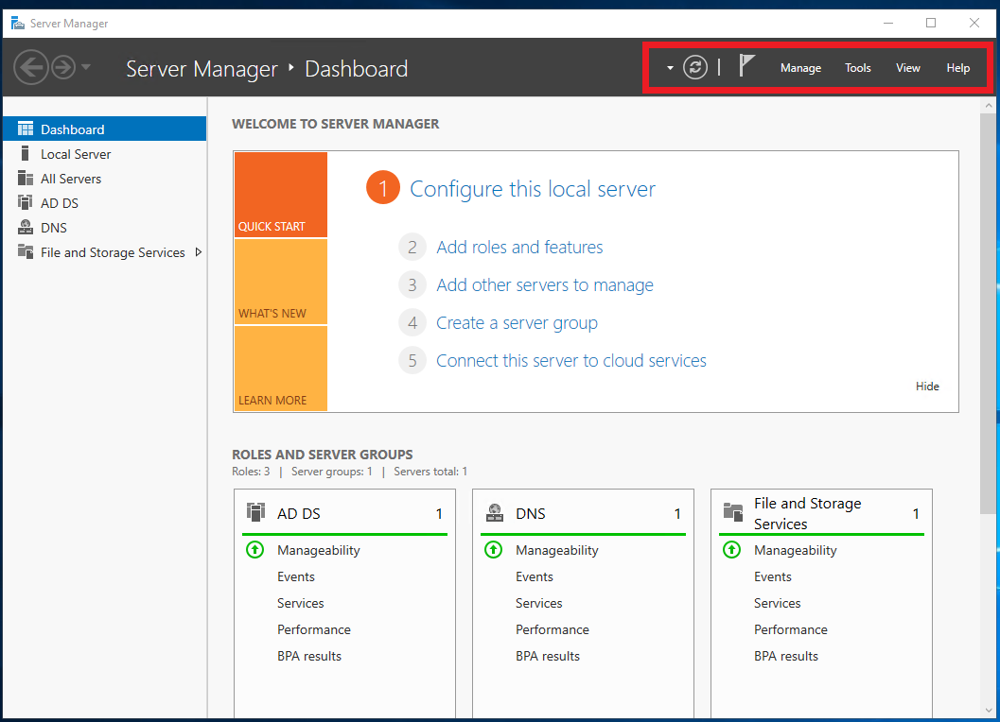

# Windows Day 3: Cheat Sheet

## Key Terms

- **Active Directory (AD)**: All the services that work together to manage authentication and authorization within a Windows Server network.

- **Domain Controller**: A server that manages all of the users and access to all domain-joined resources. It has Active Directory installed on it and handles all of the authentication. The domain controller has a database that is used to check for authentication requests. Often, replica or secondary domain controller servers exist on a network to maintain authentication requests in case one fails. Domain controllers receive and handle authentication requests, permissions, and access according to what is defined by your directory.

- **Domains**: A Windows domain is a digital grouping of all object types, such as users, computers, network resources, and security principals, in an enterprise. These are managed by a server called a domain controller.

- **Organizational unit (OU)**: OUs are virtual collections of objects like containers, that can have policies applied to them. They are organization-defined collections of objects (users, groups, computers, etc.) in AD. These typically mirror business functions. For example, user objects within the OU `accounting.GoodCorp.net` should be only users in the accounting department. OUs are not considered security principals.

- **Users**: A user object and security principal includes all of the information stored about a user in Active Directory.

- **Groups**: A collection of object users, computers, and other resources. These are used to manage identical permissions and access controls for security purposes. These are also used to manage email distribution groups. Groups are considered security principals and use authentication to access resources.

- **LM hashes**: An insecure hashing method used by the older authentication protocol, `LAN Manager`.

- **NTLM**: A challenge/reponse-based authentication protocol security suite developed by Microsoft as the successor to `LanMan`.

- **Kerberos**: Named after the mythological three-headed guard dog of hell, Cerberus, Kerberos is a ticket-based authentication protocol that is now the default authentication protocol for Windows Server domains since Windows Server 2000.

---

## Key Commands and Operations

### Server Manager

To find `tools` you'll need for activities such as `Add Users and Computers` and `Group Policy Management`, click `Tools` at the top right of `Server Manager`:

 

### Finding SIDs and RIDs

- `Get-ADUser -Filter * | Format-List Name, SID`

- `Get-ADPrincipalGroupMembership -Identity Bob | Format-Table -Property Name, SID`

- `Get-ACL \\ad\dev | Format-List`

---

### Copyright

2022 edX Boot Camps LLC. Confidential and Proprietary. All Rights Reserved.
