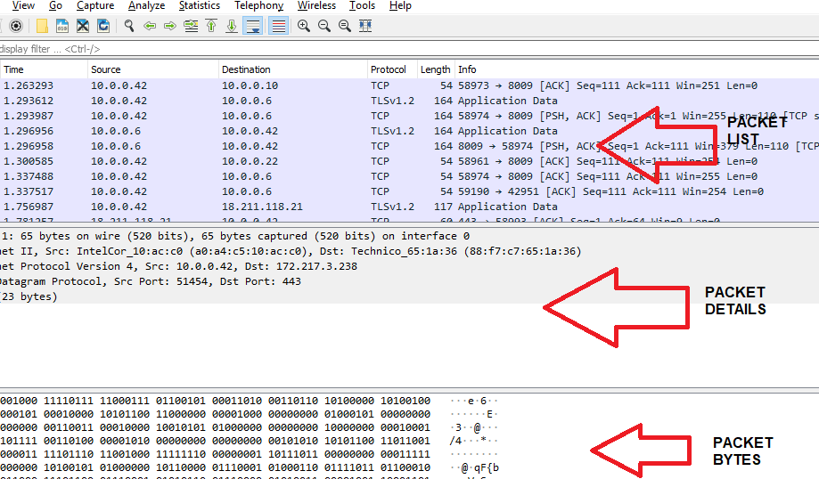
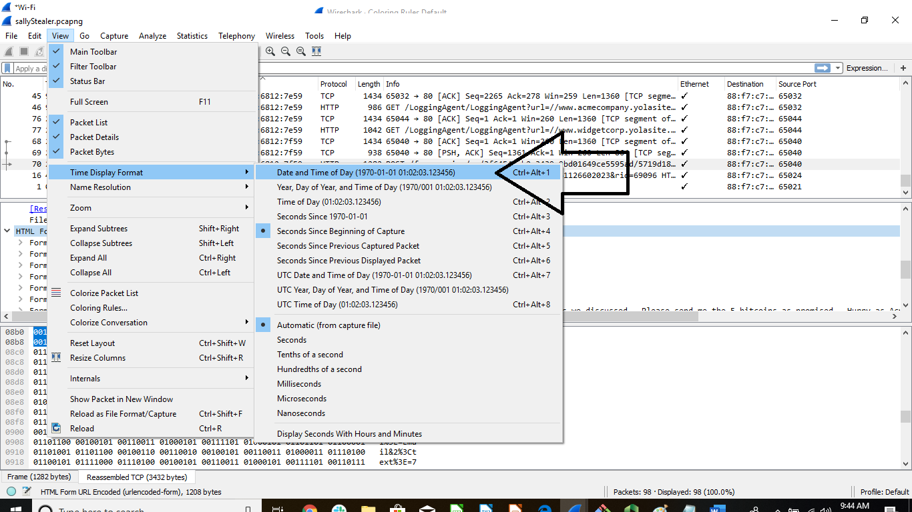

## 8.2 Student Guide: Ports, Protocols, and the OSI Model

### Overview

Today's class is the second part of our introduction to networking. You will learn about **protocols** and **ports** and then use this knowledge to analyze a suspicious employee's traffic log. You'll learn how protocols work together by studying the **OSI model** and use what you learn to identify the source of various network problems.

After studying these foundational networking concepts, we will cover how to use Wireshark to create and analyze live traffic captures. Class will finish by analyzing a capture file taken on a rogue employee's computer to determine exactly what they were doing and whom they were communicating with.

### Class Objectives

By the end of class, you will be able to:

- Interpret data in network packets by analyzing their headers, payloads, and trailers.

- Explain the role of ports in specifying a network packet's destination.

- Associate common protocols with their assigned ports.

- Explain how encapsulation and decapsulation allow different protocols to interact with each other.

- Use the layers of the OSI model to identify sources of problems on a network.

- Capture and analyze live network traffic using Wireshark.

### Lab Environment

- You will use your Web Lab virtual machine for today's activities. 

### Class Slides  

The slides for today can be viewed on Google Drive located here: [8.2 Slides](https://docs.google.com/presentation/d/1jITuNdF7DuRZ_fXK07W0sV4XS5nDW5nodvaPTk-5wU8/edit#slide=id.g105e4070612_0_1281)

---

### 01.  Welcome and Introduction

Last class we covered the following concepts:

- Networking's main function is to share data across entities.

- Various network devices are used to facilitate data sharing.

- IP and MAC addresses direct the path that data takes across entities.

In today's class, we will build on these skills by covering the following:

- How protocols standardize the transmission of data across networks.

- How ports determine where the data is sent from and where it is received.

- How the OSI model conceptualizes how data is communicated across a network.

- How to install and use Wireshark to visualize the flow of data across a network.

- How to use Wireshark specifically to capture and analyze network traffic.

### 02. Protocols

A lot happens behind the scenes to allow machines to share data over a network. This includes:

  - Opening and closing connections

  - Finding the location to send the data
  - Converting and deconverting the data
  - Transmitting the data reliably
  - Handling errors

Issues do occur during these processes, such as network communication errors. Data transfer relies on **protocols** to clearly communicate vital information and reduce the risk of errors.  

#### Communications and Protocol  

The following analogy will help us understand how **protocols** can prevent communication issues:

- When military officers exchange messages over a radio, they can encounter the following issues:
  - Communications don't come in clearly.

  - Multiple communications are sent at the same time.
  - Communications are cut off.

- Military officers need to make sure that their entire message is transmitted, received, and understood clearly. To do this, they use special words throughout their exchanges:  

  - Military Officer 1:   "This is Military Officer 1. Are you there? **Over**."  

  - Military Officer 2:   "**Roger**, I am here. This is Military Officer 2, **over**."
  - Military Officer 1:   "Start the attack at noon, **over**."
  - Military Officer 2:   "**Roger**, **out**."

- In the communication above:
    - "**Over**" is used to signal the end of a specific line of communication.

    - "**Roger**" is used to signal that the message was received completely.
    - "**Out**" is used to signal the message was received, the exchange is complete, and the order will be followed.

The example shows how military officers avoid communication issues by using a fixed mode of communication specifically designed for radio transmissions.

- This mode ensures there is no ambiguity when sending and receiving messages.

- Assigning clear meanings to certain keywords ("roger," "over," and "out") and strict rules for when to use them drastically improves the efficacy of communications.

- For example, the keyword "over" can only appear at the end of a transmission. The recipient knows not to speak until they hear "over."  This solves the problem of communications being sent at the same time or being cut off.

These strict rules are known as a **protocol**. They impose structure by specifying precisely what keywords mean and where in a message they must appear.

#### Network Protocols

Like radio transmissions, machines communicating on networks also need to be certain that a message is transmitted and understood in its entirety.

- Networks also solve these problems with protocols&mdash;sets of standardized rules that specify how interactions between communicating entities should work.

- For example, similar to the military's use of "over" to end a communication, a network communication uses the transmission control protocol (TCP) message `FIN` to indicate the end of the transmission.

Networking protocols are used for many communication tasks.

Note the common protocols below and their associated tasks:
  - **HTTP:** _Hypertext transfer protocol_ is used to communicate web traffic.

  - **FTP:** _File transfer protocol_ is used to transfer files.

Note that there are also some protocols that you may not be as familiar with, such as:
  - **PAP:** _Password authentication protocol_ is used for authenticating a user.

  - **SMB:** _Server message block_ is a Windows-based protocol used for sharing files.
  - **NetBIOS:** _Network basic input/output system_ allows computers to communicate on a local network.

There are often multiple protocols available for the same type of task. In these cases, you will choose which protocol to use based on context. For example, both FTP and SMB are used for file sharing, but SMB is only used on Windows, while FTP can be used with any operating system.

#### Network Packet Structure

Protocol rules impose structure on communications. A message adhering to protocol rules is called a **network packet**.

#### Packets

 - For each communication task, the client and server exchange data across networks in binary.

 - The binary data is grouped into separate pieces, known as **packets**, and transmitted across networks. Packets are simply sequences of binary data.

 - Packets have a designated structure that determines the order and length of the binary data sequences. This structure allows the recipient to properly interpret the results.

The structure of information in each packet is broken up into three parts:

- **Header:** Contains information about the data in the packet. This information includes the name and version of the protocol in use, the length of the packet, and other data needed by the recipient to properly interpret the message.

- **Payload:** The data being delivered to the destination. This is also known as the **body**, or simply the **data**. In other words, this is the _message itself_. In the military radio example above, the payloads are "I am here," "Start the attack at noon," etc.

- **Trailer:** Informs the receiver that it has reached the end of the packet. The trailer often contains information used by recipients to validate the data in the payload. Trailers are also sometimes known as **footers**. Not all protocols include a trailer.

Each of these three sections is further subdivided into **fields**. Each field consists of a name describing the kind of data it contains and a value, which is the data itself.

For example, the header may contain fields such as:

  - **Protocol:** Specifies the name of the protocol in use. The recipient uses the protocol to determine what kind of data is being transmitted and how to decode the data inside the packet payload.

  - **Version:** Specifies which version of the protocol is in use. Protocols will often be improved over time. These improvements sometimes require changing the rules of the protocol. If this is the case, there will be multiple versions of the protocol&mdash;those that do not have the improvements and those that do.
    - For example, the original version of HTTP was 1.0, but most sites now use version 1.1, which has additional features and benefits. Recipients must know which version is in use to properly interpret the data in the payload.

  - **Destination address:** Specifies where the packet is going. The receiver uses this to verify that it was intended to be the final recipient.  

  - **Length of packet:** Tells the receiver how much data is in the packet payload. This helps the recipient determine where to start and stop reading data and helps it verify that it has received the entire message.

Each of these parts and the fields within them will appear in an agreed-upon order and size so that the receiver knows exactly where to find specific information. This order is dictated by the rules of the protocol in use.

- For example, the version field is indicated in the header. As the first field, it starts at the first bit and ends at the fourth bit number. The receiver will always find this information in this exact location.

- Below is an example header displayed in binary, in which the version field is **bolded**, starting at the first bit and ending on the fourth.

  **0100**0101000000000000000111011010000001111000110001000000000000000100000000000110

- In binary, **0100** translates to **4**. Therefore, this field indicates that this header uses **Version 4**.

All protocols contain a header and payload. Not all protocols include a trailer, unless it's particularly important that the recipient be able to validate a packet's contents.

Since different protocols handle different kinds of data, they often contain different header and payload fields.

- For example, HTTP messages include a **host** field in their header, which contains the name of the website the user is trying to visit. FTP, however, doesn't involve websites, so it does not have a host field.

#### Protocols and Fields

Each protocol has its own unique structure of fields.

The **password authentication protocol (PAP)** is used to authenticate users.
  - **Authentication** is the process of verifying that a user really is who they say they are.

    - A common way to authenticate a user is to ask them to provide their credentials, such as their name and a password that only they know.

    - Since passwords are supposed to be secret, if a user can provide their username and the correct password, it's safe to trust that they are who they say they are.

- The diagram in the slide shows the PAP rules the client uses to send a request.

  - The fields must be in the exact order as indicated in the chart: code, ID, length, username length, username, password length, password.

    - The dark blue row indicates the length of each field in bytes.

    - The light blue row indicates what data is expected in the field.

  - Not all field lengths are set. Some fields lengths vary based on what's contained in the next field.

    - For example, "Username Length" informs the recipient how long the "Username" field is.

    - The recipient (the server) receives the data in this format and look for the "Username" and "Password" in the associated fields.

  - The most important fields in PAP are `sent-username`, which contains the username the user submitted, and `password`, which contains the password they sent.

#### Interpret Protocols from Raw Binary Data

Security professionals rely on web tools to convert binary data and determine the protocol being used.

Consider the following sample capture of raw binary data:

   ``011100000110000101110000001000000111001101100101011011100111010000101101011101010111001101100101011100100110111001100001011011010110010100100000010100000100000101010000010101010101001101000101010100100010000001110000011000010111001101110011011101110110111101110010011001000010000000110111``

  - Security professionals wouldn't be able to determine the protocol based on this binary data.

We will use the [String Functions binary to string converter](http://string-functions.com/binary-string.aspx) web tool to convert the binary data to a readable string format.

- Go to the webpage and copy the binary data above into the top field. Next, click "Convert!"

The output returns a snippet of the protocol header: `pap sent-username PAPUSER password 7`

  - The line displays the protocol of `pap`.

  - The `sent-username` is `PAPUSER`.

  - The `password` is `7`.

### 03. Interpret Protocols

- [Activity File: Interpret Protocols](Activities/03_protocols/unsolved/readme.md)
- [Protocols Log File](Resources/logfile)

### 04. Review Interpret Protocols Activity

- [Solution Guide: Interpret Protocols](Activities/03_protocols/solved/readme.md)

### 05. Ports

Protocols are standardized rules for determining how data is transmitted across networks, and IP addresses help identify where that data is transmitted.

**Ports** also help direct where data is transmitted. Consider the following analogy:

- Bob has a video presentation he wants to show Alice, a coworker who works across town. Bob will present from the video conference room in his office building, Room 33. Bob tells Alice to meet him at his office, but only gives Alice the address of the building, 150 Main Street.

- Because Bob doesn't specify which room he's in, Alice can find the office building, but not Bob or the video presentation.

If we compare this example to a network:

  - The address of the office building, 150 Main Street, is the **IP address**.

  - The video conference room, Room 33, is the **port**.

  - Since we know in advance that Room 33 is the video conference room, we know that any meeting in Room 33 will involve video conferencing, even if we're not explicitly told what to expect from the meeting. Similarly, port numbers can be associated with a specific network function and protocol.

In other words, when we see a port number in use, we know what type of protocol is in use.

Note the importance of ports in a security context:

  - Ports are the access points for transmitting and receiving data.

  - Ports are like doors that can be open, closed, or accessible to certain individuals.

  - Since a port is considered an access point into a system, it is important that IT professionals do not allow unauthorized access to them. Unauthorized access can potentially lead to a breach.

  - Network and security professionals are often tasked with checking whether ports are open to unauthorized individuals and then closing or restricting the access to protect against security issues.

  - When a protocol or service is said to "run on a port," it means the protocol or service can be accessed by connecting to that port.

**Virtual ports**

Computers have physical ports, which allow us to get data into the machine. But computers don't have enough physical ports on a computer for all the different kinds of protocols. Instead, we use software to create **virtual ports**.

  - Every protocol has an assigned numerical virtual port number.

    - The assigned port, known as the **destination port**, is where other machines send data when they want to communicate using that protocol.

      For example, a machine that wants to send an HTTP message to a web server would send traffic to the server's port `80`.

#### Port Numbers and Range

There are 65,536 virtual ports, numbered from `0` to `65535`. These ports are divided into three ranges.

- `0`&ndash;`1023`: **System ports** are *well-known* ports. They are **restricted**, meaning that only the operating system or administrator can bind services to these ports. This helps associate these ports with a given protocol.
  - For example, HTTP typically runs on port `80`. Since normal users can't launch their own services on port `80`, we can reliably trust that machines accepting connections to port `80` are using it to send and receive HTTP traffic.

- `1024`&ndash;`49151`: **Registered ports** are also called user  ports. Unlike system ports, users _can_ bind services to these ports. In general, "normal" users who want to launch their own services will do so using ports in this range.

- `49152`&ndash;`65535`: **Dynamic / private ports**. When a machine sends data to another machine, it must open a port to send data from. This is called a **source port**. Source ports are randomly chosen from the dynamic range whenever a machine sends a message.

The most common system ports:

- Port `80`: **HTTP** for sending web traffic.

- Port `443`: **HTTPS** for sending encrypted web traffic.

- Port `21`: **FTP** for sending files.

- Port `22`: **SSH** for operating network services securely.

- Port `25`: **SMTP** for sending emails.

- Port `53`: **DNS** for translating domains to IP addresses.

**Source and destination ports**

- The server, or receiver of a request, has a **destination port**. This port depends on the protocol. Destination ports _do not_ change. This is why we can associate a given port with a specific protocol.

- The client, or initiator of a request, has a **source port**. Source ports are randomly generated from the dynamic port range (`49152`&ndash;`65535`).

- When the response is returned by the server, the ports switch places: The source port becomes the destination port, and the destination port becomes the source port. This returns the traffic back to its original destination.

#### Ports Summary

- IP addresses are used to locate a computer on a network, such as the internet.

- A port number is used to locate a specific service on that computer.

- Both numbers are required to transport data.

- Any service can be run on any port, but certain services have associated ports that they're expected to run on.

### 06.  Ports Activity

- [Activity File: Ports](Activities/06_ports/unsolved/readme.md)
- [Ports Log File](Resources/secondlogfile)

### 07. Review Ports Activity

- [Solution Guide: Ports](Activities/06_ports/solved/readme.md)

### 08. OSI Layers

When data travels across a network, it goes through multiple steps and processes to reach its destination.

For example, the process of sending an email starts with the following steps:

  1. Convert the text of the user's email into a format the email application can understand.

  2. Add the destination address and destination port to this data.

  3. Convert this packet to a format that can be transmitted through physical wires.

Many of these steps are very similar across different protocols.

  - For example, IRC (_internet relay chat_) is a protocol used for chat. As with email, a user's typed message needs to be converted into a format the chat application understands. Then the destination address and port must be added to the data. Next, it must be converted to a format that can be transmitted through physical wires.

  - The processes used to send an IRC message and an email are the same. The only difference is the kind of application used.

Certain protocols are responsible for handling specific steps of data transmission:

  - The IMAP (_internet message access protocol_) or POP3 (_Post Office Protocol version 3_) converts the text of a user's email into a format any email application can understand.

  - The IP (_internet protocol_) adds destination address information to the email data.

  - The TCP (_transmission control protocol_) adds information about destination ports to this data.

  - Other protocols take care of the remaining steps of the process. These additional steps will be covered soon.

Since many of these steps are common across different scenarios, many protocols often perform the same "general step." Which protocol you use depends on the specific application, network, hardware, or circumstance.

 - For example, TCP and UDP (_user datagram protocol_) are both used to transport data, but TCP is used to transport data from an email application and UDP is used to transport data from a video streaming application.

Rather than discuss individual protocols when a security or network issue is detected, security professionals often discuss networks in terms of which "general step" the issue may have occurred on.

- This method helps them focus on the important details, such as which part of the network the security issue exists on, and not be distracted by questions about which specific protocol is used for the specific network.

#### The Open Systems Interconnection (OSI) Model

The **OSI model** is a framework that conceptualizes the steps data takes during transmission, making it easier to communicate where issues exist.

- The OSI model is a seven-layer conceptual framework that allows security analysts to better understand how communication works on a network by detailing the processes, devices, and protocols in place at each layer.

 - The seven layers are:
    1. **Physical**
    2. **Data link**
    3. **Network**
    4. **Transport**
    5. **Session**
    6. **Presentation**
    7. **Application**

 - IT professionals often refer to the number of the layer, rather than the layer name itself.  
   - For example, you may hear, _"This looks to be a Layer 3 issue,"_ when someone is referring to an issue on the network layer.

 - Many IT professionals use mnemonic devices to remember these layers. A few popular ones include:
    - All People Seem To Need Data Processing  
    - All Pros Search Top Notch Doughnut Places

#### Layer by Layer

Now we will move through each layer, covering the following for each:

  - Specific responsibilities related to the transmission of data

  - Key networking devices that assist with the transmission

      - **Note:** Not all layers have key devices or protocols.

  - Key protocols used

  - An example

**Layer 1: Physical**

  - **Responsibility:** The physical layer is responsible for transmission of binary data through a physical medium. It handles how data is physically encoded and decoded.

  - **Key devices:** Hubs, repeaters, cables, fibers, wireless

  - **Example:** If you send a photo across the internet, the digital binary representation of the image data (zeros and ones) is converted into a signal that can be transported on a physical medium. It can be an electrical, light, or radio signal, depending on the medium in use.

**Layer 2: Data Link**

  - **Responsibility:** The data link layer establishes links between nodes. It also ensures data gets to its final destination without corruption, thus protecting data integrity.

  - **Key devices:** Network cards, switches

  - **Key protocols:** MAC, ARP

  - **Example:** Sending data from a switch to a computer based on the MAC address of the network card on that computer

  - **Additional notes:** Layer 2 protocols locate devices on a LAN.

**Layer 3: Network**

  - **Responsibility:** The network layer is responsible for routing data through physical networks using an IP address, deciding which physical path the data will take, and ensuring that it gets to the correct destination.

  - **Key devices:** Routers

  - **Key Protocols:** IP

  - **Example:** When sending a file across the internet using FTP, your router sends the file based on the destination IP of the recipient of the file.

  - **Additional notes:** Layer 3 protocols locate devices on the public internet, outside of a LAN.

**Layer 4: Transport**

  - **Responsibility:** The transport layer is responsible for actually transmitting data across the network. It puts data onto the network. It is also responsible for assigning the source and destination ports.

  - **Key protocols:** TCP, UDP

  - **Example:** When streaming a movie, the movie is transported to your computer with the UDP protocol.

**Layer 5: Session**

- **Responsibility:** The session layer manages connections between ports on computers and handles data flow.

- **Key Protocols:** NetBios, SQL

- **Example:** When an email is sent, it starts a session with the receiving mail server.

**Layer 6: Presentation**

- **Responsibility:** The presentation layer is the translator for the network. It formats the data to be presented to the application layer. It handles data representation, decryption and encryption, character set translation, and conversion.

- **Key protocols:** SSL, TLS, JPEG, ASCII

- **Example:** Converts the data from a .JPG file to the image that appears on your computer.

**Layer 7:  Application**

  - **Responsibility:** The application layer is responsible for representing data in a way the consuming application can understand.  This is the layer a user interacts with, such as a web or email application.

  - **Key devices:** User applications

  - **Key protocols:** HTTP, FTP, SMTP, DNS

  - **Example:** Using the Internet Explorer browser to access a website

#### Encapsulation and Decapsulation

Now that we can identify the different layers of the OSI model, we need to understand how these layers work with reach other to transmit data.

As data moves through the layers, starting from Layer 7 and ending at Layer 1, the data is **encapsulated**.  

  - Encapsulation is the process of placing headers, and sometimes trailers, around the data to direct it to its destination.

  - The following examples of encapsulation take place as data moves across layers:

    - At the **transport** layer, the transmission data and the destination port are added to the **TCP header** based on the protocol being used. Then the data moves to the next layer.

    - At the **network** layer, the destination IP address is added to the **IP header** to determine where the data is being sent outside the local network.

    - At the **data link** layer, the destination MAC address is added to the **MAC header** to determine what local machine to send the data to.

    - In summary, the TCP, IP, and MAC headers encapsulate the data.

When the data reaches its destination, it is **decapsulated** across the layers from Layer 1 to Layer 7.  

  - **Decapsulation** is the process of removing the headers, and sometimes trailers, around the data to confirm the data has reached the destination.

  - The following examples of decapsulation occur as data is moving across layers in reverse order:

	  - At the **data link** layer,  the receiving device analyzes the **MAC header** to determine it matches the recipient's MAC address, confirming it's arrived at the correct destination. If so, the device removes the header and moves to the next layer.

    - At the **network** layer, the receiving device analyzes the **IP header** to determine if it contains the right IP address.  If so, that header is removed and the data moves on to the next layer.

    - At the **transport** layer, the receiving device analyzes the **TCP header** to determine the destination port intended to further process the data.

    -  In summary, the **TCP**, **IP**, and **MAC** headers are decapsulated from the data.

#### An Email Moves through the OSI Layers

Now that we know the different OSI layers, we'll cover a scenario that describes how an email moves across them, starting at Layer 7.

- Layer 7 **Application:** The user types an email in Microsoft Outlook.

- Layer 6 **Presentation:** The email text is converted from plain text to a format the receiving server can understand.

- Layer 5 **Session:** A session with the receiving mail server begins.

- Layer 4 **Transport:** Since email uses SMTP, it assigns the SMTP destination port and initiates a handshake (or the process of establishing communication between a client and server) with the mail server.

- Layer 3 **Network:** The mail server destination IP is added.

- Layer 2 **Data link:** The MAC address of the router is added so the email can be sent outside of the local network.

- Layer 1 **Physical:** The digital email is converted into a signal to be transmitted over a physical cable.

#### OSI in a Security Context

 - The OSI model helps you more easily understand new protocols.

    -    For example, if you find out that NetBIOS is a Layer 5 protocol, you immediately know that it's involved in managing user sessions, even if you've never heard of NetBIOS before.

 - The OSI model helps determine where problems in the network are occurring, even if you don't have full knowledge of the issue.

    -   For example, if you realize you're having a Layer 3 issue, you know you should start investigating your routers, even if you don't know exactly what the problem is.

 - The OSI model makes it easier to communicate where a security attack has occurred and what should be done.

    -   For example, if you know a SQL injection attack is occurring, you can explain to your management that you need a Layer 7 web application firewall to identify and mitigate the attack.

### 09. OSI Layers

- [Activity File: OSI Layers](Activities/10_osi/unsolved/readme.md)

### 10. Review OSI Activity

- [Solution Guide: OSI Layers](Activities/10_osi/solved/readme.md)

### 11. Introduction to Wireshark

Before diving into the packet capturing application, let's review network packets:

- Networks communicate with sequences of binary data called **packets**.

- Each packet contains fields such as the address of its origin, the address of its destination, and the information-related packets being sent.

- These work a lot like the post office, except billions of packets are transferred every day, and most packets take less than a few seconds to reach their destination.

- Communicating over a network is not entirely safe, as these packets can be intercepted and analyzed by other users on the network.

- Cybersecurity professionals need to be able to see who's on a network and what they're doing. In other words, we have to be spies&mdash;at least a little bit.

#### Introduction to Wireshark

  - Wireshark is a tool that allows us to monitor real-time communications across a network, as well as the activities of the devices connected to it.

  - Wireshark does this analysis by looking at individual packets.

  - Multiple packets collected into a file by Wireshark are called a **packet capture**. These have file extensions such as .cap, .pcap, and .pcapng.

  - In these packet captures, Wireshark collects and analyzes the kinds of websites and webpages individuals on the network are viewing, as well as the type of communication occurring.

Later in the lesson, we will see how Wireshark can collect someone's username, password, and private communication if they log into an insecure site.

#### Capturing Packets

Security professionals often analyze network logs to research security-related issues. For example:

 - Your manager tasks you with analyzing web traffic to determine which source ports your system uses for HTTP requests. They want to make sure these aren't being blocked by your firewall.

 - Your manager provides you with a capture of the logs you need to analyze.

You can look at the captured network logs using the command line.

Open the [Webtraffic.pcapng](Resources/webtraffic.pcapng) file in your terminal and run the following command:

  - `head webtraffic.pcapng`

Running this command is one solution, but it comes with considerable challenges:

- The IP addresses are difficult to isolate out.

- It's difficult to distinguish between requests and responses.

Security analysts can use Wireshark to overcome these challenges:

   - Wireshark is a graphical user interface designed to easily capture and analyze network packets.

   - It can also filter, parse, and isolate data from these packets.

Before we can use Wireshark to find the source IP, we need to configure Wireshark to easily capture the packet data.

#### Wireshark Demo

 First, we'll use Wireshark to capture network traffic.

- Begin by opening up a terminal in your web lab, and run the following commands:
  - `xhost +local:`
  - `sudo wireshark`

- Select which interface you want to capture traffic from. For this lesson, we will select "Eth0".

After selecting to listen on eth0, Wireshark changes to the packet capture view.
- You should start to see data scrolling in the application.

- Click the red square on the top-left to stop the network capture.

	 

Wireshark is split up into three panes: Packet List, Packet Details, and Packet Bytes.

The **Packet List** pane displays all the packets in the current capture file.

- Each line in the packet list corresponds to one packet in the packet capture file.

  The default columns display:

  - `No`: The distinct number of the packet in the packet capture file. This number doesn't change, even if a filter is applied.

  - `Time`: The timestamp of the individual packet.

  - `Source`: The address from which this specific packet comes.

  - `Destination`: The address to which this specific packet is going.

  - `Protocol`: The abbreviated protocol name.

  - `Length`: The length of the packet in bytes.

  - `Info`: Additional information about the packet, typically dependent on the protocol used.

The **Packet Details** pane displays the current packet (selected in the Packet List pane) with additional details.

  - The protocols and fields of the specific packet shown are displayed in multiple trees that can be expanded.

  - Each expanded tree can be linked to a different layer of the OSI model.

    - For example, the field name starting with `Transmission Control Protocol` correlates to the transport layer, because it contains the source and destination port and other fields from the TCP header. The field starting with `Internet Protocol Version 4` correlates to the network layer because it contains the source and destination IP and other fields from the IP header.

    

The **Packet Bytes** pane shows the data of the current packet (selected in the Packet List pane) in a hex format.

#### Customize Wireshark

Wireshark has many configurations for displaying packets.  As a security analyst, configuring your Wireshark display can assist with a variety of tasks, including:

-  Assigning different colors to protocols to easily distinguish them:

    - Navigate from `View` to `Coloring Rules`.

    - Click on the protocol whose color you want to change.  
    - Choose `HTTP` as an example.
    - Select `Background`, choose your color, then select `OK`.

    

- Changing how the time format is displayed in the Packet List pane:

  - Navigate from `View` to  `Time Display Format`.
  - Select the time format you want displayed.

    			

- Translating a network (IP) address to a host name in the Packet List pane. This makes it easier to view the host or website for each IP without having to look it up manually:

    - Navigate from `View` to `Name Resolution`.  

    - Check `Resolve Network Addresses`.

    

- Adding a column in the Packet List pane to isolate specific fields for analysis. To do this with the Source Port field:

  - Find a packet that has that field in the Packet Details pane.
  - Right-click the field you want as a header (in this case, the Source Port field).
  - Select `Apply as Column`.

    

- Removing columns in the Packet List pane that are unnecessary for your analysis:

  - Right-click on the header of the column you want to remove.
  - Select `Remove this Column`.

    		

Now that we've completed several configurations, we can analyze the captured log file.

- To open the packet capture in Wireshark, we first need to access the [Webtraffic.pcapng file](Resources/webtraffic.pcapng):

    - From the `File` tab, click `Open`.

    - Navigate to the packet capture.

- To filter for only HTTP request traffic, type the following in the display filter field:

    - Type `http.request` and press `Enter`.

    - Note that only HTTP requests are returned&mdash;all displayed with the color we configured earlier.

    - Note the column called `Source Port` displays all the source ports being used.

    - The ranges of the source ports are `51655`&ndash;`51659`.

### 12. Capture Packets Activity

- [Activity File: Capture Packets](Activities/13_capturing_packets/unsolved/readme.md)

### 13. Review Capture Packets Activity

- [Solution Guide: Capture Packets](Activities/13_capturing_packets/solved/readme.md)

### 14. Analyze HTTP Data

In the previous section, we learned how to configure Wireshark to assist with analyzing network traffic. Now, we will practice this analysis.  

#### Analyze HTTP web traffic

- Your manager asks you to see if a new employee, Michael Racer, is working hard on his first day of work.

- You can ask Michael if you could view his browser history, but this might not provide sufficient or accurate data&mdash;he could have cleared his browser history or used more than one browser.

- Fortunately, the networking team has a packet capture of Michael's web traffic, and you can use Wireshark to easily analyze the following:

  - What websites did Michael visit?

  - Were any communications sent from these websites?

Use Wireshark to view HTTP traffic:

- Open Michael's web traffic file, [michael.pcapng](Resources/michael.pcapng), in Wireshark.

    - From `File` > `Open`  > Navigate to the packet capture `michael.pcapng`.

- Add an HTTP filter to view only HTTP traffic.

    - Select `HTTP` and press Enter.

  				 

All HTTP traffic (including requests and responses) is displayed, but we want to focus on the websites that were visited.

-  To view only websites that were accessed, place the following in the filter:

     `http.request.method == "GET"`

  - This filter command can be broken down as follows:

      - `http.request.method` tells the filter to look for the method that HTTP is requesting. In other words, which websites Michael requested to see.

      - `*== "GET"` indicates to only return the `GET` method.  The `GET` method is used to **get** HTML data from the web server so your browser can display it.  Another common method is `POST`, which is used to submit or **post** information to the web server.  

  

- Now it is easier to see the websites Michael viewed. We can scroll through the data and view the hosts that were accessed.

Michael accessed the website carshoppers.yolasite.com. It looks like Michael is car shopping while at work. The other HTTP requests in the capture look to be resources that the car site needs to build its webpage.

Next, we need to see if any communications were sent from the website. To do this, we change the filter to:

  -  `http.request.method == "POST"`

  - This returns all requests made to the web server to submit or post information, such as submitting form data.

The one `POST` request is returned. We open the Packet Details pane to further analyze the data submitted to the web server.

  - Expand the `urlencoded-form` field to view the data, and read the form communication that was sent.

    		 

This clearly shows that Michael sent a message to the car shop stating that he plans to call in sick to go car shopping.

  - The only reason we can see the clear text data is because this is an unencrypted HTTP website.  It is important to always use encrypted HTTPS sites, as the data being communicated on HTTP sites can easily be intercepted and viewed.

### 15. Analyze HTTP Data Activity

- [Activity File: Analyze HTTP Data](Activities/16_http/unsolved/readme.md)
- [Sally Stealer Packet Capture](Resources/sallyStealer.pcapng)

### 16. Review Analyze HTTP Data Activity

- [Solution Guide: Analyze HTTP Data](Activities/16_http/solved/readme.md)

-------

### Copyright

&copy; 2023 edX Boot Camps LLC. Confidential and Proprietary. All Rights Reserved.
