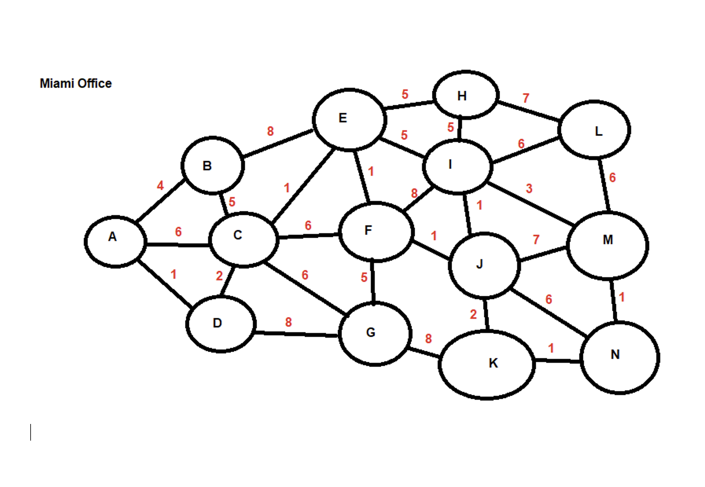
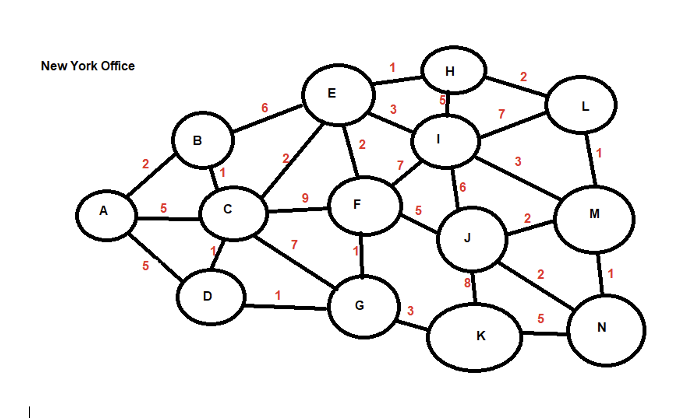
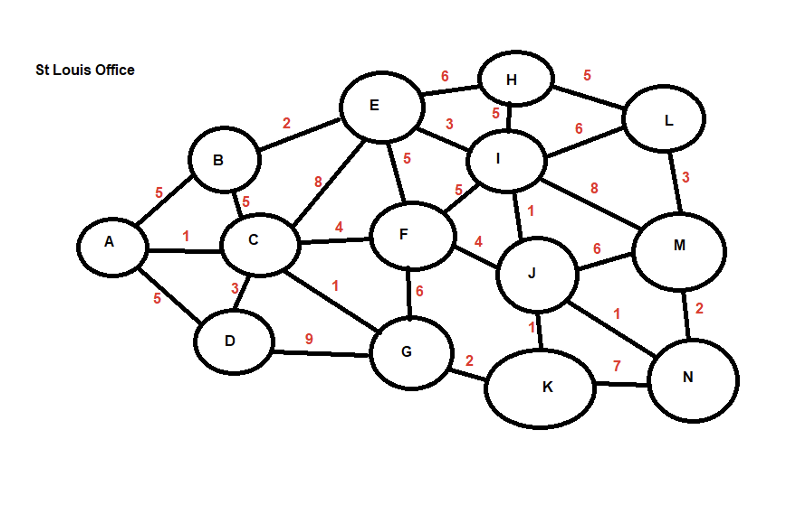

## Activity File: Routing Schemes and Protocols

In this activity, you will continue to play the role of a security analyst at Acme Corp.

- Acme Corp has several offices and needs to determine the shortest path between servers in order to create a static route.

- Your task is to analyze the network diagram and provide the shortest path between the servers.

### Instructions
   
Open the network diagrams provided.

1. For each network diagram, provide the **shortest path** between the following servers:

    - A to C
    - A to I
    - A to K
    - A to M
    - E to N

  - **Note**: In the diagram, the number between devices is the time it takes the data to travel from one device to the next.

  ### Miami Office
  

  ### New York Office
  

  ### St. Louis Office
  
  

  ---
  © 2023 edX Boot Camps LLC. Confidential and Proprietary. All Rights Reserved.