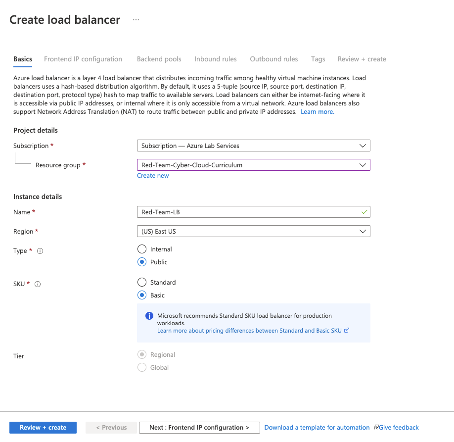

## Solution Guide: Load Balancing

To complete this activity, you had to install a load balancer in front of the VM to distribute the traffic among more than one VM.

---

Create a new load balancer and assign it a static IP address.

- Start from the homepage and search for "load balancer."

    

- Create a new load balancer in your red team resource group and give it a name.

    

- Add a frontend IP address.

	- Give the IP address a unique address name. This name will be used to create a URL that maps to the IP address of the load balancer.

	- Create a new public IP address.

    

- Add a backend pool.

     - Add your Web VMs to the backend pool.

	

	

Do not add any inbound or outbound rules.

---

© 2023 edX Boot Camps LLC. Confidential and Proprietary. All Rights Reserved.
