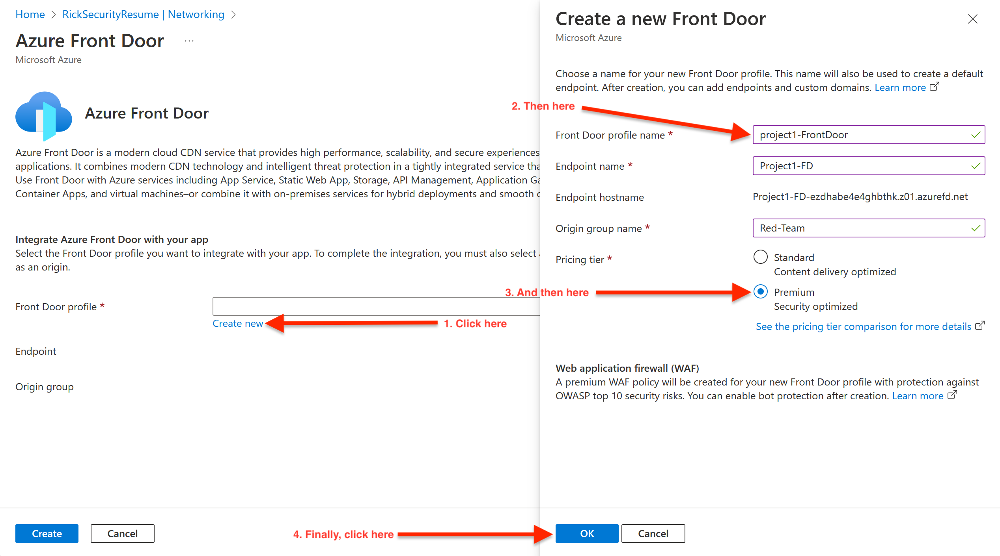
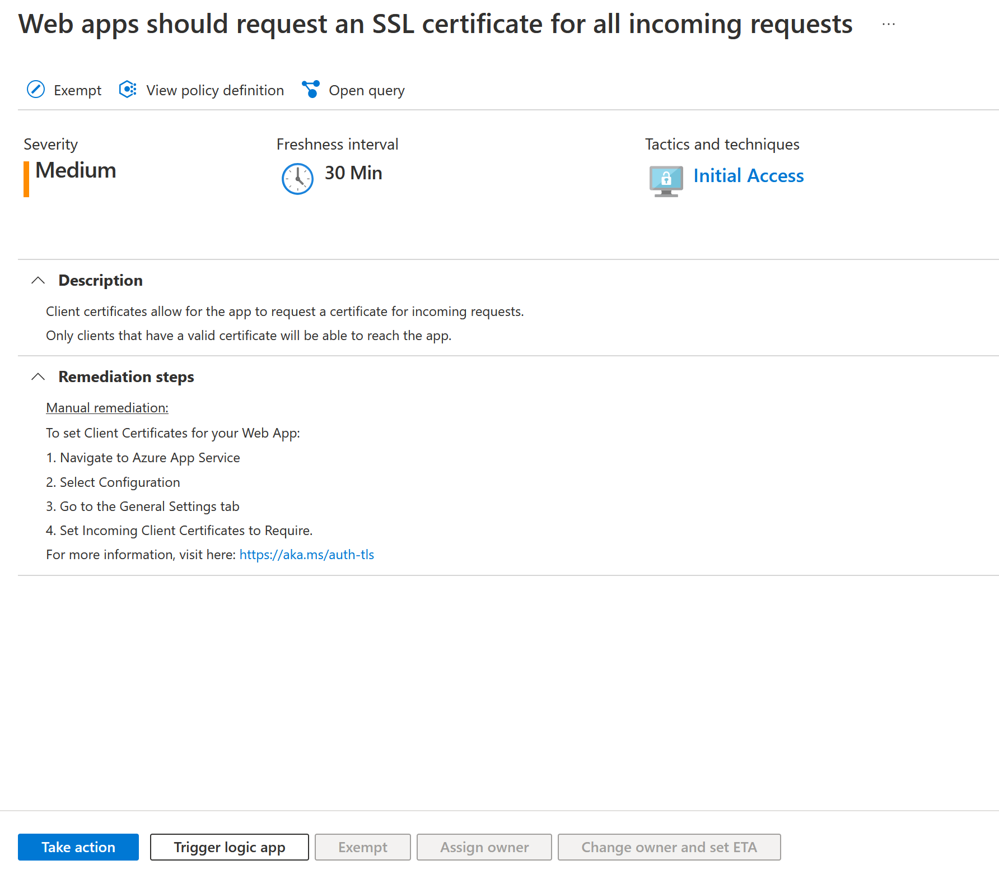

# Day 3 Activity File: Protect Your Web Application with Azure's Security Features

Today, you will be protecting your web application. Specifically, you will:

  - **Create a front door instance.**

  - **Analyze WAF rule sets.**

  - **Configure custom WAF rules.**

  - **Analyze and remediate Security Center recommendations.**

  - **Answer review questions.**

  - **Conclude and submit your project.**

### Resources

- [Azure Front Door Documentation](https://azure.microsoft.com/en-us/services/frontdoor/#overview)

- [Azure Front Door Locations by Region](https://docs.microsoft.com/en-us/azure/frontdoor/edge-locations-by-region)

- [Azure Web Application Firewall on Front Door](https://docs.microsoft.com/en-us/azure/web-application-firewall/afds/afds-overview)

- [Azure Security Center Documentation](https://docs.microsoft.com/en-us/azure/security-center/)

- If Microsoft Support is needed, visit [How to open a support ticket](https://docs.microsoft.com/en-us/azure/azure-portal/supportability/how-to-create-azure-support-request)

---

### Getting Started/Prerequisites

Before you begin Day 3, you are required to have completed the following tasks from Day 2:

- Created a key vault.

- Created a self-signed certificate.

- Imported and bound your self-signed certificate to your web app (paid domains).

- Created and bound an app service managed certificate (paid domains).

- Analyzed and compared self-signed certificates and trusted certificates.

## Instructions

### Part 1: Create a Front Door Instance

In this first part, you will create an Azure Front Door instance. To do so, complete the following steps: 

1. Begin by logging in to the Azure portal: [https://portal.azure.com](https://portal.azure.com).

	 - Make sure that you're logged in to your personal Azure account (not @Cyberxsecurity), where your Cloud Security-unit VMs are located.
	
2. Next, access the app service resource that you created on Day 1.

3. From the menu on the left side of the screen, select "Networking."

4. From this page, select "Azure Front Door" under "Inbound networking features," as the following image shows:

     
 
5. On the next page, since you haven't created your Front Door resource yet, select "Create new" next to "Front Door profile."

6. This will open a pane on the right side of your screen. 

   - In this pane, name your Front Door "project1-FrontDoor."

   - Add "Project1-FD" for the Endpoint name.

   - Make the Origin group name "Red-Team."

   - Change the pricing tier to "Premium."

   - Click the "OK" button at the bottom of the pane, as the following image shows:

     
 
7. This will return you to the Azure Front Door page.

     - Click "Create" to add the Front Door instance to your application, as the following image shows:

     - Note: this may take a few moments to complete.

     

8. To verify that your Front Door instance has been set up correctly, select "Azure Front Door" (from Step 4) again.

9. The message "Azure Front Door is enabled for your web app" should display as confirmation, as shown in the following image:
 
     

10.  Take a screenshot of this confirmation.

### Part 2: Analyze WAF Rule Sets

In this second part, you will view the features that are provided by your web application firewall. To do so, complete the following steps:

1.  From your Azure portal, enter "web app" until "Web Application Firewall policies (WAF)" appears as one of the choices in the dropdown.

2.  Select that option. The WAF that you created during the previous step should display on the "Web Application Firewall policies (WAF)" page. 

     - Note: It will begin with "DefaultWebAppWaf" and end with several random letters and numbers.

3. Select your WAF, as the following image shows:

     
 
4. When your WAF policies page opens, notice the options on the left side of your screen.

5. Select "Managed rules" either from the left-hand toolbar or from the box on the bottom of the page, as the following image shows:

     

6. When the "Managed rules" page appears, scroll through the page to view the various rules, as shown in the following image:

     

     - Note the following about these rules:

        - This is the list of the application vulnerabilities that the WAF will protect against (we will explore these vulnerabilities in further detail in the Web Vulnerabilities unit).

       - While it's unlikely that your web application would be impacted by these vulnerabilities, this exercises illustrates the Azure WAF feature, which identifies and blocks the application attacks indicated on this page.

       - These managed rules can be individually enabled or disabled, and a variety of actions can be taken if an attack is identified, such as:

          - Allow the request.

          - Block the request.

          - Log the request.

          - Redirect the request to another webpage.

### Part 3: Configure Custom WAF Rules

In this part, you will configure a custom WAF rule to protect against a potential security attack.

Let's assume for this project that you have been experiencing a variety of attacks from international IP addresses, and you need to only accept traffic from the locations where your business partners reside: the United States, Canada, and Australia.

Now you'll learn how to create a custom rule on your web application to protect against these attacks. To do so, complete the following steps:

1. Select "Custom rules" from the toolbar on the left-hand side of the screen, as the following image shows:

     

2. To create a custom rule, select "+ Add custom rule."

     - When the pane pops up on the right, name your custom rule "Project1rule."

     - Leave the status and rule type at the default options.

     - Set the priority to 100.

     - Set the following terms for the rule's condition:

        - Match type: Geo location

        - Operation: is not

        - Select the three countries (USA, Canada, Australia)

        - Then: Deny traffic

     - Then, click "Add." 

     - The following image shows these steps:

     

3. Your custom rule should now display on the page, as the following image shows:

     

4. Take a screenshot of your custom rule. Press "Save."

Congratulations! You have configured the WAF to restrict traffic from accessing your webpage unless the source IP is from the US, Canada, or Australia. 

|⚠️ **Checkpoint** ⚠️|
|:--|
|Before continuing, make sure that you have completed the following critical tasks:|
| :heavy_check_mark: Created your Azure Front Door instance. |
| :heavy_check_mark: Created a WAF and analyzed your rule sets. |
| :heavy_check_mark: Created a custom WAF rule to protect against international traffic. |
	
### Part 4: Analyze and Fix a Defender for Cloud Recommendation

**Microsoft Defender for Cloud** is a management system that provides best practices and recommendations to enhance the security of your cloud resources.

While Azure provides tools to protect your cloud resources, it is up to you to apply the correct configurations and best practices to protect your web application.

In this part, you will learn how to use Microsoft Defender for Cloud to analyze and fix a recommendation from the dashboard. To do so, complete the following steps:

1.  To access Defender for Cloud, from your web app, select "Microsoft Defender for Cloud" from the toolbar, as the following image shows:

     

2. When the Security page opens, it should display counts for both recommendations and alerts (note that your counts may vary).

     - Review the recommendations, and note that Azure describes the recommendations in this way: "Defender for Cloud continuously monitors the configuration of your app services to identify potential security vulnerabilities and recommends actions to mitigate them."

     - ⚠️ **Important:** Your security recommendations may vary or may not show up at all. If there are no security recommendations, skip ahead to Part 5, and return in a few hours to complete this section. If you have any, most security recommendations will appear within 24 hours.

3. Select the recommendation "Web apps should request an SSL certificate for all incoming requests," as shown in the following image:      

     

4.  When this page opens, expand the remediation steps, as shown in the following image:

     

5. Follow the recommended steps to remediate this recommendation.

### Part 5: Answer Review Questions

- Open your copy of the [review questions](https://docs.google.com/document/d/1VoWNPNUvobnVj7F6oM2wnVO0vViaZlzgIUs43adVw1U/edit?usp=sharing), make a copy of the document, and answer the Day 3 review questions.

     - Note that you will submit this document as one of your deliverables at the end of the project.

### Part 6: Conclude and Submit Your Project

Congratulations on completing your first project! Complete the following important instructions to submit and conclude your project.

- **Project Deliverables** 

   - Submit your review questions with all required screenshots through Bootcamp Spot.

- **Disable Any Paid Features**

   - As a reminder, you are provided a $200 credit by Microsoft to use for the resources of Cloud Week and this project.

      - If you are going to maintain your website:

        - After today's activity,  you should minimally delete your Azure Front Door instance and WAF and any resources from the previous Cloud Security unit.

      - If you are not going to maintain your website:

        - After you have submitted your review questions with screenshots, you are welcome to delete **ALL** of your cloud resources used over the last two units. 

        - Use the following [guide](https://docs.google.com/document/d/1ZzC4oTJFdlkkeWuzuJAyVSqtDFbuAWilmwXg8PZgzMs/edit) to assist with monitoring and stopping your costs.
      
- **Interview and Resume Guidance**

   - When networking and talking to potential employers, you should be able to reference the work done on this project to answer specific interview questions or to demonstrate your skills within a specific domain.

   - Reference the following document for guidance on how to add your project to your resume, discuss your project, and answer potential interview questions regarding your project activities: [Interview and Resume Guidance](https://docs.google.com/document/d/1ID0bnnONLGqIkkPTCr_UpRH3WKWY0oASgwCOCzzXKrY/edit?usp=sharing).

---

© 2023 edX Boot Camps LLC. Confidential and Proprietary. All Rights Reserved.  
