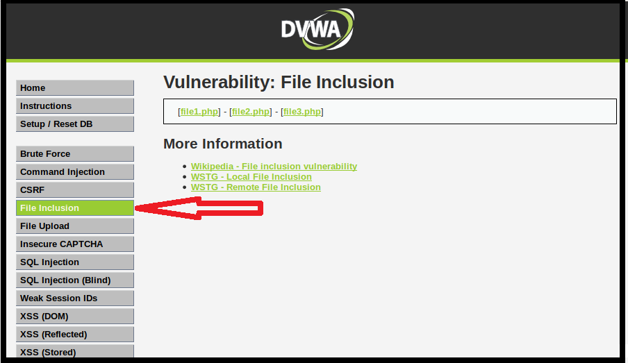

## Activity File: Directory Traversal 

In this activity, you will continue your role as an application security engineer with Replicants.

- So far, you've tested the company's main production website and confirmed that there are SQL injection and cross-site scripting vulnerabilities.

- Your manager is now concerned that other vulnerabilities might exist in the pages of your web application that work with the back-end components.

- More specifically, your manager would like you to first test for **directory traversal** vulnerabilities and propose a mitigation strategy.

### Setup 

- Access your web lab and open a browser.

- Return to the webpage from the previous activity: <http://192.168.13.25>.

  - Select the **File Inclusion** option from the options on the left side of the page.

    - Note that even though you will be on the **File Inclusion** page, you will first conduct a directory traversal attack.

    - Alternatively, access the webpage directly at <http://192.168.13.25/vulnerabilities/fi/?page=include.php>.
  
  -  The page should look like the following image:

      

  - **Note:** If you have any issues accessing this webpage, you might need to repeat the activity setup steps from the SQL Injection Activity in 15.1.

### Instructions 

The webpage you have accessed represents a page within the Replicants website. This webpage is designed for a user to access the following three files that exist on the Replicants web server:
   
   - `file1.php`
   
   - `file2.php`
   
   - `file3.php`

The user selects a link to one of these three files, and the contents of that specific file appear on the webpage.

Complete the following steps to test for directory traversal vulnerabilities:

1. Test the intended use of the web application.

    - View the contents of `file1.php`.
      
      - Select the link to `file1.php`, and note the following:
      
          - The URL changes to <http://192.168.13.25/vulnerabilities/fi/?page=file1.php>.
          
          - Note that the parameter references the file that was selected: `?page=file1.php`.
        
          - The content on the webpage was displayed:
      
              `Hello admin
              Your IP address is: 192.168.13.1`
          
      - Select the other links (`file2.php` and `file3.php`) and note their URL and webpage changes.
      
      - Note that the intended purpose of this application is to provide a user access to those three files only. 

2. On your web lab, open the terminal. 

      - Connect to the container of the Replicants webpage:

        - `docker exec -it dvwa bash`
      
      - Once you have connected to the container, run the following command to access the directory where `file1.php`, `file2.php`, and `file3.php` are located:

        - `cd /var/www/html/vulnerabilities/fi`

      - View the files in this directory using the `ls` command.

        - Note that you should see the files `file1.php`, `file2.php`, and `file3.php`.

      - View the contents at the top of `file2.php`:
        
        -  `head file2.php`
      
        - Note how this file contains HTML that matches what you saw on the Replicants website when you clicked on `file2.php`:
          
          - `<em>I needed a password eight characters long so I picked Snow White and the Seven Dwarves.</em>\" ~ Nick Helm  `

        - Take note of the other `file<#>.php` file located in this directory. 

3. Test the unintended consequences of this application.
 
    - We saw another `file<#>.php` file in that directory. That file does not have a link to access on Replicants webpage. Try to access it by modifying the parameter of the URL.

4. Traverse through other paths. 

    - In Part 3, you modified the parameter of the URL to view a hidden file. Try to access the `passwd` file by modifying the parameter of the URL again.

    - **Hint:** Use the dot-slash method.
    
    - **Hint:** To determine how many dot-slashes to use, run `pwd` from the command line and count the directories to return to `/var`.

    - By using this method, you have completed a **directory traversal attack**. 
  
5. **Bonus:** Previously, you modified the URL to view the file `passwd`. Try to access other files (such as the hosts, group, or networks) using the same techniques.

    - If you can access the files, research online and document what data those files contain.

6. Answer the following mitigation strategy questions: 

    - Describe to your management how a malicious user could take advantage of the vulnerabilities that you just exploited. Be sure to include the potential impact.

    - Describe how you would mitigate the vulnerabilities you just exploited.

___

© 2023 edX Boot Camps LLC. Confidential and Proprietary. All Rights Reserved. 
