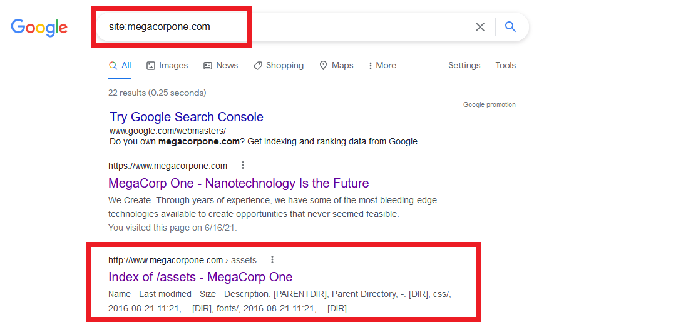
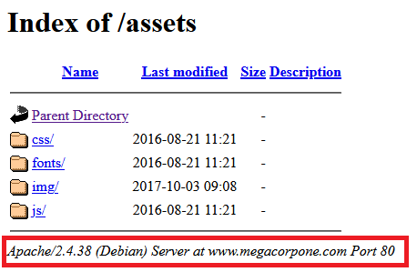
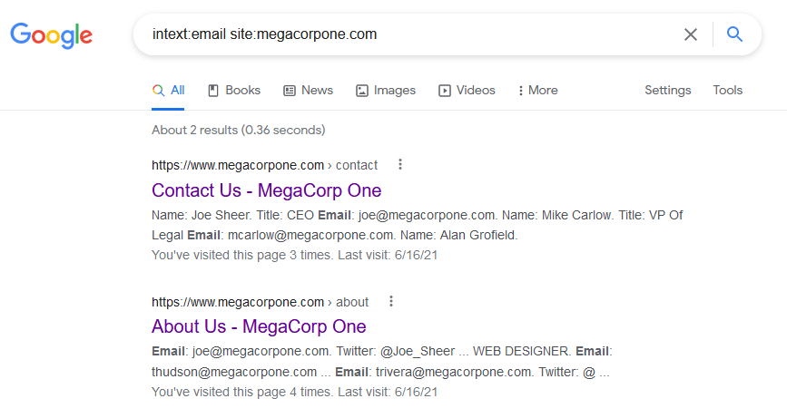
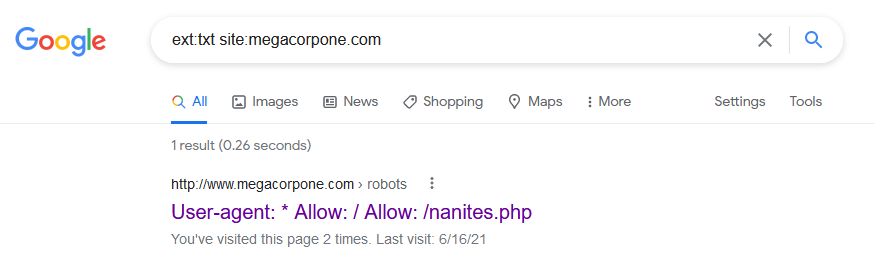
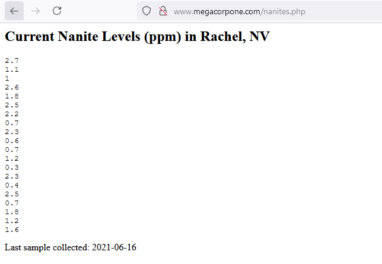

## Solution Guide: Google Dorking 

In this activity, you're beginning your penetration test against your client, MegaCorpOne, with OSINT. To start, you've performed Google dorking on MegaCorpOne in order to gather email addresses and user names.

You will use a combination of Google search techniques to target MegaCorpOne and gather information such as: 

- Employee email addresses
- Employees' first and last names
- Domain information
  
The goal is to find data that can be used against MegaCorpOne.

#### Solution

1. In a browser, navigate to Google. 

2. Using the `site` Google operand, identify the web service name and version. MegaCorpOne's website is megacorpone.com. 

     - You will find a webpage called "assets," as the following image shows: 

     
	
	 - Clicking on this page will reveal that the web server is running Apache version 2.4.38 on Debian OS, as the following image shows:
	
	 

3. Using the `intext` and `site` operands, create a list of user names and their email addresses.

     - This will return all webpages on the site megacorpone.com that have the word "email" in them, as the following image shows:
	
	 

	 - By browsing through these pages, you should identify the following MegaCorpOne users and their email addresses:

	
	 | Name  | Email |
	 | ------| ----- | 
	 | Joe Sheer | joe@megacorpone.com |
	 | Tom Hudson |thudson@megacorpone.com |
	 | Tanya Rivera |trivera@megacorpone.com |
	 | Matt Smith |msmith@megacorpone.com	|
	 | Mike Carlow |mcarlow@megacorpone.com |
	 | Alan Grofield |agrofield@megacorpone.com |
	
     - From this information, we can determine that, aside from user Joe Sheer, the email naming convention is first initial:last name. This information can be used for any potential login forms that we come across in future activities.

#### Bonus

1. In a browser, navigate to Google. 

2. Search for "ext:txt site:megacorpone.com", as the following image shows:

	

3. A result for the `robots.txt` page will appear. Click on the page, and you will find a directory called `/nanites.php`, as the following image shows:

	

4. Navigate to megacorpone.com/nanites.php to find the hidden page, as the following image shows:

	

---
© 2023 edX Boot Camps LLC. Confidential and Proprietary. All Rights Reserved.

