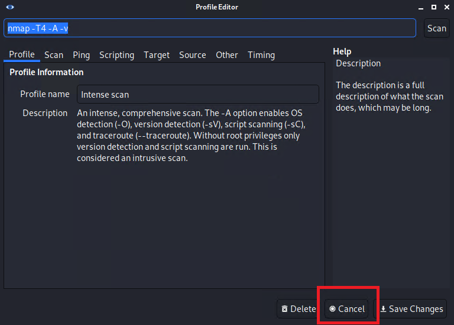
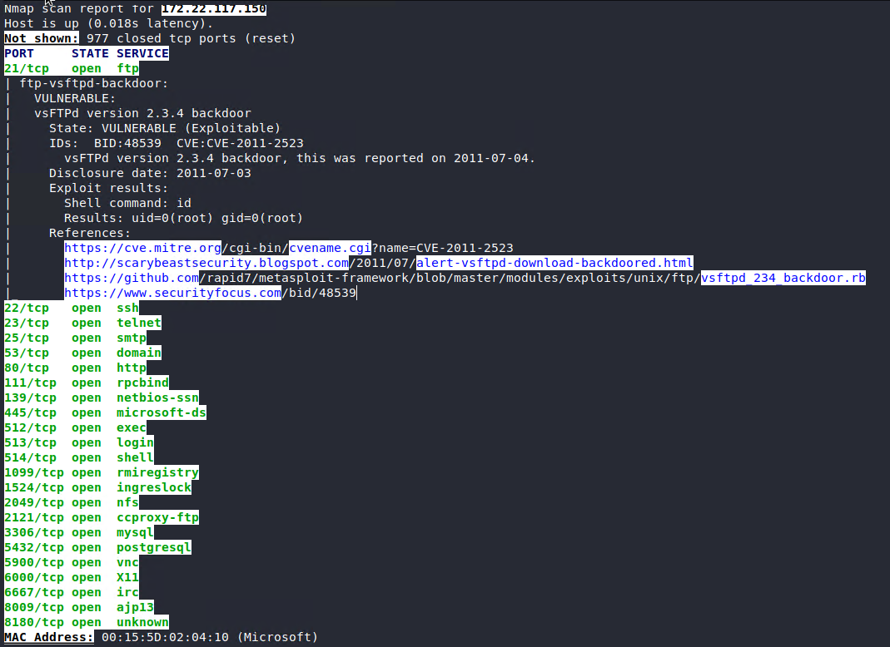
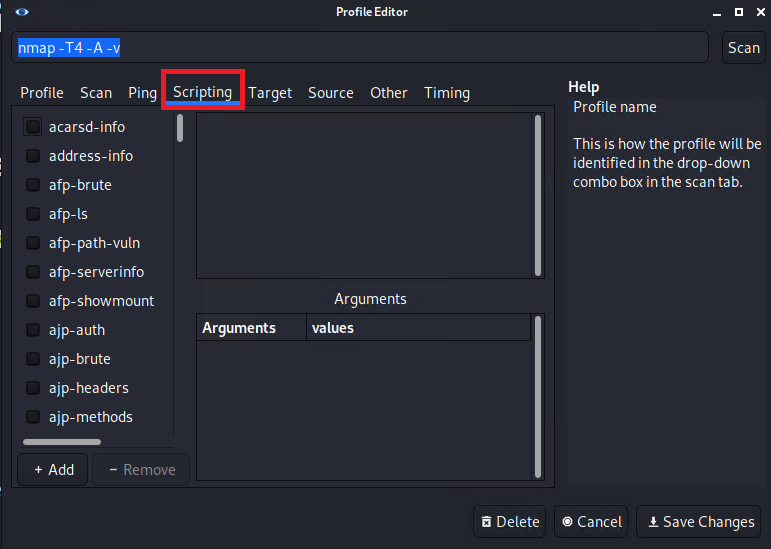
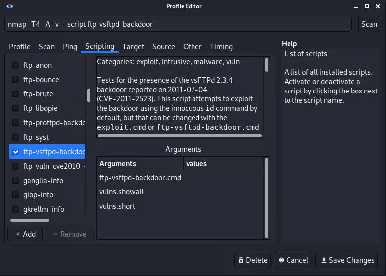

## Activity File: Zenmap & NSE Scripts

In this activity you leveraged Nmap in a new way&mdash;through a GUI called Zenmap. Using Zenmap makes certain Nmap activities easier. 

The GUI allows us to save profiles for scans and to browse Nmap's scripting engine components, called NSE scripts. NSE scripts, in turn, allow us to build upon the capability of Nmap scans by incorporating additional activities within the scan. For example, we can test for certain vulnerabilities or perform brute forcing on logins. 

In this activity, you used Zenmap and NSE scripts to build out a profile in order to perform a scan on a certain machine on the network.

### Instructions

Before starting, in Kali, view your IP address to identify what subnet you're on. 

- To do so, use the `ip addr` command in the terminal, as the following image shows:

    

1. In Kali, launch Zenmap by typing `zenmap` in the terminal.

2. Ensure that "Intense scan" is selected next to "Profile," as the following image shows:

    

    Navigate to "Profile" > "Edit Selected Profile" to read about the intense scan profile.

3. Click "Cancel," as the following image shows:

    

4. Type in your subnet's IP range using CIDR notation (e.g., /24), and click "Scan." Wait for the scan to finish, and view the results. There is a machine of interest that has port 21 open; take note of its IP address, as the following image shows:

    

5. Intense scan automatically uses certain NSE scripts based on the services discovered via the `-sC` flag. To add additional scripts, go to "Profile" > "Edit profile" > "Scripting," as the following image shows:

    

6. Scroll down to "ftp" and add "ftp-vsftpd-backdoor," then click "Save Changes," as the following image shows: 

    

7. Now the intense scan profile has been edited to include these NSE scripts. In the "Target" box, enter the IP address of the machine with port 21 open, and click "Scan" to rerun the scan on that specific host.

8. Notice in the output that port 21 (FTP) is vulnerable to the backdoor exploit, as the following image shows:

    

9. Save this scan by going to "Scan" > "Save Scan."

---
© 2023 edX Boot Camps LLC. Confidential and Proprietary. All Rights Reserved.

