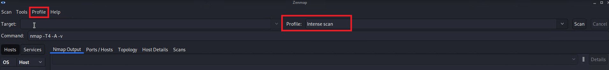
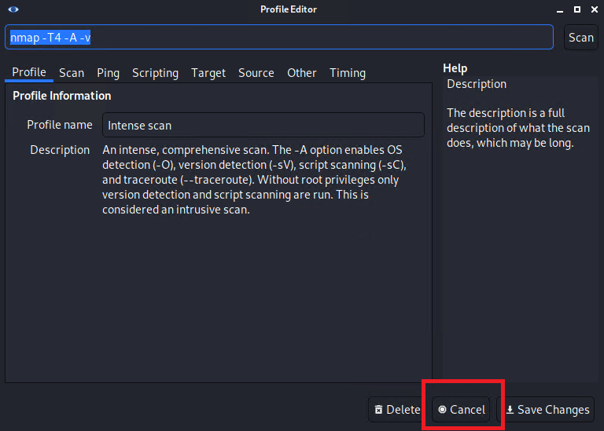
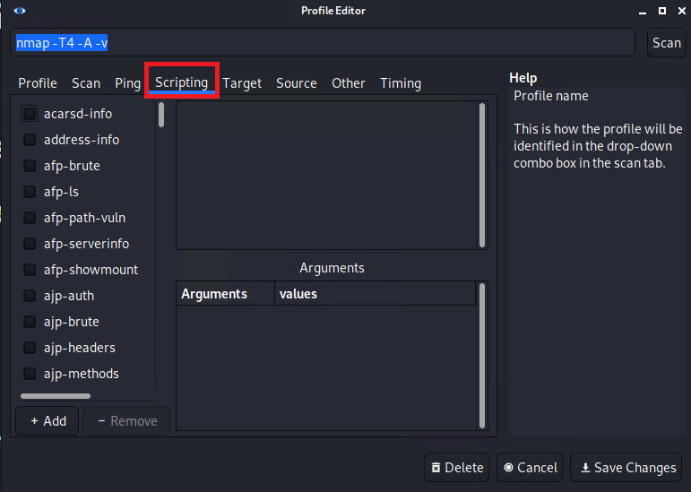

## Activity File: Zenmap & NSE Scripts

- In this activity, you will continue to play the role of a pen tester conducting an engagement on MegaCorpOne.
- Now that you are on the internal network, you'll get "the lay of the land" by performing scanning.
- You will use Zenmap and NSE scripts to build out a profile in order to perform a scan on a certain machine on the network. 

⚠️ **Reminder:** Don't forget to save your findings, as you will add them to your report on Day 4!

### Instructions

1. In Kali, launch Zenmap by typing `zenmap` in the terminal.

2. Ensure that "Intense scan" is selected next to "Profile," as the following image shows:

    

    Navigate to "Profile" > "Edit Selected Profile" to read about the intense scan profile.

3. Click "Cancel," as the following image shows:

    

4. Type in your subnet's IP range using CIDR notation (e.g., /24), and click "Scan." Wait for the scan to finish, and view the results. There is a machine of interest that has port 21 open; take note of its IP address.

5. Intense scan automatically uses certain NSE scripts based on the services discovered via the `-sC` flag. To add additional scripts, go to "Profile" > "Edit profile" > "Scripting," as the following image shows:

    

6. Scroll down to "ftp" and add "ftp-vsftpd-backdoor." Click "Save Changes." 

7. Now the intense scan profile has been edited to include these NSE scripts. In the "Target" box, enter the IP address of the machine with port 21 open, and click "Scan" to rerun the scan on that specific host.

8. Notice in the output that port 21 (FTP) is vulnerable to the backdoor exploit.

9. Save this scan by going to "Scan" > "Save Scan."

---
© 2023 edX Boot Camps LLC. Confidential and Proprietary. All Rights Reserved.

