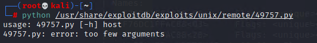

## Activity File: Exploitation

- Using Nmap and Zenmap, you have discovered a machine on MegaCorpOne's internal network, Metasploitable2, that has a service which is known to have a vulnerability associated with it. In this activity, you used a Python script to exploit this vulnerability and gain a reverse shell into the machine.

**Note:** Metasploitable2 is a purposefully vulnerable machine. You are not likely to discover something similar in a real environment.

### Instructions

1. Refer to your past Nmap or Zenmap scans, and look in the scan results for Metasploitable2. 
    - If you cannot find it by hostname, it will be the machine with the most ports open, as the following image shows:

    

2. Several of these services are exploitable. However, one is exploitable with a Python script. Using `searchsploit` in Kali, search for any exploits around the service that is **listening on port 21**. You're searching for an exploit that allows you to execute a backdoor and is written in Python.

    

    - It's important to examine scripts before running them. Some scripts require variables to be edited within the script, whereas others can have variables passed through the command line.  

3. Edit the script in nano. The path that is listed on the right is relative to the `/usr/share/exploitdb/exploits` directory, e.g., `/usr/share/exploitdb/exploits/unix/remote/xxxxx.py`, as the following image shows:

    

    - `nano /usr/share/exploitdb/exploits/unix/remote/49757.py`

4. We can tell from the two variables `args` and `host` that this script accepts the IP address of the vulnerable host as an argument, so there is no need to edit the script. The following image shows the script:

    

    Close the script using ctrl+X.

5. Run the script without any arguments to see the output of the script. 

    - `python /usr/share/exploitdb/exploits/unix/remote/49757.py`

    - The following image shows the script's output:
    
    

6. Now, pass in the host IP address as an argument, and run the script again. You should see a message saying "Success, shell opened." Type in a Linux command to check if the shell works.

    - `python /usr/share/exploitdb/exploits/unix/remote/49757.py xxx.xx.x.x`

    - The following image shows the script's output:
    
    

    - If you get a `timeout` error, rerun the command a few times and it should connect.

---
© 2023 edX Boot Camps LLC. Confidential and Proprietary. All Rights Reserved.

