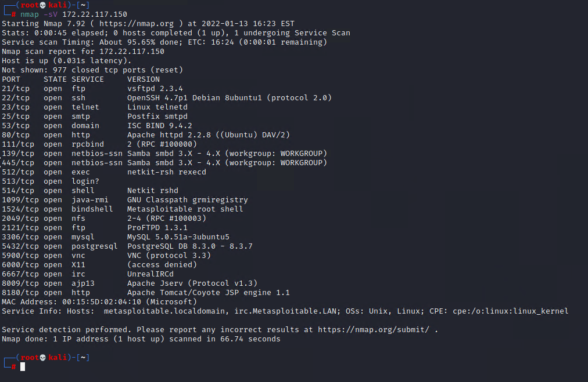

## Activity File: Metasploit Exploitation

- In this activity, you will continue to play the role of a pentester conducting an engagement on MegaCorpOne.
- Through our previous Nmap scan, we discovered several services that are exploitable. 
- MegaCorpOne has given you permission to exploit any vulnerable service you find, as long as you document your actions. 
- You are tasked with using the Metasploit framework to successfully obtain a reverse shell on the remote host using an exploit module.

Note the following:
- This activity is meant to be slightly challenging, and you will be tasked with attempting multiple exploits. 
- Some exploits may succeed and some may fail, similar to a real penetration test.
- You'll have extra time to work through this activity.
- Use the Metasploit cheat sheet to determine the appropriate commands to run.
- Make sure to use the template described later in this activity file to keep notes, because you'll use this information in later activities.

⚠️ **Reminder** - Don't forget to save your findings, as you will add them to your report on Day 4!

The following image shows the results of the Nmap scan that you ran in a previous activity: 

- :warning: **Heads Up**: Metasploit sometimes will choose a different default network adapter, which will cause exploits to not fully establish a connection back to Kali. If you encounter this, set the default LHOST via `setg LHOST 172.22.117.100`

### Instructions

Your task is to use Metasploit to exploit as many services as you can within the time limit.

- To determine what exploit to attempt, use the Nmap scan results shown in the previous image to search for potential exploits. 
   - **Hint**: Search for keyword values such as `vsftp`, `smtp_enum`, and `ssh_login`.
- One you have chosen an appropriate exploit, select (use) it.
- View and configure the required options.
- Attempt the exploit, and determine if it was successful or if it failed.

For each exploit you attempted (failed or successful), document the following:

- **Exploit**:
- **Host IP address**:
- **Port**:
- **Service name**:
- **Service version**:
- **Exploit outcome**:

For example:

- **Exploit**: exploit/multi/http/apache_mod_cgi_bash_env_exec/ 
- **Host IP address**: 172.17.0.4
- **Port**: 80
- **Service name**: HTTP
- **Service version**: Apache 2.1.3
- **Exploit outcome**: Success

For attribution purposes, it's **extremely** important to document **every** exploit attempt, even if it fails. You may attempt exploitation as many times as you'd like.

---
© 2022 edX Boot Camps LLC. Confidential and Proprietary. All Rights Reserved.

