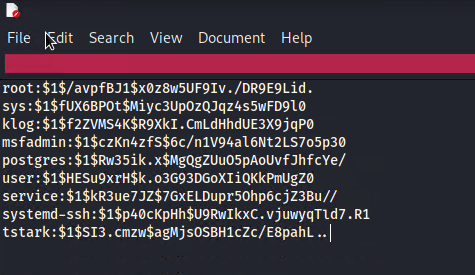
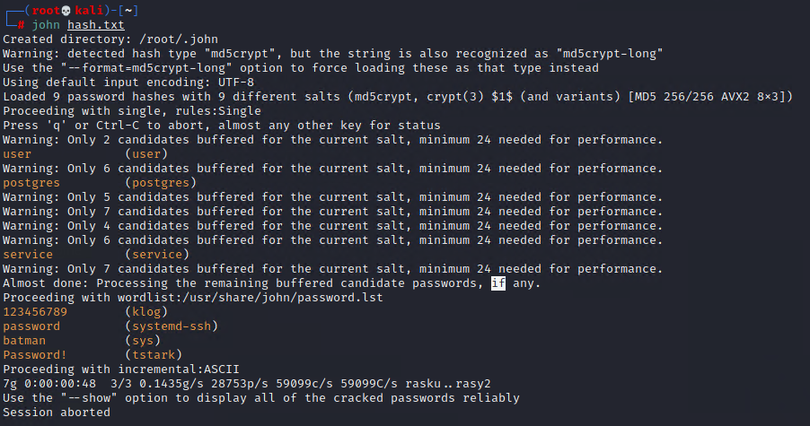

## Activity File: Password Cracking

Last lesson, you successfully elevated privileges from the daemon user to msfadmin or even root. It's important to note that even though you now have full control over the machine, enumeration is not over. We must now re-perform enumeration as a high-privileged user to see what additional information we can gather. 

One of the most fruitful files for enumeration as a high-privileged user is the `/etc/shadow` file, but know that stealing the entire file may be a waste of time. Often Linux machines have service accounts that are disabled and will serve no use. Your goal in gathering password hashes is to eventually crack the hashes for the users, some of whom may have accounts with the same password on other machines on the network. 

### Instructions 

1. SSH into the target machine using the credentials that you found during the privilege-escalation activity.

     - `ssh msfadmin@172.x.x.x` password: `cybersecurity`

2. Gather a list of active users and their password hashes.

     - `sudo ls /home` to gather list of users

     - `sudo cat /etc/shadow` to gather hashes

3. Format your hashes as such: `username:passwordhash` (e.g., `bob:$1$HESu9xrH$k.o4G93DGoXaiQKkPmUgZ0`). 

     **Note**: The hash will start with `$1$` and end before the colon (`:`).
	- 

4. Crack the hashes by using `john` and passing in the text file with the hashes as an argument (e.g., `john hashes.txt`).

     **Note**: By default, `john` uses a default wordlist. Some passwords may need an additional wordlist. In Kali, wordlists are located in the `/usr/share/wordlists` directory. Try different wordlists until you crack the password for the 'tstark' user.

     - `john --wordlist=rockyou.txt hashes.txt`		
	
	- 
	

---

© 2022 edX Boot Camps LLC. Confidential and Proprietary. All Rights Reserved.

