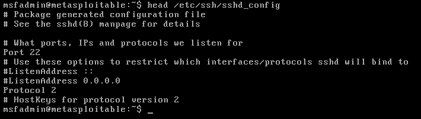
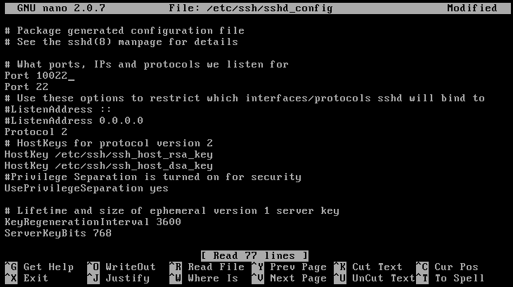
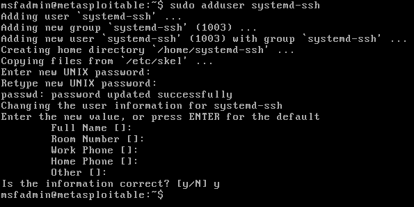

## Activity File: Persistence

In the previous activity, you dumped the `/etc/shadow` file and cracked several passwords in it. In this activity, you added an additional port for the SSH service to listen on, then opened that port on the firewall. We don't want to change the original port, 22, because that would be a red flag for administrators. 

Finally, you created an account, added it to the sudoers group, and ensured it could SSH over the new port that you specified.

**Reminder**: Ensure that you are performing the activities on the target machine and not your own assessment machine! This means you should be SSH'd in, or have a reverse/Meterpreter shell into the target.

### Instructions 

1. On the target host, read the top 10 lines of the SSH config file, located at `/etc/ssh/sshd_config`, and identify the line where a port is specified.

     - `head /etc/ssh/sshd_config`

     
   
2. Using Nano, edit the file to add an additional port, 10022. (You must `sudo` to do this.)

     - `sudo nano /etc/ssh/sshd_config`

	 

     - Due to this machine having limited services, you must restart the machine in order to restart the SSH service. Restart the machine via `sudo reboot`.

3. Now, create a new backdoor account. In order to remain inconspicuous, name this account so that it appears as if it's a service. Create a new account named "systemd-ssh", with the password "password", and then add it to the admin group. 

     - `sudo adduser systemd-ssh`

	 

     - `sudo usermod -aG admin systemd-ssh`

4. Confirm that the new account works by SSHing from your machine to the target host over port 10022 as the new user you created.

     - `ssh systemd-ssh@ipaddress`

---
© 2022 edX Boot Camps LLC. Confidential and Proprietary. All Rights Reserved.

