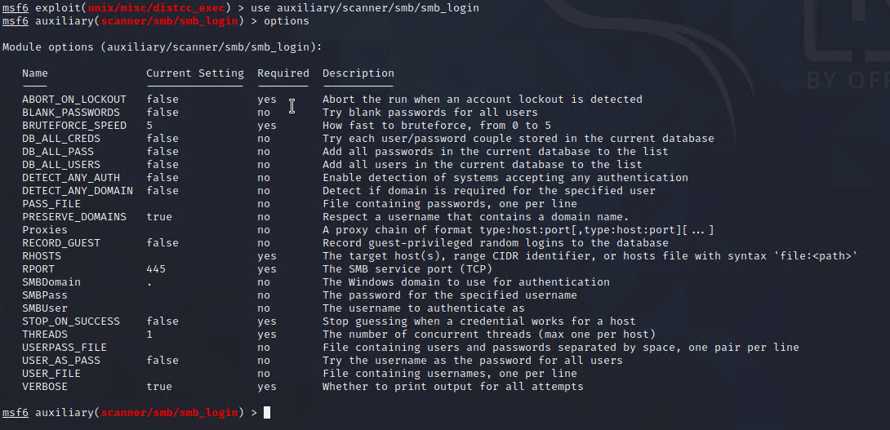
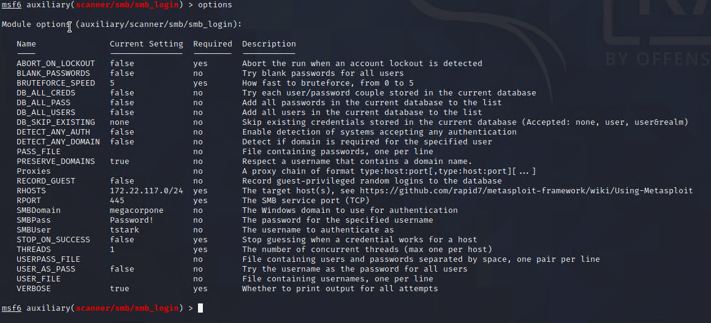

## Solution File: Windows Password Spraying

In this activity, you continued to play the role of a pen tester conducting an engagement on MegaCorpOne, performing your first attack: password spraying. 

In the previous module, you cracked several passwords belonging to the users from the /etc/shadow file on the Linux machine. Now, attempt to use those to log in to a Windows machine. The password spraying technique used the SMB protocol and a Metasploit auxiliary module for SMB logins.

- The goal of this activity was to find a working set of credentials for the target machines that you can use later on to gain access to the machine.

### Instructions

On your Kali machine, open Metasploit and load the `auxiliary/scanner/smb/smb_login` module, as the image shows.



Referencing your notes, refer back to the usernames and passwords you cracked from the /etc/shadow file on the Linux machine. Try to use each of these credentials in attempts to find a set that works on a machine. 

1. Set the SMBUser and SMBPass to a set of credentials you cracked from the /etc/shadow file. 

	```
	set SMBUser tstark
	set SMBPass Password!
	```

2. Referencing your nmap/zenmap scans, set SMBDomain to the domain of the Windows10 machine. (If the domain is lab.local, for example, the domain would just be "lab".)

	 - `set SMBDomain megacorpone`

3. Set RHOSTS to the entire subnet in CIDR notation (e.g., x.x.x.x/24).

     

4. Run the attack. What machines could it successfully log in to?

     - 172.22.117.20
	
	  

5. Open the WINDC01 VM in Hyper-V and attempt to log in with those credentials. Were you able to successfully log in?

     - No

6. What was the domain for the account you just password sprayed?

     - megacorpone

---
&copy; 2023 edX Boot Camps LLC. Confidential and Proprietary. All Rights Reserved.


