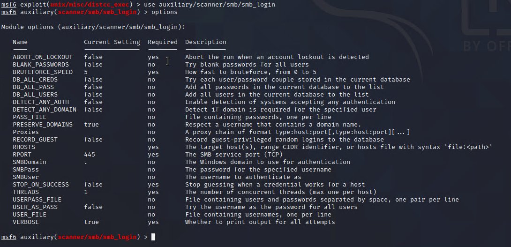
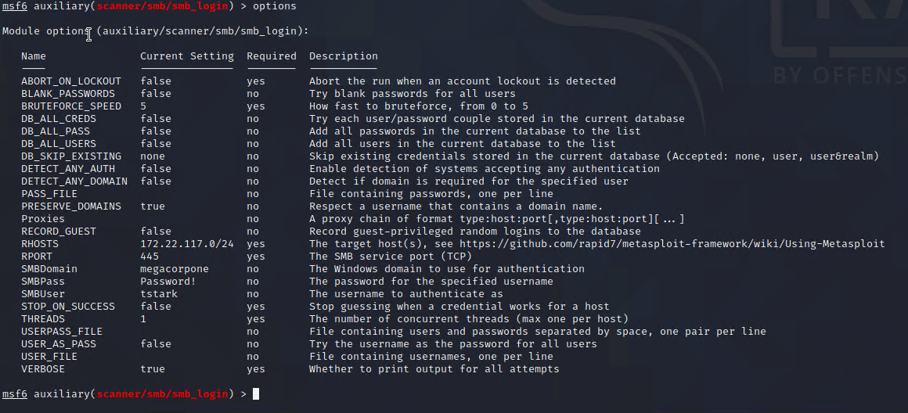

## Activity File: Windows Password Spraying

In this activity, you will continue to play the role of a pen tester conducting an engagement on MegaCorpOne. Now that you've recognized which machines on MegaCorpOne's network are Windows machines, you will perform your first attack: password spraying. 

In the previous module, you cracked several passwords belonging to the users from the /etc/shadow file on the Linux machine. Now, you'll attempt to use those to log in to a Windows machine. The password spraying technique will use the SMB protocol and a Metasploit auxiliary module for SMB logins. Since you will attempt to log in to a domain account, Windows will perform Kerberos authentication.

- You will use Metasploit to perform a password spray attack on the Windows machines that you discovered from your Nmap scans. 

- The goal of this activity is to find a working set of credentials for the target machines that you can use later on to gain access to the machine.

⚠️ **Reminder** - Don't forget to save your findings, as you will add them to your week 17 Homework!

### Instructions

On your Kali machine, open Metasploit and load the `auxiliary/scanner/smb/smb_login` module, as the image shows:

Referencing your notes, refer back to the usernames and passwords you cracked from the /etc/shadow file on the Linux machine. You will try to use each of these credentials in attempts to find a set that works on a machine. 

1. Set the SMBUser and SMBPass to a set of credentials you cracked from the /etc/shadow file. 

2. Referencing your nmap/zenmap scans, set SMBDomain to the domain of the Windows10 machine. (If the domain is lab.local, for example, the domain would just be `lab`.)

3. Set RHOSTS to the entire subnet in CIDR notation (e.g., x.x.x.x/24).

     

4. Run the attack. What machines could it successfully log in to?

5. Open the WINDC01 VM in Hyper-V and attempt to log in with those credentials. Are you able to successfully log in?

6. What is the domain for the account you just password sprayed?

---
&copy; 2023 edX Boot Camps LLC. Confidential and Proprietary. All Rights Reserved.

