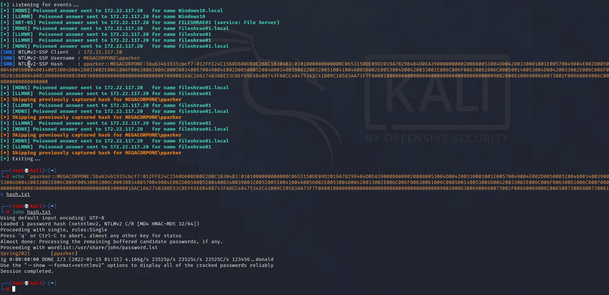

## Solution File: LLMNR Spoofing

In this activity, you performed LLMNR spoofing in order to retrieve a set of credentials for another domain user, which you cracked offline with John the Ripper.

- You used a tool called Responder to listen for LLMNR requests and spoof responses to unsuspecting victims on the network. 

### Instructions

1. In Ubuntu, begin by stopping the the `nginx` service by running the following command:  `sudo systemctl stop nginx`
     - Note: This will prevent any conflicts with port 80.
2. Next, launch a new terminal and run `Responder` as sudo while passing in `eth1` as the device to use:

     - `sudo Responder -I eth1 -v`
	
	 - Responder will now listen for LLMNR broadcasts from all devices on the network.
	
3. Wait for Responder to receive the incoming LLMNR broadcast. 

	 - Once the request is received, Responder automatically replies with an NTLM challenge asking for the password hash of the requesting user. Windows10 receives this reply and responds with the NTLMv2 hash of the user. 
	
	 - If no hashes are captured within five minutes, restart the Windows10 machine.
         - Also, you can find the results of the NTLMv2 hash in the `/Responder/logs` directory.
            - The hash will be in the log record that begins with `SMB....`
	
4. Once the password hash has been retrieved, copy it into a text file and crack it with `john`.

   

---
&copy; 2023 edX Boot Camps LLC. Confidential and Proprietary. All Rights Reserved.

