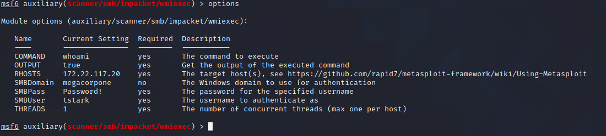
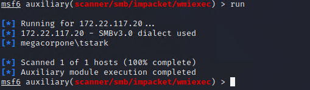
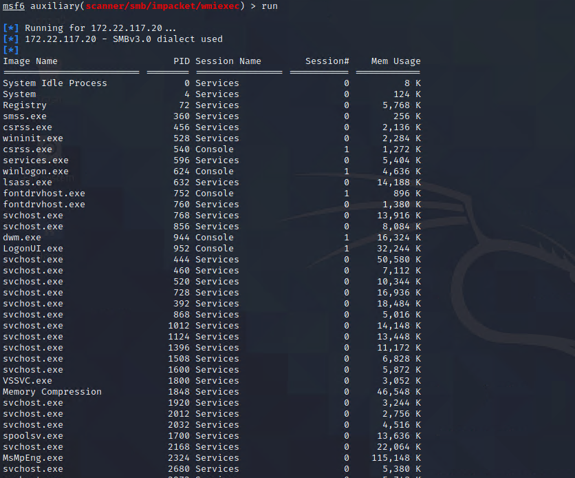

## Activity File: WMI

In this activity, you leveraged two sets of credentials and used a Metasploit module in order to run commands on the remote machine.

### Instructions

1. In Kali, open a terminal and start Metasploit (if not already started), then load the `scanner/smb/impacket/wmiexec` module.

2. View the options for the module, and set the RHOSTS, SMBDomain, SMBPass, and SMBUser fields to the target IP and credentials that you verified from password spraying.

	 

3. Set the COMMAND parameter to "whoami."

     - `set COMMAND whoami`

4.  Run the module. You should see the output "megacorpone\tstark", as the image shows:

	 
	

5. Change the COMMAND parameter to list the processes. 

    
     - `set COMMAND tasklist`

     - The following image shows the output:

	 

6. Using other commands, answer the following questions:

	1. What is the version and build number of Windows?
	
		- `systeminfo`
		
		- 10.0.19042 Build 19042
	
	2. What processor architecture is the machine?
	
		- `systeminfo`
		
		- x64
	
	3. Are there any users logged in?
		
		- `net session`
		
		- No
	
	4. What shares are available on the machine?
	
		- `net share`
		
		- C$, IPC$, ADMIN$

---
&copy; 2023 edX Boot Camps LLC. Confidential and Proprietary. All Rights Reserved.

