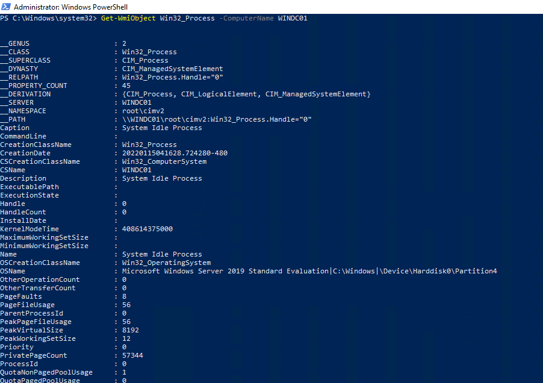
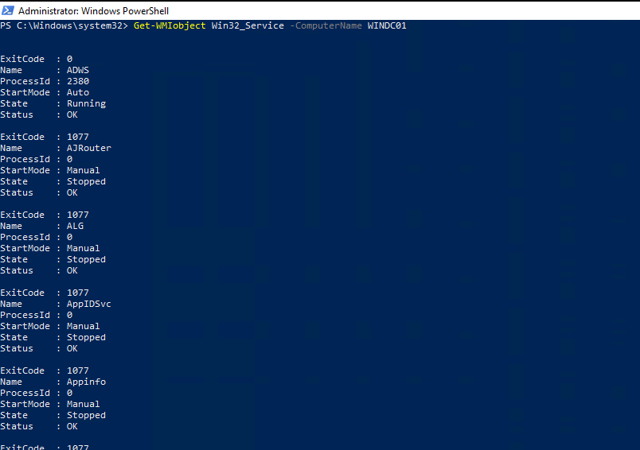

##  17.1 Lesson Plan: Introduction to Windows Penetration Testing

### Overview

In today's class, students will review the previous module, Linux penetration testing, and then be introduced to this module's topic: Windows penetration testing. We will cover Windows port scanning, initial access for Windows, and exploitation. The day will finish with students running a Meterpreter shell on a Windows workstation.

### Class Objectives

By the end of class, students will be able to:

- Discern the differences between Windows and Linux penetration testing
- Explain what ports a Windows machine commonly has open
- Explain how Windows authentication works
- Perform poisoning or spoofing attacks on a Windows network

### Instructor Notes

- Today's class will be very fast-paced and cover a lot of technical information. Be sure to pause after introducing new topics to answer any questions.

### Lab Environment

For this module, you will use the **Pen testing 2** lab environment located in Windows Azure Lab Services. RDP into the Windows RDP Host machine using the following credentials:

  - RDP login credentials for labs provisioned prior to 9/12/23
    - Username: `azadmin`
    - Password: `p4ssw0rd*`
  - RDP login credentials for labs provisioned after 9/12/23
    - Username: `azadmin`
    - Password: `p@ssw0rdp@ssw0rd`

The credentials to the Hyper-V VMs are as follows:

| Virtual Machine | Username | Password |
|-----------------|----------|----------|
| Ubuntu            |sysadmin|p4ssw0rd*|
| Windows 10 |.\Administrator|Topsecret!|
| WINDC01 | Administrator|Topsecret!

### Module Checklist

Before beginning to prep this week's lesson, be sure you have the following accessible within your lab. Notify the curriculum team as soon as possible if any of the following is not available.

- [x] Ubuntu
- [x] Windows 10
- [x] WINDC01 

### Slideshow

The lesson slides are available on Google Drive here: [17.1 Slides](https://docs.google.com/presentation/d/1kmtfy2GITMYpRtMWpfM-Y3HfW3-Aq_Cm9QDfy0Tv2Zo/). 

- **Note:** Editing access is not available for this document. If you or your students wish to modify the slides, please create a copy by navigating to **File** > **Make a copy**.

### Time Tracker

The time tracker is available on Google Drive here: [17.1 Time Tracker](https://docs.google.com/spreadsheets/d/1BZPEnRG47XfYcPDV_fIJ3InD9S94CJkzQs4rprkq3hg/edit#gid=0). 

### Student Guide

Share the student-facing version of this lesson plan after class: [17.1 Student Guide](studentguide.md).

-------

### 01. Instructor Do: Welcome and Intro to Windows Penetration Testing (0:05)

Welcome students to class and remind them that last week, we introduced penetration testing, with a focus on **Linux**. This week, in the second penetration testing module, we will shift our focus to **Windows**.

Point out that while it is important for penetration testers to be able to conduct tests against Linux machines, the majority of enterprises use Windows Server to run their businesses. Therefore, understanding and determining vulnerabilities within Windows systems is an important skill for a penetration tester.

#### Linux vs Windows Penetration Testing Methodology

In order to engage in a Windows penetration test, we will use the same pen testing methodology that we used for Linux. However, we will employ different techniques to conduct our tactics. 

- Review the following terms:
  -  A **tactic** is a specific step in penetration testing. In MITRE, examples of tactics are:
     * Reconnaissance
     * Initial access
     * Execution
     * Persistence
     * Privilege escalation

  - A **technique** is the way in which a specific tactic is carried out. 
      - For example, in the previous module, we used the execution tactic to gain a reverse shell. 
      - The specific technique that we used for that tactic was [T1203](https://attack.mitre.org/techniques/T1203/) (exploitation for client execution). 
      - In other words, we exploited a bug in code for a service (dist_cc).

- **Instructor Note:** Students may ask about the difference between the MITRE tactics **initial access** and **execution**:
  - While we used execution (remind them of the Metasploit module) to gain initial access on a machine, execution is not always used for initial access. 
  - For example, if we use another execution technique to gain access to a different machine on the network, it is not considered initial access. Only the first foothold within a network is considered initial access.

Inform students that, today, we'll cover some technical material and take an accelerated approach to the penetration testing stages we've already learned about. 

- Today, we'll specifically cover:
    * Port scanning
    * Authentication
    * Password spraying
    * Protocol spoofing
    * Exploitation and initial access
 
Emphasize that this module's topic is advanced and challenging, and it's normal for students to have questions and need clarification. Remind students that it's very important to ask any questions they have as we go, before proceeding to the next section.

### 02. Instructor Do: Linux, Windows, Ports, and Protocols (0:10)

The first half of this boot camp was intended to teach students about the inner workings of Linux and Windows. 
- In order to exploit a weakness, they must first technically understand the target. 
- By learning how to be a system administrator for either Linux or Windows machines, they learned how the operating systems are different and how to potentially identify weaknesses in each. 

#### Linux vs. Windows Technical Differences

Ask students, "Technically, how can a penetration test between Linux and Windows machines differ?"

Point out the following answers:
* Because of Active Directory (AD), passwords are more reusable throughout a Windows network.
* The software and services will be different, which introduces different potential exploits.
* Windows is much more prevalent in corporate environments.
* Permissioning is different (e.g., no sudo in Windows).
* Ports and protocols are very different.
* Authentication protocols are different.

#### Windows Ports and Protocols

Explain the following differences in Windows ports:

- Windows commonly uses different ports from Linux when operating in a network. 

- Knowledge of these common ports is important, as it can help differentiate a port scan's results and inform the pen tester which systems are on the network.

  - For example, port 22 (SSH) is a common port to find open on a Linux machine. It's the protocol that is used for remotely accessing and administrating Linux. Windows does not natively have SSH as an installed service. Instead, it relies on other protocols such as SMB (port 445) and Remote Desktop Protocol (RDP, port 3389) to be accessed remotely.

- An overwhelming majority of enterprises use Windows AD for directory services, which includes the administration of users, computers, and policies. 
  - Therefore, AD needs several ports open to properly communicate between the domain controller (DC) and workstations on the network. Two required ports for AD to work properly are:
    * Port 445: SMB 
    * Port 135: RPC
    
- It is necessary to have these ports open for a number of reasons:
  - For example, when a new change is made to a group policy in AD, workstations on the network that are connected to AD will reach out to the DC over ports 445 and 135 to retrieve the group policy update. 
  - This policy update could be anything from adding a registry key to updating the password complexity requirements. 
  
- In addition to ports 445 and 135, port 88 is also required. Port 88 is the port that Kerberos uses, which is the primary form of authentication in AD. 
  - We will cover authentication and Kerberos later today. 

Remind students that knowledge of ports that are required by AD and Windows machines can help identify the type of network you're on and what specific tactics and techniques you can perform in order to compromise the network. 

In the next activity, students will revisit the scanning phase of their engagement&mdash;this time for scanning windows machines.
- Ask the class if they have any questions before proceeding to the activity.
 
### 03. Student Do: Port Scanning (0:10)

Explain the following to students:

- In this activity, you will continue to play the role of a pen tester conducting an engagement on MegaCorpOne.
- After compromising a Linux server in MegaCorpOne's internal network, you now turn your focus to Windows machines.
- Since it's been a week since the last port scan, we will reconduct scanning in order to determine if any Windows machines are on the network.
- Remember that Windows has different services and ports open from Linux.

Send students the following file:

- [Activity File: Windows Port Scanning](Activities/01_WindowsPortScanning/Unsolved/README.md)

Answer any questions before students start the activity.

### 04. Instructor Review: Port Scanning (0:10)

The purpose of this activity was for students to determine whether there were any Windows machines on the network.

- Once we have a Windows target, we'll progress with Windows-specific attacks.

Send students the following solution guide and use it to review the activity:

- [Solution Guide: Windows Port Scanning](Activities/01_WindowsPortScanning/Solved/README.md) 

### 05. Instructor Do: Windows Authentication and Password-based Attacks(0:20)

:warning: **Instructor Note:** :warning: This section is a review of Windows authentication from the Windows module. Take it slowly, because Windows authentication is a very complicated process and vital to know in order to perform the upcoming attacks we'll perform. 

Remind the class that we just completed the scanning phase of a Windows penetration test to determine the open ports and protocols. Next, we will cover a password-based attack on a Windows machine.

- Before we perform this password attack on a Windows machine, it's very important to understand how authentication works in Windows. 

- Point out the two primary types of authentication in Windows:
  - **Windows New Technology LAN Manager (NTLM)**
  - **Kerberos**

- Kerberos is the default protocol for authentication in Windows and is heavily used in AD. If Kerberos authentication is not possible, then Windows falls back to NTLM. 

Let's examine the difference between the two. 

#### NTLM

**Windows NTLM** is a "challenge&ndash;response" protocol and occurs in a three-step method:

1. Negotiation message from the client
2. Challenge message from the server
3. Authentication message from the client

This process is visualized in the slide deck.

At a more detailed level, the process involves the following steps:

1. The user shares their username, password, and domain name with the client.
2. The client develops a scrambled version of the password, or hash, and deletes the full password.
3. The client passes a plain-text version of the username to the relevant server.
4. The server replies to the client with a challenge, which is a 16-byte random number.
5. In response, the client sends the challenge encrypted by the hash of the user's password.
6. The server then sends the challenge, response, and username to the DC.
7. The DC retrieves the user's password from the database and uses it to encrypt the challenge.
8. The DC then compares the encrypted challenge and client response. If these two pieces match, the user is authenticated and access is granted.

NTLM was replaced by Kerberos in Windows 2000 and beyond due to several insecurities. 
- NTLM password hashes were not salted, meaning that a random string of characters was not added to the hashed password to further protect it from cracking techniques. 
- Therefore, NTLM passwords could easily be brute-forced.

#### Kerberos

**Kerberos** differs from NTLM by using a ticketing system instead of a three-step method. 

In Kerberos, when the user wants to authenticate to the domain: 

1. The user sends a message to the DC with the ID of the user, the ID of the requested service, and the client network address (IP). 
2. This message is encrypted with the password hash of the user and a timestamp. The message is sent in the form of an AS-REQ (authentication service request). 
3. The DC, also known as the key distribution center (KDC), receives the user's request and checks the username. It then looks up the user's password hash and attempts to decrypt the message using the password hash. If it successfully decrypts the message, the DC knows the user supplied the correct password. 
4. The DC then responds to the message with a Ticket Granting Ticket (TGT). This TGT is proof to the DC that the user is who they say they are. This response is called the AS-REP (authentication service reply).

This process is visualized in the slide deck.

Explain the following analogy to illustrate Kerberos:
* You go to a bar that has a bouncer outside the door. 
* You approach the bouncer with your ID, proving that you are 21. (This is the initial message, AS-REQ.)
* The bouncer checks your ID to see if it is legitimate and then verifies that you are 21. (This is checking the user's password hash.) 
* If it all checks out, the bouncer stamps your hand and you're permitted to enter (AS-REP). 
* If you leave the bar and re-enter, you don't have to show your ID again and instead just show the stamp on your hand. 

Most commonly, NTLM authentication is used for *local* accounts and Kerberos is used for *domain* accounts.
- This is because normal Windows workstations and non-DC servers are not KDCs and cannot process Kerberos tickets.

Explain to students that the reason we need to know how authentication is performed in Windows is because the first attack we will learn about is a **brute force** password attack. 

#### Password-based Attacks

Explain the following about **local accounts**:

- Since local accounts use NTLM authentication, it's possible to guess passwords for a local account without having to interact with any DCs. 
- Local passwords are stored in the Security Account Manager (SAM) database. 
- When a local user tries to authenticate to their own computer, that computer, rather than a separate machine, is responsible for issuing and verifying the challenge to check if the password is correct. 
- This allows an attacker to freely attempt to log in to an account by attempting multiple passwords. This is known as a **brute force attack**.

Pause and ask students if they can think of a potential problem when brute-forcing passwords.
  - **Answer:** Local accounts, by default, do not disable an account from logging in due to a bad password. However, events are still generated by Windows for each failed login attempt, even for local accounts. If a blue team member is monitoring these logins, it's very apparent when an attack is occurring. We will investigate this type of attack from a blue team perspective in a later module.

Explain the following about **domain accounts**:

- Successfully brute-forcing a domain account in Windows is less likely due to the default group policy that locks out an account after five bad password attempts. 
- Instead, **password spraying** is a more common attack for domain accounts (which use Kerberos). 
- Password spraying involves using a single password against a list of usernames. 

- Pause and ask students if they can guess any common passwords that can be useful in a password spray attack.

  - Answer: 
    * SeasonYear (e.g., Spring2021)
    * Any variation of the word "password" (e.g., Passw0rd, pa$$worD, p@ssword)
    * PresidentYear
    * LetMeIn
    * ILoveYou

Point out that because of default password complexity requirement, in most cases you need to meet a length limit and include one special character. 

#### Summary

Summarize the concepts covered in the preceding sections:

- Penetration testing methodologies are the same for Windows and Linux. 

- The major difference between Linux and Windows pen testing is the techniques used to achieve tactics.
   -  A **tactic** is a specific step in penetration testing. 
    - A **technique** is how a specific tactic is carried out. 

- Technical differences between Linux and Windows penetration testing include software, services, permissioning, ports, and protocols and inform how we must proceed with an engagement.

- Enterprises with Windows often use Windows AD for directory services, which includes the administration of users, computers, and policies. 
  - AD needs several ports open to properly communicate between the DC and workstations on the network. 
  - Two required ports for AD to work properly are port 445 (**SMB**) and port 135 (**RPC**).

- The two primary types of authentication in Windows are:
  - **NTLM**,  a "challenge&ndash;response" protocol that works in three steps, used primarily for local accounts
  - **Kerberos**,  a protocol that uses a ticketing system for authentication, used primarily for domain accounts
    - Kerberos is the default protocol for authentication in Windows and is heavily used in AD. 
    - If Kerberos authentication is not possible, then Windows falls back to NTLM. 
- **Brute force attacks** are the password attacks used against local accounts.
- **Password spraying** is the password attack used against domain accounts.
   - Password spraying involves getting a list of usernames and attempting a single password for those accounts. 

Explain that in the following activity, students will attempt to conduct a password spraying attack against MegaCorpOne's Windows machine.

Ask the class if they have any questions before proceeding to the activity.

### 06. Student Do: Password Spraying (0:20)

Explain the following to students:

- In this activity, you will continue to play the role of a pen tester conducting an engagement on MegaCorpOne.
- Now that you've recognized which machines on MegaCorpOne's network are Windows machines, you will perform your first attack: **password spraying**.
- In the previous module, you cracked several passwords belonging to the users from the /etc/shadow file on the Linux machine. Now, you'll attempt to use those to log in to a Windows machine.
- The password spraying technique will use the SMB protocol and a Metasploit auxiliary module for SMB logins.
- Since you will attempt to log in to a domain account, Windows will perform Kerberos authentication.

Send students the following file:

- [Activity File: Windows Password Spraying](Activities/02_PasswordSpray/Unsolved/README.md)

Answer any questions before students start the activity.

### 07. Instructor Review: Password Spraying (0:10)

The purpose of this activity was to attempt to find a set of credentials that works on a machine that is connected to the domain. 

- We've discovered one way to gain initial access onto a Windows machine; in the next activity, we will explore another way.

Explain to students that even though the Metasploit module said the credentials worked on both Windows 10 and WINDC01, they received an error when trying to log in to the WINDC01 machine.
- This is because, by default, any authenticated domain user can read the SYSVOL share on a DC. 
- The SYSVOL share contains things like group policies, which needs to be reachable by authenticated users and machines. 
- So, even though the Metasploit module reported back a successful login, it really was only able to access the SYSVOL share over SMB instead of validating the credentials actually working from a logon perspective.

Point out that, typically, this behavior of false positives is only applicable to DCs. 

Send students the following solution guide and use it to review the activity:

- [Solution Guide: Windows Password Spraying](Activities/02_PasswordSpray/Solved/README.md)

### 08. Break (0:10)

### 09. Instructor Do: LLMNR Poisoning (0:15)

Remind the students that we just conducted a password spraying attack to determine working credentials for a machine connected to a domain. 

- Explain to students that there's another way of getting credentials to a domain account without the need for brute force or password spraying. It involves taking advantage of an older protocol, **Local Link Multicast Name Resolution (LLMNR)**, that is left on in the default group policy. 

Introduce **LLMNR** by covering the following:
- The protocol is meant to serve as a local backup for DNS.
- LLMNR is a broadcast protocol, meaning an LLMNR request is sent out to the entire network instead of going to a single host.

Attackers can take advantage of this protocol by:
  - Listening for LLMNR request broadcasts on the network and spoofing (faking) a response to the request
  - Then asking for the requesting computer to complete a password challenge

Explain the following steps of this attack:

1. The attacker listens for LLMNR requests on the network.
2. An unsuspecting victim on a Windows machine tries to visit a network share that doesn't exist or makes a typo trying to visit an existing one.
3. The victim's computer first goes to the DNS server and asks if it knows where the network share is. If it doesn't know, it moves on to the DHCP server and asks if it knows.
4. If the DHCP server doesn't know, it sends out an LLMNR broadcast to the entire network, asking if any other machines know where the file share is. 
5. The attacker receives this request and responds to it by asking the computer to authenticate by encoding a challenge with the user's password.
6. Once the attacker receives the challenge encoded with the password, it responds to the computer with an error, which ends the communication. The attacker now has the victim's password, which they can crack offline.

Explain that while this technique is quite old, it is still very relevant. Additionally, there are other broadcast protocols that can be taken advantage of. 
  
For the following activity, we will perform LLMNR spoofing and crack the hashed password we receive. 

Ask the class if they have any questions before proceeding to the activity.

### 10. Student Do: LLMNR Spoofing (0:20)

Explain the following to students:

- In this activity, you'll continue to play the role of a pen tester conducting an engagement on MegaCorpOne.
- While we successfully performed password spraying and found a set of credentials that works on a domain-joined machine, we want to see if we can find any other accounts through other methods.
- You will perform LLMNR spoofing in order to retrieve a set of credentials for another domain user, which you will crack offline with John the Ripper.

Additional tips:

- As penetration testers, you're hired to test any potential security flaws in the network. 
- While you have discovered one way of access, there may also be another. 
- Therefore, you should not stop looking for other vulnerabilities after you've found one. 

Send students the following file:

- [Activity File: LLMNR Spoofing](Activities/03_LLMNR/Unsolved/README.md)

Answer any questions before students start the activity.

### 11. Instructor Review: LLMNR Spoofing (0:10)

Explain that the purpose of this activity was to learn an additional way of gathering credentials on the network.

- Point out that in the previous activity, we performed password spraying and found a domain account that works. With LLMNR poisoning, we were able to gather credentials to another domain account. 

- Ask students what the potential advantages are of having multiple compromised accounts.

Send students the following solution guide and use it to review the activity:

- [Solution Guide: LLMNR Spoofing](Activities/03_LLMNR/Solved/README.md)

### 12. Instructor Do: Windows Exploitation and WMI (0:15)

Explain to students that the concept of exploitation for Windows is similar to Linux. In order to compromise a Windows machine, we will look at any vulnerable services on the system that can be exploited and leverage legitimate tools and services for Windows. 

Remind the class that earlier in the boot camp, we used a tool called **WMIC** to allow users to query a large range of system information and diagnostics, including information on the operating system and hard disks.

- There is a similar, but more powerful, tool with more capabilities called **Windows Management Instrumentation (WMI)**, which is anoter Microsoft tool created with the intention to remotely administrate Windows machines.

#### WMI

Introduce **WMI** by covering the following:

- During our Windows lesson, we used WMIC with the Windows command line. With WMI, we run commands with Powershell. 
- Similar to how most Linux machines are managed over SSH, Windows machines can be managed remotely via WMI.
- WMI operates over RPC, which is port 135. 
- Because WMI operates on port 135, which is also used for communication for AD, a port scan against the Windows machine does not show the service WMI on port 135, as WMI simply leverages the RPC protocol on that port for communications. 
- WMI is a default tool installed on Windows.

Share the documentation for WMI with students: [Microsoft | Docs: Working with WMI](https://docs.microsoft.com/en-us/powershell/scripting/learn/ps101/07-working-with-wmi?view=powershell-7.1)

#### WMI Demo

In this demonstration, we will use WMI as it is intended to be used by a system administrator. In the upcoming activity, students will use the Metasploit module for WMI. In order to do this, it's important to understand how the tool operates legitimately.

1. Log in to the Windows 10 machine with the following credentials: `bbanner`:`Winter2021`

2. Open PowerShell as Administrator, and explain that WMI has its own set of PowerShell cmdlets. 

3. Inform students that as a system administrator, you may want to see the running processes of a remote machine. Gather the remote processes on the WINDC01 machine:

     - `Get-WmiObject Win32_Process -ComputerName WINDC01`

     - The following image shows the results:
	 
	 
     
4. This can be better viewed by using PowerShell variables. Put the output of the command into a variable, then specifically view the `.Name` property to view all the processes' names:

     - ` $list = Get-WmiObject Win32_Process -ComputerName WINDC01`
  
       `$list.Name`
  
     - The image shows the results:
	 
	 

5. An additional task a system admin can perform is viewing what services are listening. Inform students that you can directly get a list of services on the remote machine with WMI:

     - `Get-WmiObject Win32_Service -ComputerName WINDC01`

     - The following image shows the results:

     

#### Summary

Summarize the concepts covered in the preceding sections:

- **Local Link Multicast Name Resolution (LLMNR)** is a broadcast protocol, meaning an LLMNR request is sent out to the entire network instead of going to a single host.

- **LLMNR poisoning** is a way of getting credentials to a domain account without the need for brute force or password spraying. 
   - It involves taking advantage of **LLMNR** protocol, which is left on in the default group policy. 
   - Attackers can take advantage of this protocol by:
     - Listening for LLMNR request broadcasts on the network and spoofing (faking) a response to the request
     - Then asking for the requesting computer to complete a password challenge

 - A powerful Microsoft tool called **Windows Management Instrumentation (WMI)** is used to remotely administer Windows machines.
   - Similar to how most Linux machines are managed over SSH, Windows machines can be managed remotely via WMI.
   - WMI operates over RPC, which is port 135. 

Explain that in today's final activity, students will attempt to use a Metasploit module with WMI to run commands remotely on the target machine.

Ask the class if they have any questions before proceeding to the activity.

### 13. Student Do: Windows Exploitation (0:15)

Explain the following to students:

- In this activity, you will continue to play the role of a pen tester conducting an engagement on MegaCorpOne.
- Now that you have two sets of credentials, you will leverage these credentials and use a Metasploit command in order to run commands on the remote machine.
- You will be provided instructions to gather information on your target machine.

Send students the following file:

- [Activity File: WMI](Activities/04_WMI/Unsolved/README.md)

Answer any questions before students start the activity.

### 14. Instructor Review: Windows Exploitation Review (0:10)

The purpose of this activity was to gain the ability to run remote code on the target machine.

- Inform students that we will expand on this ability in order to get a shell on the machine in the next class.

Send students the following solution guide, and use it to review the activity:

- [Solution Guide: WMI](Activities/04_WMI/Solved/README.md)

### 15. Wrap-up

We've covered a large amount of technical information related to:

- Windows ports and system information
- Code execution techniques with WMI

Explain that in the next class, we will continue with Windows exploitation by obtaining access to the Windows machine.

-------

&copy; 2023 edX Boot Camps LLC. Confidential and Proprietary. All Rights Reserved.  
