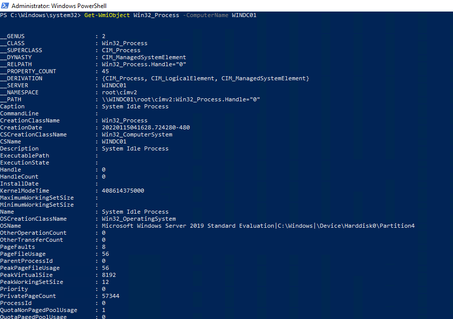
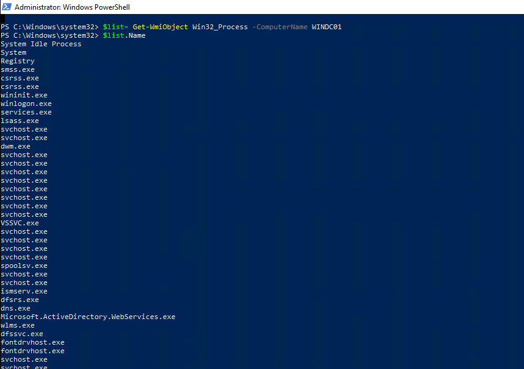
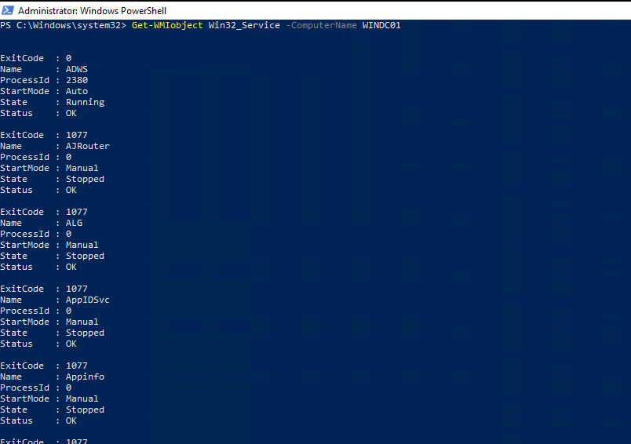

##  17.1 Student Guide: Introduction to Windows Penetration Testing

### Overview

In today's class, we'll review the previous module, Linux penetration testing, and then move into this module's topic: Windows penetration testing. We'll cover Windows port scanning, initial access for Windows, and exploitation. The day will finish by running a Meterpreter shell on a Windows workstation.

### Class Objectives

By the end of class, you will be able to:

- Discern the differences between Windows and Linux penetration testing.
- Explain what ports a Windows machine commonly has open.
- Explain how Windows authentication works.
- Perform poisoning or spoofing attacks on a Windows network.

### Slideshow

The lesson slides are available on Google Drive here: [17.1 Slides](https://docs.google.com/presentation/d/1kmtfy2GITMYpRtMWpfM-Y3HfW3-Aq_Cm9QDfy0Tv2Zo/). 

-------

### 01.  Welcome and Intro to Windows Penetration Testing

Last week, we introduced penetration testing, with a focus on **Linux**. This second penetration testing module shifts the focus to **Windows**.

While it is important for penetration testers to be able to conduct tests against Linux machines, the majority of enterprises use Windows Server to run their business. Therefore, understanding and determining vulnerabilities within Windows systems is an important skill for a penetration tester.

#### Linux vs. Windows Penetration Testing Methodology

In order to engage in a Windows penetration test, we use the same pen testing methodology as for Linux. However, we'll employ different techniques to conduct our tactics. 

Let's review the following terms:
-  A **tactic** is a specific step in penetration testing. In MITRE, examples of tactics are:
   * Reconnaissance
   * Initial access
   * Execution
   * Persistence
   * Privilege escalation

- A **technique** is the way in which a specific tactic is carried out:
    - For example, in the previous module, we used the execution tactic to gain a reverse shell. 
    - The specific technique that we used for that tactic was [T1203](https://attack.mitre.org/techniques/T1203/) (exploitation for client execution). 
    - In other words, we exploited a bug in code for a service (dist_cc).

- **Note:** You may be curious about the difference between the MITRE tactics **initial access** and **execution**:
  - While we used execution (Metasploit module) to gain initial access on a machine, execution is not always used for initial access. 
  - For example, if we use another execution technique to gain access to a different machine on the network, it would not be considered initial access. Only the first foothold within a network is considered initial access.

In this lesson, we'll cover some technical material and take an accelerated approach to the penetration testing stages that we've already learned about. 

We'll specifically cover:
* Port scanning
* Authentication
* Password spraying
* Protocol spoofing
* Exploitation and initial access

### 02. Linux, Windows, Ports, and Protocols 

In the first half of this boot camp, you learned about the inner workings of Linux and Windows. 
- In order to exploit a weakness, you must first understand the target technically. 
- By learning how to be a system administrator for either Linux or Windows machines, you learned how the operating systems are different and how to potentially identify weaknesses in each. 

#### Linux vs. Windows Technical Differences

Technically, how can a penetration test between Linux and Windows machines differ?

* Because of Active Directory (AD), passwords are more reusable throughout a Windows network.
* Software and services are different, which introduces different potential exploits.
* Windows is much more prevalent in corporate environments.
* Permissioning is different (e.g., no sudo in Windows).
* Ports and protocols are very different.
* Authentication protocols are different.

#### Windows Ports and Protocols

- Windows commonly uses different ports from Linux when operating in a network. 

- Knowledge of these common ports is important, as it can help differentiate a port scan's results and inform the pen tester which systems are on the network.

  - For example, port 22 (SSH) is a common port to find open on a Linux machine. It's the protocol that is used for remotely accessing and administrating Linux. Windows does not natively have SSH as an installed service. Instead, it relies on other protocols such as SMB (port 445) and Remote Desktop Protocol (RDP, port 3389) to be remotely accessed.

- An overwhelming majority of enterprises use Windows AD for directory services, which includes the administration of users, computers, and policies. 
  - Therefore, AD needs several ports open to properly communicate between the Domain Controller (DC) and workstations on the network. Two required ports for AD to work properly are:
    * Port 445 (SMB) 
    * Port 135 (RPC)
    
- These ports must be open for a number of reasons:
  - For example, when a new change is made to a group policy in AD, workstations on the network that are connected to AD will reach out to the DC over ports 445 and 135 to retrieve the group policy update. 
  - This policy update can be anything from adding a registry key to updating the password complexity requirements. 
  
- In addition to ports 445 and 135, port 88 is also required. Port 88 is the port that Kerberos uses, which is the primary form of authentication in AD. 
  - We'll cover authentication and Kerberos later in this lesson. 

Knowledge of ports that are required by AD and Windows machines can help identify the type of network you're on and what specific tactics and techniques you can perform in order to compromise the network. 

In the activity that follows, you'll revisit the scanning phase of your engagement&mdash;this time for scanning Windows machines.

 
### 03. Port Scanning Activity

- [Activity File: Windows Port Scanning](Activities/01_WindowsPortScanning/Unsolved/README.md)

### 04. Port Scanning Review

- [Solution Guide: Windows Port Scanning](Activities/01_WindowsPortScanning/Solved/README.md) 

### 05. Windows Authentication and Password-based Attacks

We just completed the scanning phase of a Windows penetration test to determine the open ports and protocols. Next, we'll cover a password-based attack on a Windows machine.

- Before we perform this password attack, it's important to understand how authentication works in Windows. 

- There are two primary types of authentication in Windows:
  - **Windows New Technology LAN Manager (NTLM)**
  - **Kerberos**

- Kerberos is the default protocol for authentication in Windows and is heavily used in AD. If Kerberos authentication is not possible, then Windows falls back to NTLM. 

Let's examine the difference between the two. 

#### NTLM

**Windows NTLM** is a "challenge&ndash;response" protocol and occurs in a three-step method:

1. Negotiation message from the client
2. Challenge message from the server
3. Authentication message from the client

This process is visualized in the slide deck.

At a more detailed level, the process involves the following steps:

1. The user shares their username, password, and domain name with the client.
2. The client develops a scrambled version of the password, or hash, and deletes the full password.
3. The client passes a plain-text version of the username to the relevant server.
4. The server replies to the client with a challenge, which is a 16-byte random number.
5. In response, the client sends the challenge encrypted by the hash of the user's password.
6. The server then sends the challenge, response, and username to the DC.
7. The DC retrieves the user's password from the database and uses it to encrypt the challenge.
8. The DC then compares the encrypted challenge and client response. If these two pieces match, the user is authenticated and access is granted.

NTLM was replaced by Kerberos in Windows 2000 due to several insecurities:
- NTLM password hashes were not salted, meaning that a random string of characters was not added to the hashed password to further protect it from cracking techniques. 
- Therefore, NTLM passwords could easily be brute-forced.

#### Kerberos

Kerberos differs from NTLM by using a ticketing system instead of a three-step method. 

In Kerberos, when the user wants to authenticate to the domain: 

1. The user sends a message to the DC with the ID of the user, the ID of the requested service, and the client network address (IP). 
2. This message is encrypted with the password hash of the user and a timestamp. The message is sent in the form of an AS-REQ (authentication service request). 
3. The DC, also known as the key distribution center (KDC), receives the user's request and checks the username. It then looks up the user's password hash and attempts to decrypt the message using the password hash. If it successfully decrypts the message, the DC knows the user supplied the correct password. 
4. The DC then responds to the message with a Ticket Granting Ticket (TGT). This TGT is proof to the DC that the user is who they say they are. This response is called the AS-REP (authentication service reply).

This process is visualized in the slide deck.

Consider the following analogy to illustrate Kerberos:
* You go to a bar that has a bouncer outside the door. 
* You approach the bouncer with your ID, proving that you are 21. (This is the initial message, AS-REQ.)
* The bouncer checks your ID to see if it is legitimate and then verifies that you are 21. (This is checking the user's password hash.) 
* If it all checks out, the bouncer then stamps your hand and you're permitted to enter (AS-REP). 
* If you leave the bar and re-enter, you no longer have to show your ID again and instead just show the stamp on your hand. 

Most commonly, NTLM authentication is used for *local* accounts and Kerberos is used for *domain* accounts.
- This is because normal Windows workstations and non-DC servers are not KDCs and cannot process Kerberos tickets.

The reason we need to know how authentication is performed in Windows is because the first attack we will learn about is a **brute force** password attack. 

#### Password-based Attacks

Note the following about **local accounts**:

- Since local accounts use NTLM authentication, it's possible to guess passwords for a local account without having to interact with any DCs. 
- Local passwords are stored in the Security Account Manager (SAM) database. 
- When a local user tries to authenticate to their own computer, that computer, rather than a separate machine, is responsible for issuing and verifying the challenge to check if the password is correct. 
- This allows an attacker to freely attempt to log in to an account by attempting multiple passwords. This is known as a **brute force attack**.

Can you think of a potential problem when brute-forcing passwords?

-  Local accounts, by default, do not disable an account from logging in due to a bad password. However, events are still generated by Windows for each failed login attempt, even for local accounts. If a blue team member is monitoring these logins, it's very apparent when an attack is occurring. We will investigate this type of attack from a blue team perspective in a later module.

Note the following about **domain accounts**:

- Successfully brute-forcing a domain account in Windows is less likely due to the default group policy that locks out an account after five bad password attempts. 
- Instead, **password spraying** is a more common attack for domain accounts (which use Kerberos). 
- Password spraying involves using a single password against a list of usernames. 

Examples of common passwords that can be useful in a password spray attack are:

* SeasonYear (e.g., Spring2021)
* Any variation of the word "password" (e.g., Passw0rd, pa$$worD, p@ssword)
* PresidentYear
* LetMeIn
* ILoveYou

Additionally, due to default password complexity requirements, in most cases you need to meet a length limit and include one special character. 

#### Summary 

- Penetration testing methodologies are the same for Windows and Linux. 

- The major difference between Linux and Windows pen testing is the techniques used to achieve tactics.
   -  A **tactic** is a specific step in penetration testing. 
    - A **technique** is how a specific tactic is carried out. 

- Technical differences between Linux and Windows penetration testing include software, services, permissioning, ports, and protocols and inform how we must proceed with an engagement.

- Organizations with Windows often use Windows AD for directory services, which includes the administration of users, computers, and policies. 
  - AD needs several ports open to properly communicate between the domain controller (DC) and workstations on the network. 
  - Two required ports for AD to work properly are port 445 (**SMB**) and port 135 (**RPC**).

- The two primary types of authentication in Windows are:
  - **NTLM**,  a "challenge&ndash;response" protocol that works in three steps, used primarily for local accounts
  - **Kerberos**,  a protocol that uses a ticketing system for authentication, used primarily for domain accounts
    - Kerberos is the default protocol for authentication in Windows and is heavily used in AD.
    - If Kerberos authentication is not possible, then Windows falls back to NTLM. 
- **Brute force attacks** are the password attacks used against local accounts.
- **Password spraying** is the password attack used against domain accounts.
   - Password spraying involves getting a list of usernames and attempting a single password for those accounts. 

### 06. Password Spraying Activity 

- [Activity File: Windows Password Spraying](Activities/02_PasswordSpray/Unsolved/README.md)

### 07. Password Spraying Review 

- [Solution Guide: Windows Password Spraying](Activities/02_PasswordSpray/Solved/README.md)

### 08. LLMNR Poisoning 

There's another way of getting credentials to a domain account without the need for brute force or password spraying. It involves taking advantage of an older protocol, **Local Link Multicast Name Resolution (LLMNR)**, that is left on in the default group policy. 

- The protocol is meant to serve as a local backup for DNS.
- LLMNR is a broadcast protocol, meaning an LLMNR request is sent out to the entire network instead of going to a single host.

Attackers can take advantage of this protocol by:
  - Listening for LLMNR request broadcasts on the network and spoofing (faking) a response to the request
  - Then asking for the requesting computer to complete a password challenge

The attack occurs through the following steps:

1. The attacker listens for LLMNR requests on the network.
2. An unsuspecting victim on a Windows machine tries to visit a network share that doesn't exist or makes a typo trying to visit an existing one.
3. The victim's computer first goes to the DNS server and asks if it knows where the network share is. If it doesn't know, it moves on to the DHCP server and asks if it knows.
4. If the DHCP server doesn't know, it sends out an LLMNR broadcast to the entire network, asking if any other machines know where the file share is. 
5. The attacker receives this request and responds to it by asking the computer to authenticate by encoding a challenge with the user's password.
6. Once the attacker receives the challenge encoded with the password, it responds to the computer with an error, which ends the communication. The attacker now has the victim's password, which they can crack offline.

While this technique is quite old, it is still very relevant. Additionally, there are other broadcast protocols that can be taken advantage of. 
  
For the activity that follows, you'll perform LLMNR spoofing and crack the hashed password you receive. 

### 09. LLMNR Spoofing Activity

- [Activity File: LLMNR Spoofing](Activities/03_LLMNR/Unsolved/README.md)

### 10.  LLMNR Spoofing Review 

- [Solution Guide: LLMNR Spoofing](Activities/03_LLMNR/Solved/README.md)

### 11. Windows Exploitation and WMI 

The concept of exploitation for Windows is similar to Linux. In order to compromise a Windows machine, you'll look at any vulnerable services on the system that can be exploited and leverage legitimate tools and services for Windows. 

Earlier in the boot camp, we used a tool called **WMIC** to allow users to query a large range of system information and diagnostics, including information on the operating system and hard disks.

- There is a similar, but more powerful, tool with more capabilities called **Windows Management Instrumentation (WMI)**, which is another Microsoft tool created with the intention to remotely administer Windows machines.

#### WMI

- During our Windows lesson, we used WMIC with the Windows command line. With WMI, we run commands with Powershell. 
- Similar to how most Linux machines are managed over SSH, Windows machines can be managed remotely via WMI.
- WMI operates over RPC, which is port 135. 
- Because WMI operates on port 135, which is also used for communication for AD, a port scan against the Windows machine does not show the service WMI on port 135, as WMI simply leverages the RPC protocol on that port for communications. 
- WMI is a default tool installed on Windows.

Review the following documentation for WMI: [Microsoft | Docs: Working with WMI](https://docs.microsoft.com/en-us/powershell/scripting/learn/ps101/07-working-with-wmi?view=powershell-7.1)

#### WMI Demo

In this demonstration, we'll use WMI as it is intended to be used by a system administrator. In the upcoming activity, you'll use the Metasploit module for WMI. In order to do this, it's important to understand how the tool operates legitimately.

1. Log in to the Windows 10 machine with the following credentials: `bbanner`:`Winter2021`

2. Open PowerShell as Administrator, and note that WMI has its own set of PowerShell cmdlets. 

3. As a system administrator, you may want to see the running processes of a remote machine. Gather the remote processes on the WINDC01 machine:

     - `Get-WmiObject Win32_Process -ComputerName WINDC01`

     - The image shows the results:
	 
	 
     
4. This can be better viewed by using PowerShell variables. Put the output of the command into a variable, then specifically view the `.Name` property to view all the processes' names:

     - ` $list = Get-WmiObject Win32_Process -ComputerName WINDC01`
  
       `$list.Name`
  
     - The image shows the results:
	 
	 

5. An additional task a system admin can perform is viewing what services are listening. You can directly get a list of services on the remote machine with WMI:

     - `Get-WmiObject Win32_Service -ComputerName WINDC01`

     - The image shows the results:

     

#### Summary 

- **Local Link Multicast Name Resolution (LLMNR)** is a broadcast protocol, meaning an LLMNR request is sent out to the entire network instead of going to a single host.

- **LLMNR poisoning** is a way of getting credentials to a domain account without the need for brute force or password spraying. 
   - It involves taking advantage of **LLMNR** protocol, which is left on in the default group policy. 
   - Attackers can take advantage of this protocol by:
     - Listening for LLMNR request broadcasts on the network and spoofing (faking) a response to the request;
     - Then asking for the requesting computer to complete a password challenge.

 - A powerful Microsoft tool called **Windows Management Instrumentation (WMI)** is used to remotely administer Windows machines.
   - Similar to how most Linux machines are managed over SSH, Windows machines can be managed remotely via WMI.
   - WMI operates over RPC, which is port 135. 

In today's final activity, you'll attempt to use a Metasploit module with WMI to run commands remotely on the target machine.

### 12. Windows Exploitation Activity

- [Activity File: WMI](Activities/04_WMI/Unsolved/README.md)

### 13. Windows Exploitation Review

- [Solution Guide: WMI](Activities/04_WMI/Solved/README.md)

-------

&copy; 2023 edX Boot Camps LLC. Confidential and Proprietary. All Rights Reserved.  
