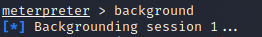
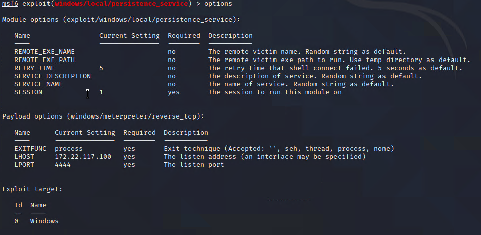
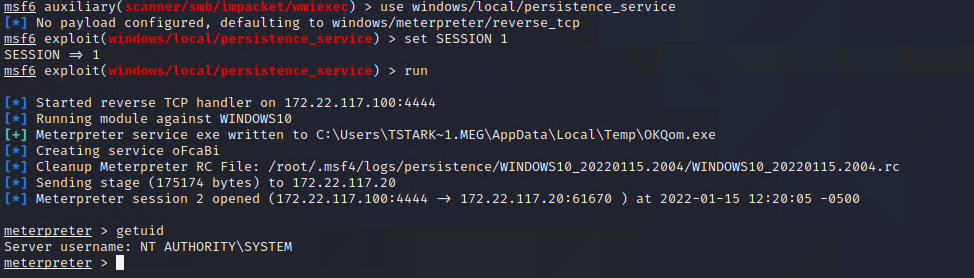

## Solution File: Windows Privilege Escalation

Now that we understand and recognize our privilege escalation attack path, you implemented it with Metasploit. Specifically, you escalated your privileges on the Windows machine, giving you full control of the entire machine.

### Instructions

1. Background the Meterpreter session via the `background` command, as the image shows:

	

2. Use the `windows/local/persistence_service` module in Metasploit.

3. View the OPTIONS and set the SESSION to your current Meterpreter session number ID. If you're unsure of the session number, type `sessions`.

		

4. Once the parameters are set, run the module.

    - `run`

5. Once complete, view the user ID.

    - `getuid`

		
	
6. Notice that the executable it uploads is a random file name. How could we make this more stealthy?

    - Name it something more legitimate, like `explorer.exe`.
---
&copy; 2023 edX Boot Camps LLC. Confidential and Proprietary. All Rights Reserved.

