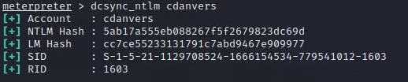
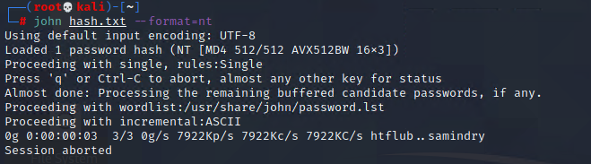

## Solution File: Credential Access

In this activity, you used your SYSTEM access on the domain controller to make a copy of the `NTDS.dit` file and attempted to crack the password hashes in it.

### Instructions

1. In Meterpreter, enter a shell, then view the users on the machine via the `net` command.

	- `net users`

2. Exit the command shell, then load `kiwi` and perform `dcsync_ntlm` in Meterpreter for each of the users. Run the command `dcsync_ntlm` to see the usage.

    - `dcsync_ntlm`

     

3. Take each NTLM hash and place them in a text file. Using `john`, crack the hashes in the file.

    - `john hash.txt --format=NT `

     

---
&copy; 2023 edX Boot Camps LLC. Confidential and Proprietary. All Rights Reserved.

