## Day 3 Solution File: Attacking Rekall's Windows Servers

### Flag Solutions

#### Flag 1: Tanya4life

* Searching GitHub should lead to finding the [totalrekall GitHub page](https://github.com/totalrekall). Searching the `site` repository will lead to the [`xampp.users` page](https://github.com/totalrekall/site/blob/main/xampp.users), which contains the credentials `trivera:$apr1$A0vSKwao$GV3sgGAj53j.c3GkS4oUC0`, as the following image shows: 

  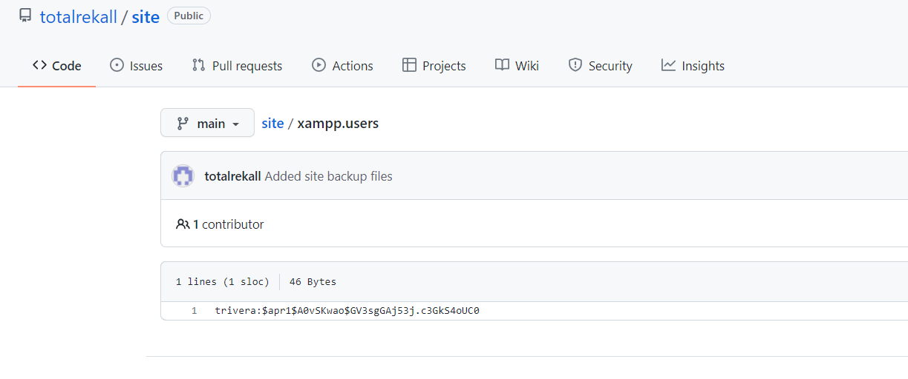

* These credentials can be cracked using `john`.
	
* `echo '$apr1$A0vSKwao$GV3sgGAj53j.c3GkS4oUC0' > hash.txt`

* `john hash.txt`

* The flag is the cracked hash: `Tanya4life`

#### Flag 2: 4d7b349705784a518bc876bc2ed6d4f6

* From the Kali machine, a port scan of the subnet that the Kali machine is on (172.22.117.0/24) will reveal two machines: 

	- Win10 @ 172.22.117.20
	- Server2019 @ 172.22.117.10
	
* The port scan will reveal several ports open on Win10, one of which is HTTP, as the following image shows: 

  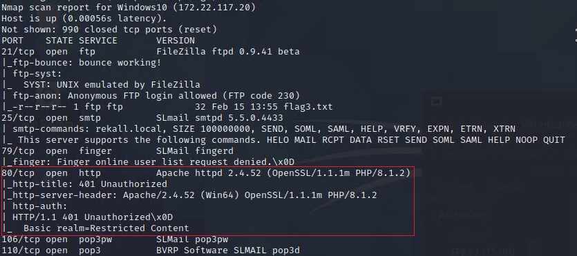

* Going to this page displays a prompt for credentials, as the following image shows:

  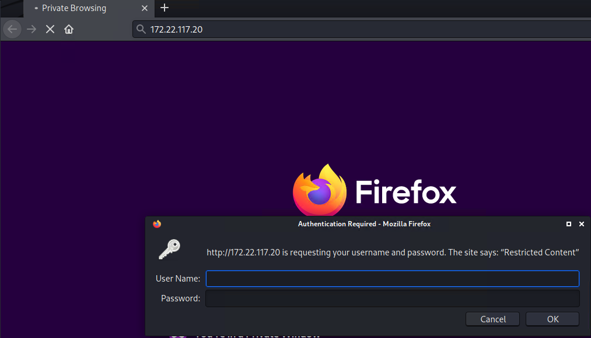

* The credentials cracked from the discovered GitHub page, `trivera` / `Tanya4life`, will grant access.

* Inside is `flag2.txt`, as the following image shows: 
 
  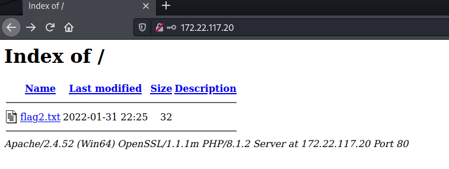

* This file contains the flag: `4d7b349705784a518bc876bc2ed6d4f6`

#### Flag 3: 89cb548970d44f348bb63622353ae278

* Returning to the port scan results will show "FTP" open on port 21. If the Nmap scan was done using the `-A` flag or using the NSE script for FTP anonymous access, the scan will reveal that FTP anonymous access is possible, as the following image shows: 

  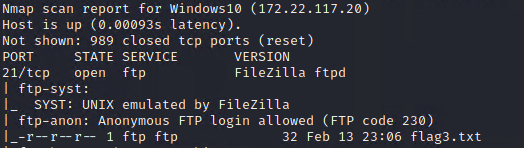

* Once logged into FTP as anonymous, you can download and read the flag.

	* `ftp 172.22.117.20`

	* `anonymous`

	* `get flag3.txt`

	* `exit`

	* `cat flag3.txt`

  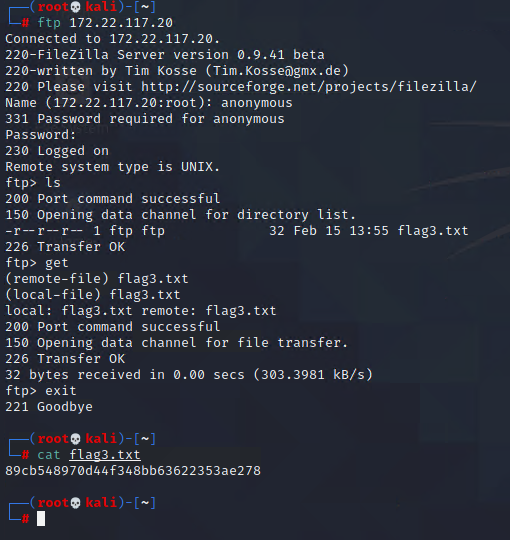

#### Flag 4: 822e3434a10440ad9cc086197819b49d

* Return to the port scan results, and note that the SLMail service is running on SMTP port 25 AND on POP3 port 110, as the following image shows:

  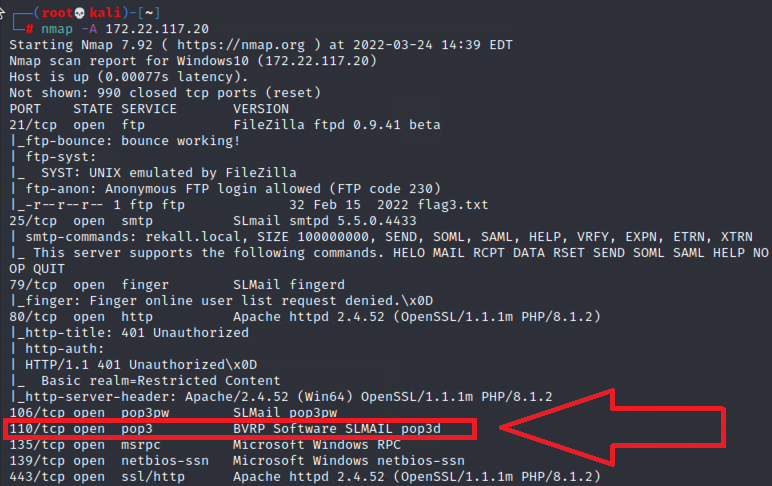

  - Port 110 is the port required for this exploit.

* Using `searchsploit` shows a Metasploit module for that version of SLMail, as the following image shows:

  

* Loading up Metasploit via MSFconsole, loading the SLMail module and setting the RHOSTS to 172.22.117.20, and then running the exploit will grant a Meterpreter shell, as the following image shows:

  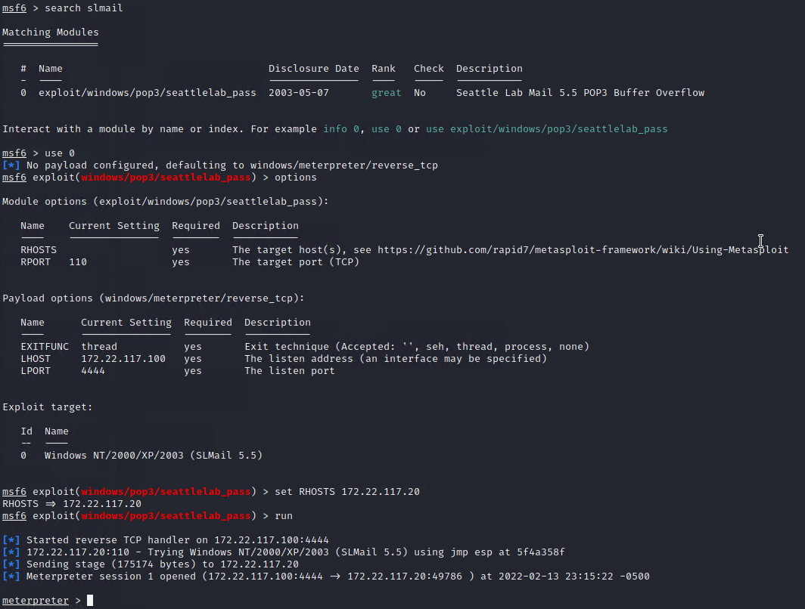

* Listing the directory files will show `flag4.txt`, which can be read with `cat` from within Meterpreter, as the following image shows:

  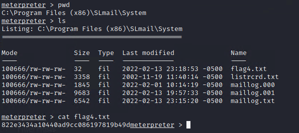

#### Flag 5: 54fa8cd5c1354adc9214969d716673f5

* The hint about "scheduled tasks" should suggest looking at scheduled tasks on the system. This can be done by dropping into a command shell within Meterpreter and using the `schtasks` command `schtasks /query`, as the following image shows:

  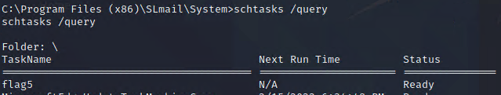

* The details of the schtasks can be read with the command `schtasks /query /TN flag5 /FO list /v`, as the following image shows:

  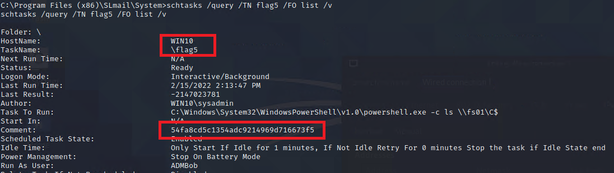

#### Flag 6: Computer! 

* After compromising SLMail using Metasploit, the Meterpreter shell will be the `SYSTEM` user. `kiwi` can then be loaded, as the following image shows:

  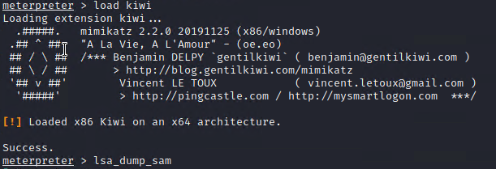

* By using the command `lsa_dump_sam`, `kiwi` will reveal a user named `flag6`, as the following image shows:

  

* Cracking the NTLM password will reveal Flag 6: Computer!

  

#### Flag 7 <!-- @CE This solution doesn't actually tell us what Flag 7 is. Can we add the actual flag to the Flag 7 header, like the others? -->

* Using the `search` command in Meterpreter will reveal `flag7.txt` in the `C:\Users\Public\Documents` folder, as the following image shows:

  

#### Flag 8: ad12fc2ffc1e47

* Using `kiwi` to dump the cached credentials on Win10 will reveal that an administrator, `ADMBob`, has their credentials cached, as the following image shows:

  

* Store the username and hashed password into a file, then crack it with `john` to reveal the password: `Changeme!`

  

* These new credentials have access to the Server2019 machine. By using the `PsExec` module in Metasploit with these credentials, a SYSTEM shell can be obtained on Server2019, as the following image shows:

  

* By entering a command shell within Meterpreter, you can list the users with `net user`, and `flag8` is the name of a user, as the following image shows:

  

- Flag 8 is the code that follows `flag8-`

#### Flag 9: f7356e02f44c4fe7bf5374ff9bcbf872

* By moving to the root, `C:\`, and listing the files, `flag9.txt` can be read via `cat` in Meterpreter, as the following image shows:

  

#### Flag 10: 4f0cfd309a1965906fd2ec39dd23d582

* Using `kiwi` to DCSync the `Administrator` user on Server2019 will reveal their NTLM password hash, which is flag 10.

  

---
© 2023 edX Boot Camps LLC. Confidential and Proprietary. All Rights Reserved.  
