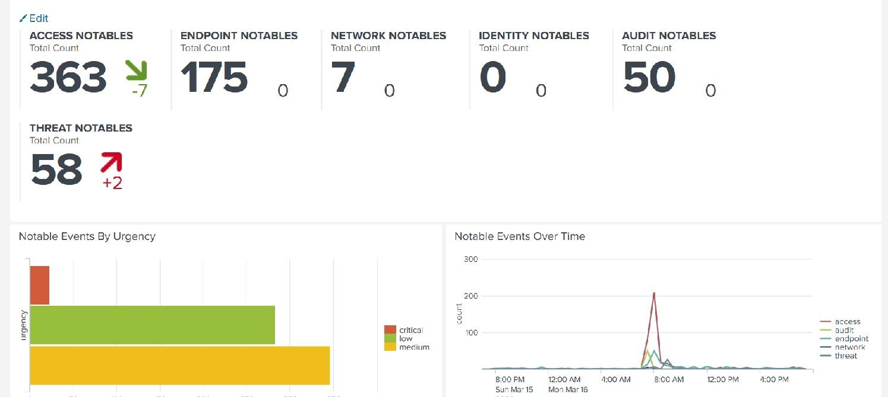

## 20.2 Student Guide: Advanced Security Monitoring Tools

### Overview

In today's class, you'll learn about advanced monitoring tools that security professionals use to monitor and analyze security events. Then you will explore career paths and certifications related to Splunk and SIEM skills. You will conclude by exploring Splunk certifications.

### Class Objectives

By the end of class, you will be able to:

  - Differentiate between various advanced security monitoring solutions, such as SOARs, UBAs, and UEBAs, and determine which is most appropriate for a specific security situation.

  - Understand how knowledge of SIEM software and Splunk is valued in the information security job market.

  - Continue learning about Splunk with free Splunk training courses. 

### Slideshow

The lesson slides are available on Google Drive here: [20.2 Slides](https://docs.google.com/presentation/d/1Daqwb7LcuRUgCsVZI2FR7hNzrXDMNCuZ2dwscCFT-0M/)

-------

### 01. Introduction to Advanced Security Monitoring Tools

#### Splunk Enterprise Security

Over the past five classes, you've covered many of Splunk's capabilities and add-on applications. 

  - While these Splunk capabilities can assist in security investigations, Splunk has a SIEM product specifically designed to assist security professionals.

Splunk's SIEM product is called **Splunk Enterprise Security (ES)**.
  - Splunk ES provides security professionals insights from machine-generated data, such as:
    - Network devices like routers and firewalls
    - Endpoint devices like antivirus solutions
    - Vulnerability management systems like Nessus

Splunk ES is one of the most popular add-on products for security professionals as it has pre-built dashboards, reports, and built-in features:

Splunk ES features allow you to:
  - Identify, prioritize, and investigate security events
  - Gain insights into security events
  - Monitor the status of a security environment
  - Audit security events
  - Navigate these tasks with a pre-built, easy-to-use interface
  
The Splunk ES dashboard can be used to help monitor security events:

   
    
Learning the capabilities of Splunk ES is outside the scope of this class, but if you are interested in researching the capabilities offered by Splunk ES, you can explore the following resources in your own time:

   - [Splunk: ES video demo](https://www.youtube.com/watch?v=HN4zGIyi3PI)  
   - [Splunk: ES documentation](https://docs.splunk.com/Documentation/ES)
   
#### Advanced Security Monitoring Solutions  

While SIEM products such as Splunk ES provide many monitoring benefits, organizations are now integrating **advanced security monitoring solutions** into their businesses to provide additional protection.
 
  
  - The core goal of all security monitoring solutions is to help detect information security events.

  - Advanced security monitoring solutions provide additional benefits such as machine learning, artificial intelligence, automation, and response.

  - The most popular advancements in the information security industry are:

    - User behavior analytics (UBA)
    - User and entity behavior analytics (UEBA)
    - Security orchestration, automation, and response (SOAR) 
 

**UBA** is a security monitoring tool that uses machine learning, AI, and data processing to detect abnormalities in user activity.

  - UBA gathers information on typical user behaviors and creates baselines.
    - For example, UBA can gather information on the servers and systems a user accesses, as well as when and how frequently. 

    - UBA can create alerts for when a user's activity deviates from this typical behavior. 

    - If a user usually only logs onto a server between 9am and 5pm Monday through Friday, UBA creates an alert if the user logs in on at 2am on a Saturday.

**UEBA** is a security monitoring tool similar to UBA, except it extends its monitoring to other "entities."
  - Entities can include routers, servers, and Internet of Things (IoT)) devices.   

  - UEBA looks at normal user and entity behaviors and creates alerts when users or entities show abnormal activity.
 
**SOAR**, comparable to a SIEM, automates security processes and responds to security incidents.
  - Examples of automating security processes include:
    - Creating logging
    - Assigning priorities to security incidents

  - Examples of responding to security incidents include:
    - Launching security investigations
    - Mitigating threats
   
  - Similar to a SIEM, SOAR gathers machine data from multiple entities and analyzes the data for security events.
    - SOAR uses **playbooks** that detail the processes and response actions for specific events.

    - Playbooks are designed and configured by each organization.
      - For example, an organization can design a playbook to automate the response to a phishing incident.
        - The image illustrates how SOAR uses a playbook to automate the steps of a response.

        - This diagram also illustrates how using SOAR playbooks can decrease incident response time.

   
             
        
In the activity that follows, you'll research vendors that offer these advanced security monitoring tools and learn about the different capabilities of each product.
 

### 02. Activity: Advanced Security Monitoring Tools

- [Activity File: Advanced Security Monitoring Tools](activities/05-Advanced-Security-Monitoring/Unsolved/README.md)

### 03. Activity Review: Advanced Security Monitoring Tools

In this activity, you researched several security products and provided a summary of your findings.

Completing this activity required the following steps:

  - Researching the various security products available from a variety of vendors

  - Selecting advanced security monitoring products from the provided sites

  - Researching and summarizing the findings from the products selected  
  

### 04. Splunk Careers
 
The Splunk knowledge and tools you've learned over the past five classes can apply to careers and certifications in the information security (InfoSec) industry. 

  - Even if an employer doesn't use Splunk, many Splunk skills are easily applied to other vendors and similar products.

  - For example, if a security professional who is familiar with Splunk ES takes a position at an organization that uses LogRhythm, they should be able to note the similar core capabilities and quickly adapt to the other software. 
    

Splunk skills are desireable for many InfoSec positions. For example: 

  - **SOC analysts** work in a security operations department alongside security engineers. Their positions involve detecting, containing, and potentially remediating information security threats. Most SOC analysts use SIEM products, such as Splunk ES, to monitor their environment.
  
  - **Cyber threat analysts** analyze an organization's networks and applications to protect it from cybercriminals. Cyber threat analysts often use Splunk products to make predictions about cybercriminals and attacks.
  
  - **Application security (AppSec) engineers** can use Splunk to fix web and mobile application vulnerabilities. AppSec engineers use Splunk to analyze their application logs to help create and test their remediation.
  
  - **Network security administrators** use products like Splunk to monitor suspicious network traffic, such as DDOS attacks. They can use the findings from Splunk logs to mitigate and prevent future attacks.
  
  - **Incident response managers** can use Splunk to monitor the status of ongoing security investigations after an incident occurred.
  
Some of these positions, such as the SOC and cyber threat analyst, may use Splunk products as part of their primary responsibilities.

  - Other security positions, such as AppSec administrators, may only use Splunk for a small portion of their tasks.

  - Either way, understanding how to use Splunk is a valuable skill for InfoSec professionals.
  
Splunk is already a required skill in many roles, and the industry demand is increasing every year.
  - The chart illustrates the growth in demand.
  
 
   (Source: Brain4ce Education Solutions, n.d.)
  
In the activity that follows, you'll search job sites to find positions where Splunk is either a required skill or primary responsibility.

### 05. Activity: Splunk Careers

- [Activity File: Splunk Careers](activities/09-Splunk-Careers/Unsolved/README.md)

### 06. Activity Review: Splunk Careers

This activity illustrated the value of Splunk in the current information security job market. You researched jobs that require Splunk skills.

Completing this activity required the following steps:

  - Using several job sites to research jobs with Splunk skills

  - Answering several questions on your findings

### 07. Break
    

### 08. SIEM Certifications

Similar to other domains in cybersecurity, Splunk skills are validated through certifications. These allow candidates to prove they have the required skills to assist an organization.

- Having a certification can help a cybersecurity professional acquire a new position, receive a promotion, and gain access to networking opportunities with professionals who have similar certifications. 

Here are the certifications that Splunk offers:

- **Splunk Core Certified User:** Entry-level certification that demonstrates a user's basic ability to use the Splunk software.

- **Splunk Core Certified Power User:** Certification that demonstrates a user's foundational skills with Splunk's core software, in addition to more complex skills such as creating calculated fields and data models.

- **Splunk Core Certified Advanced Power User:** Certification that demonstrates a user's capability to design reports, complicated searches, and dashboards.

- **Splunk Enterprise Certified Admin:** This certification focuses on an individual's ability to support daily administrative tasks using Splunk ES.

- **Splunk Enterprise Certified Architect:** This certification focuses on a Splunk administrator's role to support advanced troubleshooting, configurations, and deployments within Splunk ES.

- **Splunk Enterprise Security Certified Admin:** This certification focuses on a Splunk administrator's role to support installation, advanced troubleshooting, configurations, and deployments with a Splunk ES environment.
  
 If you are interested in learning more about the tracks and certifications Splunk offers, view the following link: 
  - [Splunk: Training and certifications](https://www.splunk.com/en_us/training.html)

Like many certifications in the InfoSec field, most of the courses for these certifications are expensive. Many of them cost over $2,000.
 
- Fortunately, Splunk offers many single-subject courses for free. These courses help prepare for the **Splunk Core Certified User** certification exam. 

  - Splunk also offers a free introductory course in several of its advanced monitoring tools that were covered earlier in today's class.

You can independently complete any remaining courses to obtain the **Splunk Core Certified User certification**.

  - This is completely optional and up to you.
  - Note that there are costs associated with several additional courses, as well as taking the exam. 
  - View the [Splunk Core Certifed User certification page](https://www.splunk.com/en_us/training/certification-track/splunk-core-certified-user.html) if you are interested in the requirements for obtaining the certification.

In the final activity of the day, you will:
  - Set up a Splunk account
  - Register and complete several free Splunk single-subject courses with the aim of completing a certification

### 09. Activity: Splunk Certification

- For the remainder of the class, you will register for and begin Splunk single-subject courses.

- You must register for a Splunk account and complete the certification registration.

- Once the registration is completed, you will complete several free single-subject courses.

- [Activity File: Splunk Certification](activities/12-Splunk-Certifications/Unsolved/README.md)

### 10. Activity Review: Splunk Certification

The goal of this activity was to introduce you to Splunk's free single-subject courses. You were tasked with completing several free courses.

Completing this activity required the following steps:

- Registering for a Splunk account and completing the certification registration

If interested:

 - Complete the remaining courses in your own time.
 - Take the Splunk Core Certified User exam to earn your Splunk certificate.

Note the following resources for taking the exam:
  - [Splunk: Core Certified User certification](https://www.splunk.com/en_us/training/certification-track/splunk-core-certified-user.html)
  - [Splunk: Video on getting certified](https://www.youtube.com/watch?v=-faNAbfUPFE&feature=emb_logo)  (video)
  - [Splunk: Exam registration tutorial](https://www.splunk.com/pdfs/training/Exam-Registration-Tutorial.pdf)
  - [Pearson VUE: Splunk exam registration](https://home.pearsonvue.com/splunk)
  - [Splunk: Certification study guide](https://www.splunk.com/pdfs/training/Splunk-Certification-Exams-Study-Guide.pdf)
 
### 11.  Overview of Remaining Projects and Introduction to **BootCon**

You will complete two more projects in this course:
  
  - **Defensive Security Project:** Occurs at the end of the Defensive Security module. Details will be provided at the beginning of the project week.
  - **Final Project:** Occurs during the last week of class. An overview is provided now so that you can begin brainstorming and preparing for your project.

#### Final Project: **BootCon**

 -  [bootCon Presentation Guide](https://docs.google.com/document/d/1OpdJfVxTdcix4RhuzrS5YcnZLHSTThM5Nzpfe0laU4s/edit?usp=sharing)

  
  - This document contains a set of instructions and ideas for a **bootCon** presentation.

    - It is completely acceptable to recreate an existing presentation, as long as you are able to demonstrate the concept.
  
 - You can reach out to your instructor to discuss any ideas for their presentation, and your proposals are due in Week 22.

-------

&copy; 2023 edX Boot Camps LLC. Confidential and Proprietary. All Rights Reserved.  
