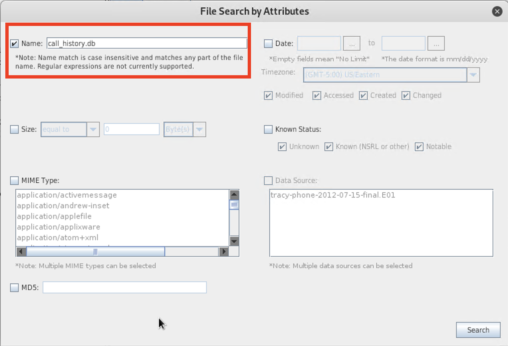
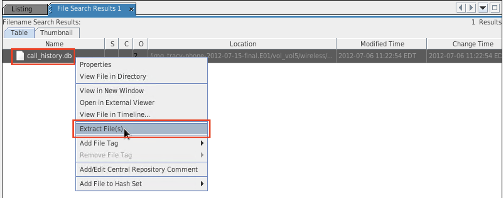
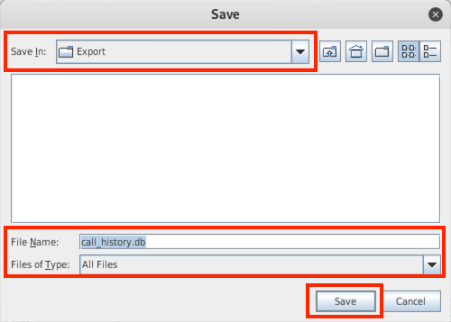
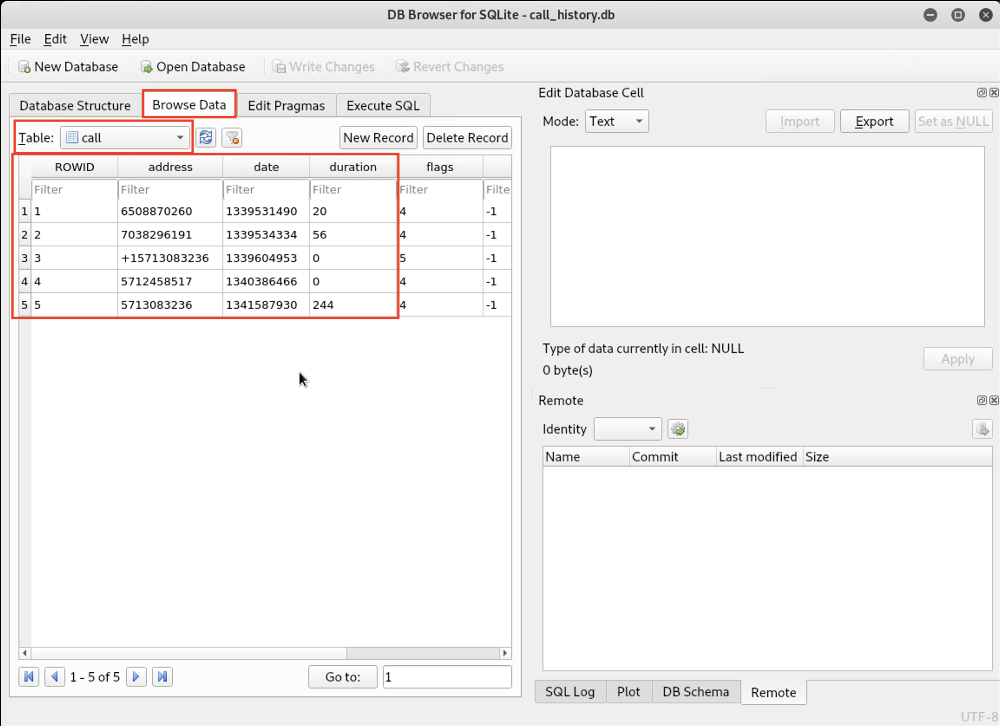
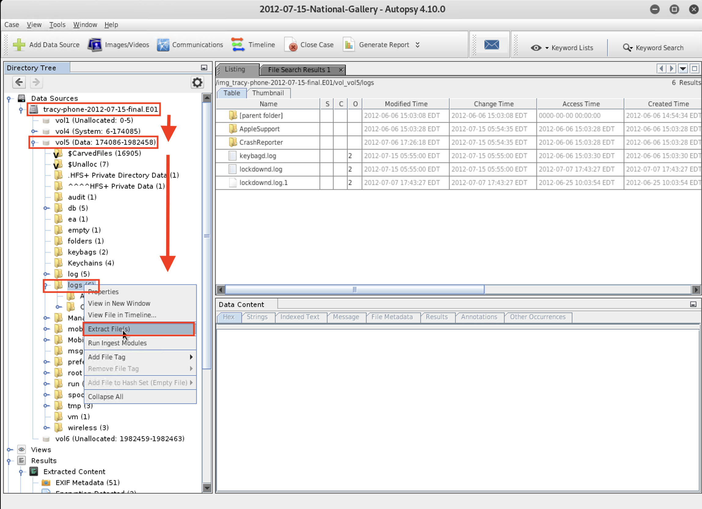
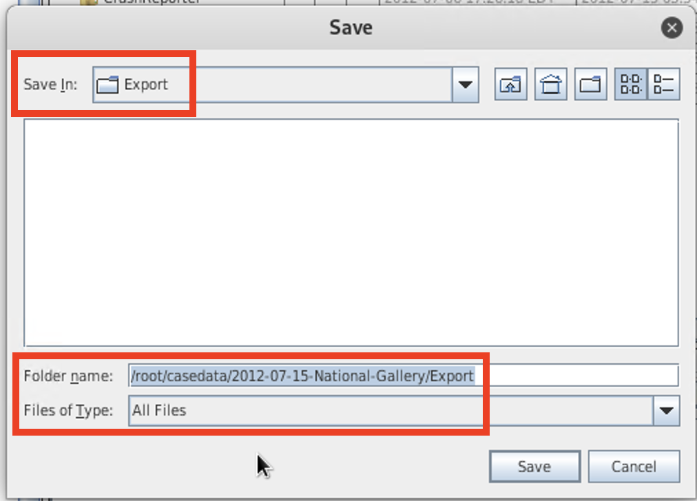

## Solution Guide: Extracting Evidence for Offline Analysis

#### Single File Export
 
A senior investigative team member has asked you to `Export` the `call_history.db` file for offline analysis.
  
  1. Locate the `call_history.db` file in the iPhone image file.
 
  
 
  2. Extract the file to the `Export` directory located at `/root/casedata/2012-07-15-National-Gallery/Export`.
 
  
 
  
 
- Now you will view the file using SQLite DB Browser, the third-party application used by your team. It's professional courtesy to verify your exports prior to handing them off to other team members.
 
  3. Open a new terminal window and navigate to the `/root/casedata/2012-07-15-National-Gallery/Export` directory.
 
  4. Run the following command: `sqlitebrowser call_history.db`.
 
  The SQLite DB Browser will open.
 
  5. Click the **Browse Data** tab.
 
  6. Select **call** in the Table dropdown menu to reveal the call history.
 
  
 
**Bonus**
 
 - What is the command to launch and simultaneously open the call table?
 
    -  `sqlitebrowser -R -t call call_history.db`
 
#### Full Directory Export
 
You were also asked to export the entire `logs` directory for further offline analysis. The team will use this file to locate and confirm Tracy's phone number.
 
 1. Navigate to the `vol5/logs` directory in the **Directory Tree** pane.
 
    
  
 2. Export the entire directory to  `/root/casedata/2012-07-15-National-Gallery/Export`.
 
    
 
Parse the file for Tracy's phone number to verify the correct file was exported.
 
  3. Open a new terminal window, navigate to the `/root/casedata/2012-07-15-National-Gallery/Export` directory, and `cd` into the newly created `logs` directory.
 
#### Data Export Analysis
 
1. Open the `lockdownd.log.1` file in a text editor of your choice.
 
2. Ensure you `cd` into the log directory, and pipe `cat lockdownd.log.1` to `less`.
 
3. Parse the file and extract Tracy's phone number.
 
   - What is Tracy’s phone number?
 
     - 1 (703) 340-9661
 
----

&copy; 2023 edX Boot Camps LLC. Confidential and Proprietary.   All Rights Reserved.

