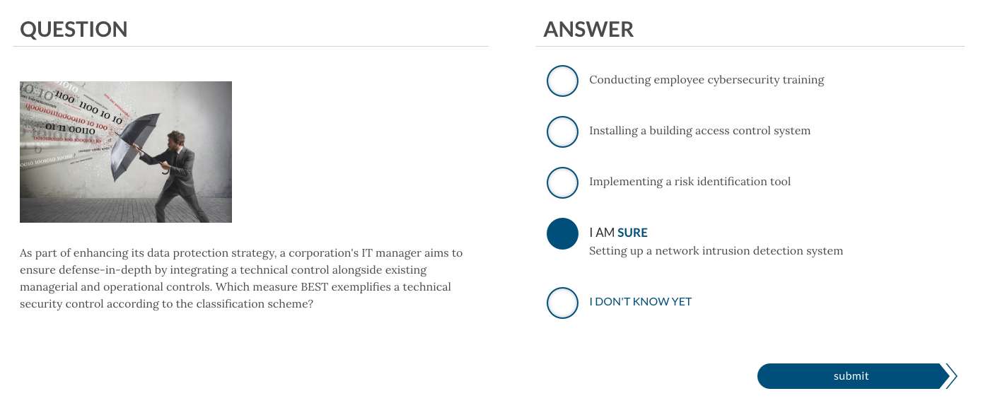

## 23.1 Lesson Plan: Career Prep and Certifications

### Overview  

Today marks the beginning of Prep Week. This week, we'll focus on steps that students can take to prepare for a job in cybersecurity. Today, we'll focus on aspects of the Security+ exam and introducing students to other introductory, advanced, and specialized certifications.

### Class Objectives

By the end of class, students will be able to: 

- Understand the importance of career and job-search preparation. 
- Understand the value of certifications in their job searches and career development. 
- Map out certification roadmaps based on their specific experience level and field of interest. 
- Use CompTIA's CertMaster tool to begin preparing for the Security+ exam. 
- Understand performance-based questions (PBQs) and how to answer them.

### Slideshow

The lesson slides are available on Google Drive here: [23.1 Slides](https://docs.google.com/presentation/d/1xGgXky30ISJLbkyT-haW3uR4DGYMWc6H7ROwj9H9LkM/edit#slide=id.g1ea3e1f75a4_0_7).

- To add slides to the student-facing repository, download the slides as a PDF by navigating to **File** > **Download** and choosing **PDF document**. Then, add the PDF file to your class repository along with any other necessary files.

- **Note**: Editing access is not available for this document. If you or your students wish to modify the slides, please create a copy by navigating to **File** > **Make a copy**.

### Time Tracker

The time tracker is available on Google Drive here: [23.1 Time Tracker](https://docs.google.com/spreadsheets/d/1OCsWPS2fx6dwYIP3xyB95ifKHcLUpvMYQ2rev0r-zX8/edit#gid=0)

### Student Guide

Share the student-facing version of this lesson plan after class: [23.1 Student Guide](studentguide.md).

-------

### 01. Instructor Do: Welcome to Career Prep Week (0:10)

Welcome students back to class! Explain that this week, we'll focus on preparing students for a new career in cybersecurity. Over the past several weeks, we've covered many different career paths and opportunities within cyber, and now we'll explain to students how they can best position themselves to land one of these roles.

As the demand for cybersecurity professionals grows, employers want qualified individuals to fill an increasing number of roles. But it can be challenging for organizations to find qualified candidates who fit their needs. Inform students that this week, we'll focus on strategies that students can implement to prepare for a new career and prove to employers that they have the required skills to handle these new responsibilities.  

#### Week Overview

The skills and tools that students have learned throughout this course are already preparing them to begin their cybersecurity career. But, while it would be nice if organizations were now lined up at the door handing out job offers, a competitive job market requires an additional set of skills. 

In the coming weeks, students will need to apply not just their new cybersecurity skills but also job hunting skills that position them to get interviews and, eventually, job offers.

The week will proceed as follows:

- **Day 1**: Today, we'll begin by discussing Career Prep Week. Then we will cover certifications, with a focus on Security+, and some strategies for taking certification tests.

- **Day 2**: We will cover the Security+ domains, job searching, and career development methods.

- **Day 3**: We will focus on mock interviews. 

#### Day 1 Overview

Explain that an important first step of career development is demonstrating that you can perform the tasks that your desired job requires. And a good way to do this is to pass a certification exam. Employers can be sure that an individual with a certification has the necessary skills to perform specific tasks, so a certification can give potential employees an edge when searching for a new job.

- Certification is a good way to demonstrate knowledge in a particular field.
- As of April 2020, 44 organizations issue over 300 cybersecurity certifications, which cover 25 specialties and paths.
- Explain that today's class will help prepare students for the Security+ certification.

- **Security+**
  - This course provides a voucher to take the Security+ exam to graduated students.  
  - This week we will cover:
    - Test preparation tips.
    - The CompTIA CertMaster study tool. 
    - Performance-based questions (PBQs). 
    - Domains on the exam that are not covered in this course's curriculum.

Ask the class if they have any questions before proceeding to the next section.

### 02. Instructor Do: Introduction to Information Security Certifications (0:15)

Certifications provide prospective professionals an advantage in the information security job market. They tell potential employers that the candidate has the specific skill sets needed to perform daily tasks associated on the job. Point out that earning your certification has the following additional benefits:

1. Further education 
    - While preparing for a certification, even before the certification is formally awarded, individuals learn new skills related to the subjects covered in the certification. While achieving credentials is often the objective, the material learned studying for the exam can expand upon existing knowledge and improve job performance.
  
2. Networking 
    - Certifications often have national and local organizations that host meetings, conferences, seminars, and social events. These events can provide opportunities to network with peers in your field.   
  
3. Career advancement
    - Information security certifications can also place more established professionals in a stronger position to obtain a promotion or new role.

Cybersecurity professionals may pursue different types of certificates depending upon the stage of their career. It is important to understand that some certifications offer a path to more advanced or specialized certifications. Familiarity with these other certifications can provide students with insight into another cybersecurity professional's skill set and career path.
  
#### Types of InfoSec Certification   
  
We can break cyber certifications into three categories:

1. Beginner information security certifications. 

   - Entry level and foundational towards more advanced certificates. 
   - These certifications typically do not have minimum work requirements or prerequisite courses.
   - They typically cover a broad range of subjects.
   - Examples include **Security+**, **CEH**, and **GSEC**.

2. Advanced information security certifications, which are typically obtained after working in the industry for several years. While each certification varies, some require three to five years' experience.

   - Many of these certifications focus on security management.
   - These certifications typically have minimum work requirements and prerequisite courses.
   - They typically cover a broad range of subjects.
   - Examples include **CISSP** and **CISM**.

3. Specialized information security certifications, which are more advanced certifications. Security professionals obtain these after working in the industry for several years.

    - These certifications typically have minimum work requirements and prerequisite courses.
    - They typically cover specific subjects. For example:
        - **GIAC Certified Forensic Examiner (GCFE)** is specific to forensics professionals.
        - **Offensive Security Certified Professional (OSCP)** and **PenTest+** are specific to penetration testers.
    - Specialized certifications can be vendor or non-vendor specific. For example:
        - **OSCP** is a non-vendor-specific penetration testing certification.
        - **Cisco Certified Network Associate (CCNA)** or **Cisco Cybersecurity Operations Associate (CBROPS)** is a vendor-specific certification for Cisco products.

After this boot camp, most of the class will begin their certification journey with Security+. After earning that certification, students can take steps to further their credentials.  

- A student’s interests can steer their certification paths.
  
- For example, a penetration tester's certification path will be different from a computer forensics specialist's path.

  - A penetration tester's path might look like this: Security+ > CEH > CISSP > OSCP.

  - **Note**: We will cover these additional certifications in more detail later in the lesson.

     - A forensic specialist's path might look like this: Security+ > CFCE > GCFA > EnCE.
       
       
Each domain has suggested guidance for the best certification path.  
  
- Show students the CompTIA guide on the slides, which details several certification paths.

The goal of the next activity is for students to become familiar with the information security certifications that are desired for different positions. Students will search several job sites to find out what InfoSec certifications are desired for various job openings.

Ask the class if they have any questions before proceeding to the first activity.

### 03. Student Do: Certifications and Careers (0:20)

Explain the following to students:

- In the next activity, you will use job search websites to research InfoSec careers and certifications.
- You are tasked with finding five information security careers and the desired or required certifications that align with each.
- You will add your findings to the spreadsheet provided.

Send students the following:

- [Activity File: Certifications and Careers](Activities/01_Certs_and_Careers/Unsolved/Readme.md)
- [Career and Certifications Spreadsheet](https://docs.google.com/spreadsheets/d/1fFBqz6ThWEekheg0y7Ae_80565T0KSNA5PA2O6yn3NU/edit?usp=sharing)

### 04. Instructor Review: Certification and Careers Activity (0:07)

Remind students that the goal of this activity was to illustrate the many information security careers that either require or desire specific certifications. Students were tasked with searching job sites for information security positions and the relevant certifications for each position.

Note that there is no formal solution file, as each student may have different findings based on their search results and selected positions.

- Ask several students to share their findings and point out any certifications that are mentioned often. 

Answer any questions that remain before proceeding to the next section.

  
### 05. Instructor Do: Certification Paths (0:12)

Explain that while students will likely work toward their Security+ certification first, there are several other beginner InfoSec certifications that do not require experience and cover many domain areas. We'll discuss some of those briefly now.   

**Certified Ethical Hacker (CEH)** is a certification offered by EC Council.

- While the CEH generally focuses on penetration testing topics, it also covers a broad spectrum of topics valuable to information security professionals.
- CEH also offers an advanced certification called **CEH Practical**, which tests individuals' skills with hands-on penetration testing tools.
    
**GIAC Security Essentials (GSEC)** is a certification offered by the Global Information Assurance Certification (GIAC).

- GSEC covers a broad spectrum of topics ranging from active defense to cryptography.
- We will not cover GSEC this week. Share the following link in case students are interested: https://www.giac.org/certification/security-essentials-gsec.
    
    
**Systems Security Certified Professional (SSCP)** is a certification offered by (ISC)² ("ISC squared").

- SSCP covers security best practices for setting up, monitoring, and administering IT infrastructure.
- While SSCP is one of the entry-level certifications offered by (ISC)², they do request one year of professional cybersecurity experience.
- We will not cover SSCP this week. Share the following link in case students are interested: https://www.isc2.org/Certifications/SSCP.
  
Explain that while it is not recommended for security professionals to obtain multiple beginner cybersecurity certifications, many professionals do obtain the Security+ and the CEH, since they cover different domains.   

- Ask the class if they have any questions about cybersecurity beginner certifications before proceeding to advanced and specialized certifications.
            
For many cyber professionals, the next step in advancing a career is obtaining advanced and specialized certifications. 
  
#### Advanced Cybersecurity Certifications

Explain that there are several advanced cybersecurity certifications that do not have a specialized focus.

  - Many of these are obtained by cybersecurity managers.
  
Introduce the following advanced certifications:  

**Certified Information Systems Security Professional (CISSP)** is an advanced certification offered by (ISC)².

- It covers a wide variety of cybersecurity topics and is one of the most popular certifications in information security.
    
**Certified Information Security Manager (CISM)** is a certification offered by ISACA.

- It covers information security management topics.
- We will not cover CISM this week. Share the following link in case students are interested: https://www.isaca.org/credentialing/cism.

#### Specialized Certifications

Explain that there are hundreds of specialized certifications available for those interested in mastering their specific cybersecurity domain.

**Offensive Security Certified Pentester (OSCP)** is a specialized pen testing certification offered by Offensive Security. 

- It is a hands-on penetration testing exam consisting of two parts: a 24-hour penetration testing exam and a documentation report due 24 hours after the exam.

- Share the following link in case students are interested: https://www.offensive-security.com/pwk-oscp/.
    
**Certified Information Privacy Professional (CIPP)** is a specialized privacy certification offered by IAPP.

- It is considered the "gold standard" for those working in privacy.

- Share the following link in case students are interested: https://iapp.org/certify/get-certified/cippus/.

**EnCase Certified Examiner (EnCE)** is a vendor-specific specialized certification for computer forensics professionals. 

- It is offered by OpenText and used by law enforcement.

- Share the following link in case students are interested: https://www.opentext.com/products-and-solutions/services/training-and-learning-services/encase-training/examiner-certification.

Remind the class that the certifications we just covered are only a small portion of the vast list of advanced and specialized certifications.

In the next activity, students will have the opportunity to research several advanced and specialized certifications for a domain they are interested in.
  
Ask the class if they have any questions before proceeding to the activity.
  
### 06. Student Do: Find a Certification Pathway (0:20)

Explain the following to students:

- In this activity, you will research several advanced and specialized certifications.

- You will select an information security domain that you are interested in and determine its relevant certifications.

- You will add your findings to the spreadsheet that you worked on in the previous activity. 

- Feel free to share your findings with fellow students who share similar interests.  

Emphasize that this spreadsheet is something students can take with them after the course as a reference for advanced and specialized certifications to pursue after Security+.

Send students the following:

- [Activity File: Advanced and Specialized Certifications](Activities/02_Advanced_Certs/Unsolved/Readme.md)
- [Career and Certifications Spreadsheet](https://docs.google.com/spreadsheets/d/1fFBqz6ThWEekheg0y7Ae_80565T0KSNA5PA2O6yn3NU/edit?usp=sharing)
- [Wikipedia: List of Information Security Certifications](https://en.wikipedia.org/wiki/List_of_computer_security_certifications)

### 07. Instructor Review: Certifications Pathway Activity (0:07)

Remind students that the goal of this activity was to illustrate the many information security certifications that can prove an individual's advanced skills and specializations. Students were tasked with researching advanced and specialized certifications related to an information security domain that they are interested in.

Instead of a formal review, ask several students to share their personalized findings with the class.

Answer any questions that remain before proceeding to the next section.

### 08. Break (0:15)

### 09. Instructor Do: Introduction to Security+ (0:15)

Welcome the class back from break, and explain that for the remainder of today's class, we'll focus on Security+ exam preparation.  

Begin by reviewing the basics of the Security+ certification:

**What is the Security+ certification?**

- According to [CompTIA](https://www.comptia.org/certifications/security): "Security+ is the first security certification IT professionals should earn. It establishes the core knowledge required of any cybersecurity role and provides a springboard to intermediate-level cybersecurity jobs. Security+ incorporates best practices in hands-on troubleshooting to ensure security professionals have practical security problem-solving skills. Cybersecurity professionals with Security+ know how to address security incidents—not just identify them."

**Which jobs typically require the Security+ certification?**

   - Security architects
   - Security engineers
   - Security consultants
   - Security specialists
   - Information security analyst

**What skills and knowledge areas are assessed in this certification?**
  
- Attacks, Threats, and Vulnerabilities
- Architecture and Design 
- Implementation 
- Operations and Incident Response 
- Governance, Risk, and Compliance 

**What are the details of the exam?**

- The exam is comprised of 90 multiple-choice and performance-based questions (PBQs).
  - We'll discuss performance-based questions in more detail at the end of today's class.
- Test takers have 90 minutes to complete the exam.
- The passing score is 750, on a scale of 100-900.
- The cost of the exam is $392.00. 
  - **Note**: All eligible students will receive an exam voucher at the end of this boot camp upon request.
  
  
#### Preparation Tips  

- Use CompTIA's study tools.
  - While there are many books, online resources, study guides, and apps available to prepare for the exam, CompTIA provides the most up-to-date resources for exam prep. 

  - From past students' experiences, the CompTIA CertMaster tool has proven to be the best method for preparing for the exam.

- Organize your study time.
  - Design a structured study plan and stick with it. Block out at least several weeks to focus on studying for the exam. 

  - If possible, find and meet with study groups to help encourage each other during test preparation.

- Focus on your weak spots.
  - Early on, attempt to determine which domains are the most challenging and focus your studies there.

- Use supplemental study tools. 
  - Create study guides and flashcards of common terms and acronyms. Find video content that explains confusing subjects.

  - For example, if you do not understand a term or a concept, search YouTube for a visual explanation of that topic.

- Find a Security+ online community.
  - There are many online blogs, forums (e.g., Reddit), and wiki pages dedicated to preparing for the Security+ exam.
  
  
#### Test-Taking Tips 

- Take care of yourself.
  - Arrive early, well-rested, fed, hydrated, and relaxed. 

- Pay attention.
  - Read each question and answer twice before deciding on your answer. 
  
  - Look for keywords in the questions, such as "best," "most," or "least."

  - Always stay aware of how much time remains. 

- If you're unsure of an answer, guess. 
  - Eliminate the answers you know are not correct, and select from the remaining answers. You'll receive the same penalty for an incorrect answer as for an unanswered question, so always make a best guess. 

Next, you'll demonstrate the Security+ CertMaster tool. 

### 10. Instructor Do: Security+ CertMaster  (0:07)

Remind the class that the best study tool for the Security+ is the **CertMaster Practice** tool from CompTIA.
  
Introduce the CertMaster Practice tool by covering the following:
  - This boot camp provides students with access to the CertMaster Practice tool.

  - Per CompTIA, CertMaster Practice comes with:
     - Quick knowledge assessment.
     - Adaptive learning that reinforces existing and new knowledge.
     - Personalized feedback.
     - Real-time learning analytics.

 - CertMaster Practice has an easy-to-use interface to access questions for all domains covered on the Security+ exam.

 - Access to the tool is available to students for one year to assist with exam preparation.
    - ***Note*** Students will be using the trial version during the class. Upon graduation they will receieve the full paid version that aligns with the exam of their choice (Graduates get to choose the Security+, Cloud+, Network+, Server+, or Linux+ exam). Explain that this is to maximize the availability of the tool when they are prepared to start studying for the certification. 
 
Explain that you will now demonstrate the CertMaster tool by showing how to setup the trial version using the provided slides and navigating how to use the basic features.

#### CertMaster Practice Walkthrough

Begin by sending students the following URL, and recommend that all students bookmark this page:
 
  - https://www.comptia.org/training/certmaster-practice/trial-sign-up
  
  - Point out the Free Trial form on the right side of the page and make sure to tell the students to select the Security+ Exam, as the following image shows:
  
    

After you log in with the credentials you created, the main dashboard will appear, as the following image shows:

   

- Point out that this main dashboard contains:

  - A small sample of modules from the Security+ exam (top left).
  - Your progress based on the percentage of practice questions completed (top right). 
  - The course overview comparing your statistics to all other participants using the CertMaster practice tool (bottom).
  
Explain that the modules do not have to be completed in a specific order.
  - To select a module, you will need to expand one of the domains.
  - ***Note*** The full version will include all of the domains for the certification.
  
For this demonstration, we will expand the **Security+ Sample Learning Module** domain.
  - Select the dropdown arrow to display the sample module within **Security+ Sample Learning Module**, as the following image shows:
 
    
    
- There is only one module within **Security+ Sample Learning Module**.
  - The full version will include a dashboard with several modules:
    - Topic of the module
    - Your progress on that specific module
    - The image below provides a sample of what the full version will include.

     
  
We will select module **Security+ Sample Learning Module**.
  
  - Select **Begin Learning** under that module.
  
  - Note that questions will be mixed each time you begin a module, so what you and students see may vary. 
 

Explain that students can answer questions in one of two ways: 

  - If they are sure of an answer, they can click the corresponding circle twice to fully fill in the answer, as the following image shows: 
   
     

  - If they are unsure, they can click on two answers, each one time, to suggest best but unsure guesses, as the following image shows: 

      
    
     - **Note that this option is not available on the actual exam, only the CertMaster practice tool.**
      
  - If you submit multiple unsure answers, CertMaster will let you know if one of your choices was correct but will not tell you which one, as the following image shows:

       

  - You'll then be able to review your answers, as the following image shows:

      
 
  - At the end of the answer review page, a summary explains the answer, as the following image shows:
    
      
  
#### Additional Tips

- Explain that while you are working on a module, you can view your current progress by clicking the arrow on the top right of your module, as the following image shows: 

  
 
- After you complete the module, you can view a summary of the completed modules.
  
  - From the dashboard, select **Course Report**, as the following image shows:
  
    
  
  - This provides a summary of all your completed modules.

  - Additionally, this page shows the most challenging questions, which you can return to and re-answer, as the following image shows: 
    
   
   
Now, students will complete the sample learning module within the CertMaster trial practice tool.

  - Ask the class if they have any questions before proceeding to the activity.
   

### 11. Student Do: Security+ CertMaster Activity (0:10)

Explain the following to students:

- In this activity, you will access your Security+ CertMaster Trial study tool.

- You are tasked with completing the sample module from the CertMaster Trial tool.

- For this first attempt, try to answer the questions without using external resources, to see how prepared you are for the exam.

Send students the following:

- [Activity File: Security+ CertMaster](Activities/03_CertMaster/Unsolved/Readme.md)

### 12. Instructor Review: Security+ CertMaster Activity  (0:07)

In the previous activity, students were introduced to the CertMaster study tool. They were tasked with accessing the trial, but once they receive their voucher code, they will have full access for one year.

Completing this activity required the following steps:

- Accessing the CertMaster trial.
- Completing the sample module of questions.
- Reviewing the results of the module.

Note that there is no formal solution file as the answers are provided by the CertMaster site.

  - If time remains, ask several students to share which questions challenged them.

Answer any questions that remain before proceeding to the next section.
  
### 13. Instructor Do: Security+ PBQ  (0:10)

Remind class that the Security+ exam has two types of questions: multiple choice and **performance-based questions (PBQs)**. 
    
Introduce PBQs by covering the following:
 - PBQs present test takers with a simulated environment, such as a network, firewall, or terminal. 

 - Since the question environment is simulated and not live, there may be some limitations compared to a real-world environment.

 - PBQs are often the first questions on the Security+ exam. 
  
In the next demonstration, we will explore some Security+ PBQ questions. 

#### PBQ Demonstration

- Begin by accessing [CompTIA's PBQ simulation](https://simulation.comptia.org/), as the following image shows:
  
     
  
- After opening the simulation, explain the following:
  
  - This is an interactive question in which you can click on page elements.
  
  - Demonstrate interactivity by selecting **Workstation 1**. It will open a Windows command prompt, as the following image shows:
  
       

- Scenarios and instructions are displayed on the left side of the screen, as the following image shows:
    
    
 
  - Remind students to always read the scenario and instructions carefully.
    
- Read the scenario and instructions out loud to the class:  
  
   - **Scenario**: After experiencing attacks on its servers, Company A hired a cybersecurity analyst to configure a DMZ and increase security measures. Shortly after the network was reconfigured, an assistant on the second floor reported that one of the executives could not access the internet (more specifically https://comptia.org). However, he said, they can send internal email, use the intranet, and print on the local area network printer.  
    
  - **Instructions**:
      - Check the IP addresses and connectivity for each of the workstations to determine which is the affected machine. 
      - Use that information to ensure that the access control list (ACL) is properly configured to allow all workstations access to the internet.
      - The router's ACL implements an implicit deny. Only make changes to correct the connectivity issue.

Now, we'll complete the steps to solve the PBQ.
  
1. Check the IP addresses and connectivity for each of the workstations to determine which is the affected machine. 

   -  To check the IP address of each machine, run `ipconfig`.
      - Since `C:\` indicates that this is a Windows machine, we use `ipconfig` instead of `ifconfig`.
   - Check connectivity to the website https://comptia.org:
      - Run `ping comptia.org`

   - Run these commands for each workstation.

      - **Workstation 1**

       

       - Workstation 1's IP address is `192.168.0.68`.
       - Workstation 1 received a successful ping response to comptia.org.
  
      - **Workstation 2**  

       

       - Workstation 2's IP address is `192.168.0.82`.
       - Workstation 2 received a failed ping response to comptia.org.
  
   - So far, we have determined that Workstation 2, with the IP `192.168.0.82`, is the workstation that can't access the internet.

2. Use that information to ensure that the ACL is properly configured to allow all workstations access to the internet. 

    - Since we need to ensure that the access control list allows all workstations to access the internet, we will:
      - Select the router that connects the workstations to the internet.

      -  View the ACL of that router, as the following image shows:
  
       
  
     - This ACL contains the rules for what traffic is allowed in and out of the router.

     - To remove a rule, click the yellow **x** to the right of the rule, as the following image shows:
  
       
    
   - Since Workstation 2 was the workstation experiencing a connectivity issue, we will first determine which subnet that workstation belongs to.

     - The only subnet `192.168.0.82` can belong to on the list is `192.168.0.80/28`.

     - `/28` means the IP range for this subnet is: `192.168.0.81` - `192.168.0.94`.

     - Explain that the rule setup for this subnet explains why the workstation can't access the internet. It is denying all access to any IP with any protocol and any port.

3. The router's ACL implements an implicit deny. Only make changes to correct the connectivity issue.

    - Remove this ACL rule to fix this connectivity issue by clicking the yellow **x**, as the following image shows:

       

    - After clicking the yellow **x**, the ACL rule is removed, as the following image shows:

      

4. Finally, we need to submit our answers. 
  
   - Close the ACL page, and select **Submit** on the top right of the page, as the following image shows:

      

   - After selecting Submit, you will receive your score from this simulation, as the following image shows:

     

Ask students if they have any questions about this PBQ simulation.

  - In the next activity, students will complete several PBQ questions.
  
  - The PBQs in the next activity will not be as interactive as the one in the demonstration, but they will provide good practice for the type of PBQs that students will likely encounter on the Security+ exam.
 
### 14. Student Do: Security+ PBQs (0:15)

Explain the following to students:

- In this activity, you will be provided several Security+ performance-based questions.

- You are tasked with completing all of the questions in the allotted time.

- Be sure to read all the instructions carefully before completing the activity.

Send students the following:

- [Activity File: Security+ PBQ](Activities/04_PBQ/Unsolved/Readme.md)
- [PBQ Practice Test](https://forms.gle/cqrgQX2jw1MU51t4A)

**Instructor Note**: You can keep track of your students' scores by creating and sharing a copy of [this version of the quiz](https://docs.google.com/forms/d/1JPef56LGfmJnAa8lM8hmh2o8UJVLrYL9me7epLf4Yno/edit?usp=sharing): 
  - Open the quiz, click the three-dot icon and select **Make a copy**. 

  - Send out the new copy.

  - To view the student scores, select **Responses** on the top middle of your copy of the quiz.

### 15. Instructor Review: Security+ PBQ Activity and Wrap Up (0:07)

In the previous activity, students practiced Security+ PBQs. 

Students should be able to view their scores and the correct answers by clicking **View Score** after submitting their answers. 

Answer any questions that remain before wrapping up the class.  

Let the students know that in the next class, we'll focus more on Security+ by reviewing the five domains covered in the exam. We will also spend time reviewing strategies to help students prepare for success as they start their new cyber career. 
  
-------
© 2023 edX Boot Camps LLC. Confidential and Proprietary. All Rights Reserved.  

