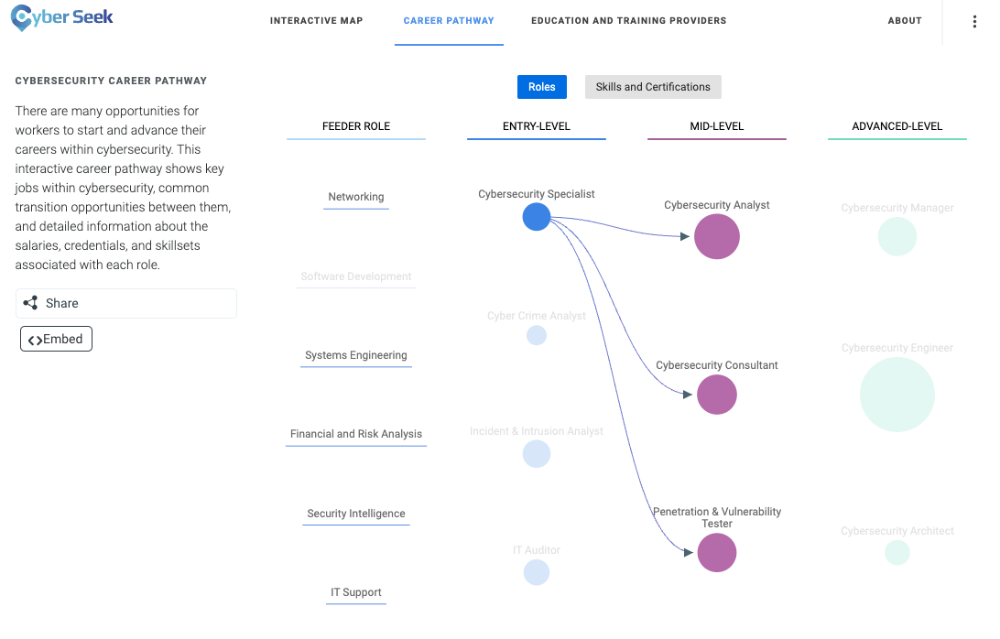
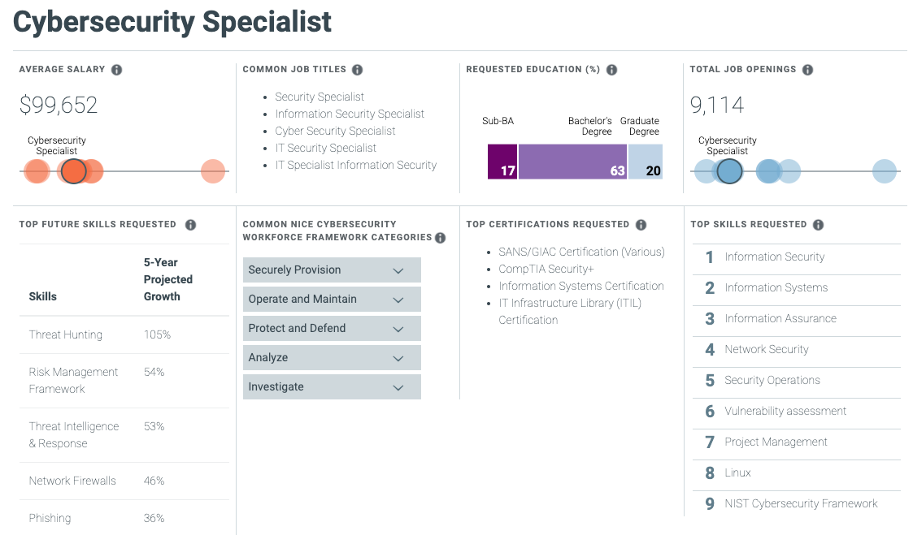

## 23.2 Student Guide: Security+ and Security Job Searching

### Day 2 Overview

Today we'll continue on with Career Prep Week, diving deeper into the domains covered by the Security+ certification and then moving on to discuss strategies for you to best position yourself to start your cyber career. You'll begin using online resources to map out your desired career path and look for opportunities. You will also explore ways to develop your own network of cyber professionals.

### Class Objectives

By the end of class, you will be able to:

- Understand how each domain is divided across the Security+ exam.
- Prepare for Security+ questions from domains and topics that we have not explored in our curriculum, such as "Architecture and Design" and "Identity and Access Management."
- Correctly answer Security+ practice questions. 
- Identify a cyber career field you are interested in and map out a career path toward a desired role. 
- Begin developing your professional network. 

### Slideshow

The lesson slides are available on Google Drive here: [23.2 Slides](https://docs.google.com/presentation/d/1b6BHmmQpLDQyuGOe9Kz-B2aPrq_XHIFXESe8c2L_p-g/edit#slide=id.gd1f7fe79b6_0_2681)

-------

### 01. Welcome to Day 2 of Career Prep Week 

Today, we'll continue preparation for the Security+ exam, and we'll also focus on strategies that you can use to help develop your cyber careers. As we approach the conclusion of this boot camp, you can use these skills to position yourself for success.

Remember that previously, we covered the following:

- Certifications are broken into three types: beginner certifications, advanced certifications, and specialized certifications.
- Information security professionals take different certification paths depending on their interests.  
- One of the most popular beginner certifications is Security+.
   - One of the best methods to prepare for the Security+ exam is the CertMaster Practice tool, which students have access to through this course.

Over the next two classes, we will cover:

- Finding your cybersecurity career path.
- Building your cybersecurity network.
- Non-traditional job searching.
- Behavioral and technical interview tips.

### 02. Security+ Identity and Access Management Domain

The Security+ exam consists of five domains, broken down as follows:
- 1.0 Attacks, Threats, and Vulnerabilities (24%)
- 2.0 Architecture and Design (21%)
- 3.0 Implementation (25%)
- 4.0 Operations and Incident Response (16%)
- 5.0 Governance, Risk, and Compliance (14%)

While this boot camp covered many topics across these domains, several subdomains on the exam are outside the scope of our class. 

So, we'll review some of the types of questions you may encounter on the Security+ exam from these subdomains now.

#### Identity and Access Management

First, we'll cover the types of questions the exam may contain on the topic **Identity and Access Management (IAM)**.

IAM refers to the security policies that ensure that an organization's resources are only accessible by the right people, for the right reasons, at the right times.
  
- There are significant risks to incorrectly assigning access to resources.

 - For example, if an organization gives all staff access to payroll databases, they would be able to view PII and other private data of the organization and its employees. 

Across the Security+ domains, several subdomains contain questions covering IAM, including the following:

**2.4 - Summarize authentication and authorization design concepts.**

- This subdomain focuses on the basic terms and concepts associated with IAM, such as:

   - **Authentication, Authorization, and Accounting (AAA)**: The framework to best control access to an organization's resources.
     - Types of authentication factors:
       - Something you are: This includes biometrics, such as retina scanning or facial recognition.
       - Something you have: Such as tokens or key cards.
       - Something you know: Such as PINs and passwords.
      
- Sample question: 
        
   - **Of the following authentication factors, which one is a different factor than a retina scan?**
     - (A) Hand geometry recognition
     - (B) Voice recognition
     - (C) Fingerprint recognition
     - (D) Proximity cards 

   - The correct answer is **D**. Proximity cards are "something you have," while the other options are all biometric factors ("something you are").
  
**3.8 - Given a scenario, implement authentication and authorization solutions.**

- This subdomain focuses on the the application of the concepts associated with IAM, such as authentication protocols like Kerberos, CHAP, and PAP.
   - **Kerberos** is an authentication protocol developed at MIT that uses tickets.
   - **Password Authentication Protocol (PAP)** uses a standard username and password to authenticate to a remote system. It is considered insecure. 
   - **Challenge-Handshake Authentication Protocol (CHAP)** uses a three-way handshake, making it more secure than PAP.
   
- Sample question:     
        
   - **Which of the following authentication protocols is considered insecure due to its lack of encryption?**
     - (A) EAP
     - (B) SAP
     - (C) PAP
     - (D) CHAP

   - The correct answer is **C**. PAP is insecure and unencrypted. 

- This subdomain also focuses on the management decisions that make sure the right people have access to the right resources for the right reasons. Types of access controls include:
    - **Mandatory Access Control (MAC)**
    - **Discretionary Access Control (DAC)**
    - **Role Based Access Control (RBAC)**

- This topic also focuses on selecting the optimal access controls based on your organization's environment.

    - For example, voice recognition is an appropriate biometric control if your office environment is relatively quiet.
    
- Sample question: 

    - **Which of the following biometric controls would you select for a noisy office with good lighting that needed a cost-efficient solution?**
      - (A) Voice recognition
      - (B) DNA analysis
      - (C) Fingerprint recognition
      - (D) Speech recognition
  
    - The correct answer is **C**. A and D would not be optimal in a noisy office, and B would likely be an expensive biometric solution.

       - Note that **voice recognition** detects speakers based on characteristics specific to the person's speech, while **speech recognition** detects the words spoken, absent of any unique accents, inflections, or characteristics of the speaker. 
       - Speech recognition is "what was said" and voice recognition is "who said it." 

- This subdomain also focuses on how user accounts are managed, including the concept of least privilege. 

    - This is the principle that an individual or system should be given the minimum access rights needed to complete their tasks.
       - Account types:
         - User accounts: The basic, standard account type of users at your organization. These accounts are usually limited in privileges.
         - Guest accounts: Allow non-employees to have limited access to your organization's resources.
         - Privileged accounts: Have greater access than user accounts and are provided to managers and system administrators.
    
- Sample question: 
      
   - **An external auditor needs limited access to your organization. What type of account should you provide them?**
     - (A) Guest Account
     - (B) User Account
     - (C) Sudo Account
     - (D) Service Account
        
   - The correct answer is **A**. You would provide a guest account to a non-employee who needed limited access.

### 03. Security+ Identity and Access Management Activity

- [Google Form: Identity and Access Management Quiz](https://forms.gle/wxtZpELtv33i5StV8)
  
### 05. Security+ Architecture and Design Domain 

In this section, we'll review the Security+ Architecture and Design domain, as there are several subdomains that we did not cover in our class.

**Architecture and Design** covers the processes and controls used to protect the confidentiality, integrity, and availability of an organization's data.

Within the Architecture and Design domain are eight subdomains: 

1. Explain the importance of security concepts in an enterprise environment.
2. Summarize virtualization and cloud computing concepts.
3. Summarize secure application development, deployment, and automation concepts. 
4. Summarize authentication and authorization design concepts.
5. Given a scenario, implement cybersecurity resilience.
6. Explain the security implications of embedded and specialized systems. 
7. Explain the importance of physical security controls. 
8. Summarize the basics of cryptographic concepts.

While it's important to be familiar with all eight subdomains, today we'll focus on the three subdomains that have not been covered in our course: 3, 6, and 7.

#### Subdomain 3: Summarize secure application development, deployment, and automation concepts.

- This subdomain focuses on the concepts and processes relevant to developing secure applications for organizations and their users.

   - Some terms that you should be familiar with include:
     - **Input Validation**: Restricts what data can be input to application fields, such as limiting non-ASCII characters.
     - Software development methodologies:
       - **Agile**: A flexible development method that allows changes to the development requirements.
       - **Waterfall**: A structured and rigid development method where each step of the development cycle depends on the previous steps.
    
- Sample question:

   - **What is the biggest risk of outputting detailed application errors with coding details?**
     - (A) There is no risk, and it is recommended.
     - (B) Coding details could provide the developer's name.
     - (C) Coding details could illustrate vulnerabilities in the application code, which a hacker can then exploit.
     - (D) Coding details could show when the code was written.
  
   - The correct answer is **C**. Displaying the code details, such as the coding language, version, and structure, could provide vulnerability information for hackers to exploit.

#### Subdomain 6: Explain the security implications of embedded and specialized systems.

- This subdomain focuses on the security of systems that have hardware with software embedded within them.
    -  A smart refrigerator is an example of an embedded system. A smart refrigerator has software embedded within its hardware to complete specific tasks, such as monitoring temperature and determining if a filter needs replacing.

- You should become familiar with the following terms:
    -  **Supervisory Control and Data Acquisition (SCADA)**: A system used to control technical equipment in industries such as energy, oil, and water management.
    - **Internet of Things (IoT)**: The network of devices that are connected to the internet, which are considered an extension of the internet itself. These devices include smart light bulbs, refrigerators, printers, door locks, etc.
       - IoT is an expansive term relevant to many areas, such as smart houses, research and monitoring in the healthcare industry, wearable devices such as step counters, data collection in agriculture, manufacturing, city management, and many, many more. 
    
- Sample question: 
      
   - **To protect their data, which type of systems are usually not connected to the internet?**
      - (A) Linux servers
      - (B) Apache web servers
      - (C) SCADA systems
      - (D) Home office networks
  
   - The correct answer is **C**. While some SCADA systems have limited connection to the internet, they are usually not connected because they run high impact systems.

#### Subdomain 7: Explain the importance of physical security controls. 

- This subdomain focuses on concepts associated with physical security processes and controls.

   - Terms you should become familiar with include:
     - **Environmental controls**: For example, HVAC systems and fire suppression systems.
     - **Physical access controls**: For example, mantraps and security guards.
     - **Physical control types**: For example:
       - **Deterrents**, such as alarms.
       - **Preventions**, such as locks or gates.
    
- Sample question: 

   - **What type of risk can a bollard protect against?**
      - (A) Fire
      - (B) Flooding
      - (C) Vehicle access
      - (D) Script kiddies
  
   - The answer is **C**. A bollard is a short post built into the ground to protect areas from vehicle access.
 

### 06. Security+ Architecture and Design Quiz Activity 

- [Google Form: Architecture and Design Quiz](https://forms.gle/1AT2r9qY2xsyAcJj7)

### 09. Introduction to Cyber Career Paths 

In the very first week of class, we introduced the vast number of domains and specialties that exist in the cybersecurity industry.

Refer to the cybersecurity domains map on the slide as a refresher.

As we moved throughout the course, we highlighted roles relevant to the particular skills and domains that we were learning. Understanding and mapping out career paths is an important way to begin your job search.  
 
If you ask a cyber professional how they found their way into the industry, many will share one of following responses:
- They started in careers outside of IT. 
- Before entering a cyber-specific role, they had to work in one or many other IT roles. 
  
#### Finding Career Paths

Use the following resources to explore common career paths:

- [Cyberseek](https://www.cyberseek.org/pathway.html) provides information about supply and demand in the cybersecurity job market. 

  - Clicking on any of the featured roles will display helpful information, such as number of job openings, average salaries, and desired skills and certifications, as the following images show:    
   
 
  
 

- [LinkedIn](https://www.linkedin.com/) shows real professionals' career pathways and development. 

 
### 10. Career Paths Activity

- [Activity File: Career Paths](Activities/01_Career_Paths/unsolved/readme.md)

### 12. Cyber Networking 

One of the best methods for landing a cybersecurity job is to build and connect with a **cyber network**.

  - The cybersecurity industry, while growing each year, is still a tight-knit, highly connected group of professionals.
  
Establishing connections and building your network can help in the following ways:

- Through connections, you can meet other industry professionals, many of whom are actively hiring.
  - Hiring managers often circumvent the traditional job posting process and hire from personal recommendations.

- Networking can provide resources for specific cyber domains.
  - For example, if you need to find a mobile forensic specialist and have a large network, it's likely that your network contains the specialist you need. 

- Connecting with professionals who are associated with trusted third-party companies and vendors can give you access to better pricing and personalized service. 
  - For example, a contact who works for a SIEM vendor could come in handy if you are looking for SIEM products for your organization. 
  
It may feel challenging to break into a cyber network or connect with cyber professionals. 

- But just by joining this class, you've already formed a cyber network consisting of the students and TAs in the class.

- We recommend that you connect with one another through LinkedIn, if you haven't already.
  
The best way to build your network is to join local cyber groups, chapters, and professional associations. 

  - Many of these have members who are also very new to the industry.
  
The benefits of joining local cyber groups include:
- Regional specificity
- Welcoming attitude towards new professionals
- Monthly meetings, trainings, and social events
- Inexpensive or free membership and event cost

While many groups are offered for general cyber networking, there are also groups with specialized focuses, such as:

- Groups that emphasize certain technologies, such as cloud security groups like Cloud Security Alliance (CSA).

- Groups that focus on specific industries, such as banking and finance security groups like Financial Services Information Sharing and Analysis Center (FSISAC).

- Groups that connect people from specific demographics, such as Women in CyberSecurity (WiCS).

### 13. Building Your Cyber Network Activity

- [Activity File: Building Your Cyber Network](Activities/02_Cyber_Network/unsolved/readme.md)

### 15. Non-Traditional Job Searching

While networking is an excellent way to increase your chances of landing an interview, it must be combined with additional job searching approaches. 

Job searching requires casting a large net. The wider and more diverse your search, the more likely it is you'll find something. 

Now we'll discuss some traditional and non-traditional job searching methods.

#### Traditional Job Search Methods

Traditional job search methods include: 
- Searching websites like Indeed, Dice, and Monster.com.
- Searching for open positions on LinkedIn.
- Working with a recruiter. 

These methods are popular because of their comparatively easy application processes and the clarity of details in job postings.  

- However, this simplicity means you are often one of thousands of applicants. 

- The person reviewing the job applications will only know you by the information on your resume or job profile. 

Due to these limitations, cybersecurity professionals often use non-traditional approaches for finding open positions in addition to traditional approaches.    

#### Non-Traditional Job Search Methods

Cybersecurity professionals often use their creative thinking skills to "hack" the traditional approaches to job searching. These hacks include:

- Proposing that an employer create a position for your skills. 
    - You can share your observations of the organization's challenges or areas of need, and how your skills can address them.
    - This is most successful with organizations where you have a personal connection.
    
- Sharing your skills on platforms beyond your resume and LinkedIn.
    - Create blogs, custom websites, and videos to advertise your skills and find potential employers.

- Attending cyber events in which the primary purpose of the event is not job searching.
    - Increase your odds by attending cyber trade shows and conferences where you are one of fewer individuals looking for open positions.

- Reach out directly to the real decision maker at an organization. We'll discuss this more next.

#### Contacting Team Managers and Decision Makers

Recruiters and talent acquisition staff often manage an organization's hiring process. But they are the gatekeepers, not the ones who make final hiring decision. 

- The final hiring decisions are typically made by the managers and cybersecurity department leaders. These managers are also valuable resources for insight and information about working in the industry. 

A quick LinkedIn search can help you find these personnel.

  - Navigate to LinkedIn and run a search with the following format:
    - Cyber Manager [Company] [City] OR Security Director [Company] [City]
    - For example: Cyber Manager Microsoft Chicago

- Review the results, and try to find someone who seems responsible for hiring, building, and managing the cybersecurity team. 

Once you find this person, you can introduce yourself with a message similar to the one below. 

  - Note that this is a soft first introduction, with no specific mention of open positions. That can be discussed in future meetings.

    Hello [First Name],

      I’m [Your Name], an aspiring cybersecurity professional transitioning from a career in [previous career]. As I make this transition, I am mapping out my job aspirations and pathways. I came across your profile and wanted to reach out to you because of your [success in X field/other reason that this person's career interests you]. 

      I [recently graduated/am about to graduate] from the cybersecurity boot camp at [your school], where I studied offensive and defensive security, web application security, and governance and compliance. I am also currently working [or worked] on some exciting new projects, including [one-line project description].

      If you have a few minutes, I would love to pick your brain about how you got started, what you do at [company], and how you maintain your expertise. Let me know if you’re available for a quick coffee or phone/Zoom call sometime.

      I look forward to hearing from you and appreciate your time either way!

      Thanks and best,

      [Your Name]

      
### 16. Hacking Your Job Search Activity

- [Activity File: Hacking Your Job Search](Activities/03_Hacking_Your_Search/unsolved/readme.md)

-------

© 2022 edX Boot Camps LLC. Confidential and Proprietary. All Rights Reserved.  

